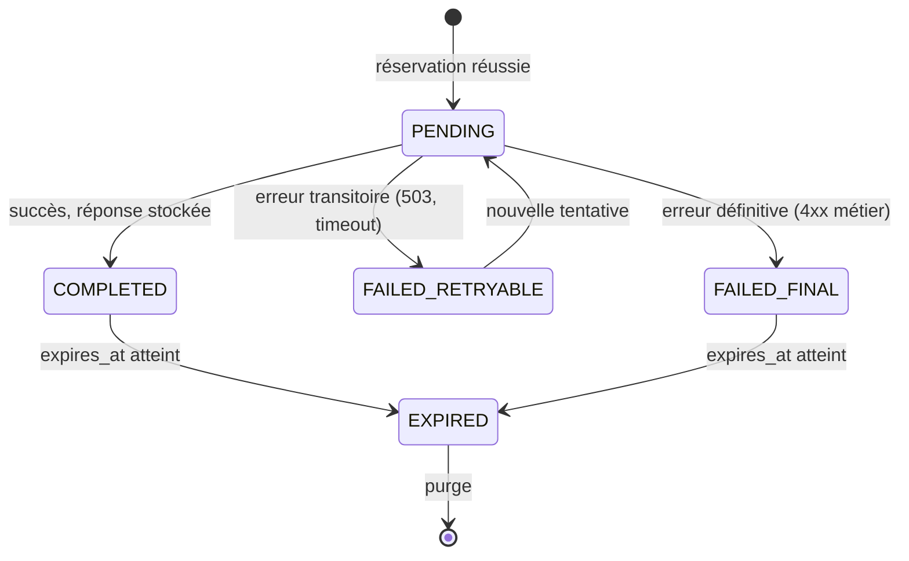

# Eventini — Idempotence et contrôle de concurrence

> **Statut :** Spécification normative · **Version :** 1.0 · **Date :** 30 juillet 2026
> **Décision :** [ADR-0012](../adr/0012-idempotency-storage.md) · **Table :** `idempotency_records` ([`DATABASE_SCHEMA.md` §8.3](../database/DATABASE_SCHEMA.md))
> **Applique :** Document C §19 et §20 — les 3 choix laissés ouverts y sont tranchés

> ⚠️ **Rien de ceci n'existe dans le dépôt.** Aucune table, aucun intercepteur, aucun en-tête traité. `backend/src/shared/idempotency/` ne contient qu'un `.gitkeep`.

---

## 1. Pourquoi c'est critique pour Eventini

Un opérateur de scan travaille dans un hall de congrès avec une connectivité instable. Il scanne un QR code. La requête part, le réseau tombe, le client réessaie.

Sans idempotence, cette séquence produit **deux enregistrements de présence** pour la même personne. Les compteurs du tableau de bord deviennent faux, le rapport final est faux, et personne ne s'en aperçoit avant la clôture.

C'est la raison pour laquelle l'idempotence est ici une exigence métier, pas une élégance d'API.

---

## 2. Le contrat

```http
POST /api/v1/events/evt_01JXYZ/check-ins
Idempotency-Key: 01JQRSTUVWXYZ
Content-Type: application/json

{ "ticketReference": "tkt_pub_9f3a...", "eventSessionId": "esn_01", "scannedAt": "2026-08-15T09:14:22Z" }
```

| Cas | Réponse |
|---|---|
| Première requête | exécution normale, réponse mémorisée |
| Rejeu identique | **la réponse mémorisée**, `meta.idempotency.replayed = true` |
| Même clé, corps différent | `409 IDEMPOTENCY_CONFLICT` |
| Requête encore en cours | `409` + `Retry-After: 2` |
| Clé expirée | traitée comme une première requête |

### Où la clé est obligatoire

`POST /events/{id}/check-ins` · `POST /events/{id}/check-outs` · `POST /events/{id}/attendance-sync` · `POST /participants/imports` · `POST /reports/exports` · `POST /events/{id}/registrations/{id}/tickets` · `POST /platform/organizations` · `POST /auth/invitation-acceptances`

Clé absente sur ces routes ⇒ `400 VALIDATION_ERROR`. Ce n'est pas optionnel : une route rejouable sans clé est une route qui produira un doublon un jour.

### Format de la clé

ULID ou UUID v4 généré par le client. 16 à 128 caractères, `[A-Za-z0-9_-]`. **Aucune donnée sensible** : la clé est journalisée et stockée.

Une clé **par intention**, pas par tentative. Un client qui régénère sa clé à chaque réessai a implémenté un compteur, pas une idempotence.

---

## 3. Empreinte canonique

C'est ce qui distingue un rejeu légitime d'une collision de clé.

```
request_hash = SHA-256(
    method                          "POST"
  + "\n" + route_template           "/api/v1/events/:eventId/check-ins"
  + "\n" + organizationId           "org_01JXYZ"
  + "\n" + actorId                  "usr_01ABC" ou "dev_01ABC"
  + "\n" + canonical_json(body)
  + "\n" + canonical(path_params)
)
```

`canonical_json` : clés triées, espaces normalisés, pas de flottant en notation scientifique, `null` conservé (`{"a":null}` et `{}` sont deux intentions différentes).

**Exclus de l'empreinte** : tous les en-têtes volatils — `traceparent`, `User-Agent`, `X-Request-Id`, `Date`, `Authorization`. Les inclure ferait diverger l'empreinte à chaque réessai, ce qui transformerait un rejeu légitime en `409`.

Le **gabarit** de route est utilisé, pas l'URI concrète : `/events/:eventId/check-ins` et non `/events/evt_01/check-ins`. L'identifiant est déjà dans `path_params`, l'y compter deux fois est du bruit.

---

## 4. Réservation

```sql
INSERT INTO idempotency_records (
  id, organization_id, actor_id, actor_session_id,
  method, route, idempotency_key, request_hash,
  status, created_at, expires_at
) VALUES ($1, $2, $3, $4, $5, $6, $7, $8, 'PENDING', now(), $9)
ON CONFLICT (organization_id, actor_id, method, route, idempotency_key)
DO NOTHING
RETURNING id;
```

Aucune ligne retournée ⇒ la clé existe déjà.

**Aucun verrou n'est nécessaire.** L'index unique `ux_idempotency_scope` est le mécanisme atomique. C'est exactement ce que le Document C §19.6 demandait en écrivant qu'« un simple `find then insert` est vulnérable » : ici il n'y a pas de `find` avant l'`insert`.

La portée inclut `organization_id` **et** `actor_id` : la même clé dans deux organisations ne peut pas entrer en collision, ce que le Document C §19.5 exige explicitement.

---

## 5. Machine à états



| État | Rejeu |
|---|---|
| `PENDING` | `409` + `Retry-After: 2` |
| `COMPLETED` | réponse mémorisée, `replayed: true` |
| `FAILED_RETRYABLE` | ré-exécution autorisée |
| `FAILED_FINAL` | erreur mémorisée renvoyée — ne pas ré-exécuter une opération qui échouera pareil |
| `EXPIRED` | nouvelle exécution |

`FAILED_FINAL` mémorise l'erreur : rejouer un `409 EVENT_NOT_ACTIVE` produirait le même `409` en consommant des ressources pour rien.

---

## 6. Requête en vol : `409`, pas d'attente

Le Document C §19.9 proposait quatre comportements sans en choisir un. **Décision : `409` avec `Retry-After: 2`.**

Un client bloqué en attente retient une connexion serveur. Sous synchronisation offline — plusieurs appareils rejouant leurs lots simultanément — cela épuise le pool de connexions bien avant d'épuiser quoi que ce soit d'autre. Le `409` déplace l'attente côté client, où elle est gratuite.

Le client mobile réessaie avec un backoff exponentiel et jitter. C'est un comportement qu'il implémente de toute façon pour les pannes réseau.

`locked_until` protège du blocage définitif : une ligne `PENDING` dont `locked_until` est dépassé (processus mort en cours de traitement) est reprise par la requête suivante.

---

## 7. Réponse de rejeu

```json
{
  "data": { "attendanceRecordId": "att_01JXYZ", "result": "ACCEPTED",
            "participantName": "Dupont, Marie", "checkedInAt": "2026-08-15T09:14:23.120Z" },
  "meta": {
    "requestId": "req_01JNEW",
    "timestamp": "2026-08-15T09:14:31.400Z",
    "apiVersion": "v1",
    "idempotency": { "replayed": true, "originalRequestId": "req_01JORIG" }
  },
  "error": null
}
```

Le corps `data` est **identique** à l'original. `meta.requestId` est celui de la requête **courante** ; `originalRequestId` permet de retrouver l'exécution réelle dans les logs.

---

## 8. Rétention

| Portée | Durée |
|---|---|
| Général | **24 h** |
| Synchronisation attendance et check-in | **7 j** |

7 jours parce qu'un scanner peut rester hors ligne toute la durée d'un événement multi-jours. Une rétention de 24 h transformerait un rejeu parfaitement légitime en double check-in — précisément le scénario que ce mécanisme existe pour empêcher.

Purge par job BullMQ quotidien sur `expires_at`, par lots. Résout un choix ouvert du Document C §19.10.

---

## 9. Application à la synchronisation offline

Le lot porte une clé, **et chaque opération à l'intérieur porte la sienne**.

```http
POST /api/v1/events/evt_01/attendance-sync
Idempotency-Key: 01JBATCH_DEVICE01_0042
```

```json
{
  "deviceId": "dev_01JXYZ",
  "operations": [
    { "operationId": "01JOP001", "type": "CHECK_IN",
      "ticketReference": "tkt_pub_a1", "eventSessionId": "esn_01",
      "clientRecordedAt": "2026-08-15T09:14:22Z" },
    { "operationId": "01JOP002", "type": "CHECK_IN",
      "ticketReference": "tkt_pub_b2", "eventSessionId": "esn_01",
      "clientRecordedAt": "2026-08-15T09:15:01Z" }
  ]
}
```

**Deux niveaux, délibérément.** La clé de lot rend le renvoi du lot entier sans effet. `operationId` — stocké dans `attendance_records.idempotency_key` avec l'index `ux_attendance_idempotency` — rend chaque opération individuellement rejouable, y compris si elle est redécoupée dans un lot différent.

Réponse **par opération** :

```json
{
  "data": {
    "batchId": "01JBATCH_DEVICE01_0042",
    "results": [
      { "operationId": "01JOP001", "status": "ACCEPTED", "attendanceRecordId": "att_01" },
      { "operationId": "01JOP002", "status": "REFUSED", "reason": "TICKET_REVOKED" }
    ],
    "summary": { "accepted": 1, "refused": 1, "duplicate": 0 }
  }
}
```

Le lot renvoie `200`, pas `207`. Chaque opération porte son propre résultat ; le transport a réussi, ce sont certaines opérations métier qui ont été refusées. Un refus n'est pas une erreur HTTP.

### Arbitrage

| Règle | |
|---|---|
| Horodatage faisant foi | `server_recorded_at`, toujours |
| `client_recorded_at` | conservé pour analyse, **jamais** autoritaire, jamais utilisé pour ordonner |
| Doublon | `ux_attendance_checkin_unique` tranche, résultat `DUPLICATE` |
| Ticket révoqué entre-temps | refusé — l'état courant du serveur l'emporte sur l'état connu du client |
| Session fermée entre-temps | refusé avec `EVENT_SESSION_CLOSED` |
| Décalage d'horloge client | sans effet : aucune décision ne dépend de l'horloge du client |
| Taille de lot | 500 opérations maximum |

**Le client hors ligne n'est jamais l'autorité finale.** Il propose ; le serveur dispose. C'est ce qui permet de tolérer un appareil dont l'horloge est fausse ou dont le snapshot est périmé.

---

## 10. Concurrence optimiste

### Le mécanisme

Les ressources modifiables portent `version INTEGER NOT NULL DEFAULT 1`, exposé en `ETag`.

```http
GET /api/v1/events/evt_01JXYZ
ETag: "evt_01JXYZ-v3"

PATCH /api/v1/events/evt_01JXYZ
If-Match: "evt_01JXYZ-v3"
```

```sql
UPDATE events
SET name = $1, version = version + 1, updated_at = now(), updated_by = $2
WHERE id = $3 AND organization_id = $4 AND version = $5
RETURNING version;
```

Zéro ligne affectée ⇒ quelqu'un a modifié entre-temps ⇒ `409 VERSION_CONFLICT`.

Le filtre `organization_id` est présent **même** avec un `id` de clé primaire : c'est la règle de la garde Prisma, sans exception pour les lectures par identifiant.

### Où c'est obligatoire

`events` · `event_sessions` · `participants` · `registrations` · `organizations` · `organization_memberships`

`If-Match` absent sur ces ressources ⇒ **`428 PRECONDITION_REQUIRED`**. C'est délibérément strict : sur un événement édité simultanément par deux administrateurs, une écriture aveugle écrase silencieusement le travail de l'autre.

### Ce qui n'en a pas besoin

| Table | Pourquoi |
|---|---|
| `attendance_records` | append-only |
| `audit_logs`, `security_events` | append-only |
| `refresh_token_rotations` | `ux_refresh_active_per_family` sérialise déjà |
| `tickets` | transitions d'état uniquement, pas d'édition de champs |

### Verrous pessimistes

Réservés à quatre situations : forte contention mesurée, ressource unique, fenêtre courte, transition critique.

Employés uniquement pour : la rotation de refresh token (et encore, l'index unique suffit), la réservation de capacité d'événement, et la publication de l'outbox.

**Un verrou Redis ne remplace jamais une contrainte PostgreSQL.** Le verrou coordonne ; la contrainte garantit.

---

## 11. Frontières transactionnelles

Idempotence et concurrence n'ont de sens que si l'écriture métier et son enregistrement sont **atomiques**.

```
BEGIN
  1  réserver la clé d'idempotence      (INSERT … ON CONFLICT DO NOTHING)
  2  exécuter l'opération métier
  3  écrire dans outbox_events          si un événement doit être publié
  4  marquer l'idempotence COMPLETED    avec la réponse
COMMIT
→ publier depuis l'outbox               APRÈS le commit
```

Publier avant le commit produirait un événement temps réel annonçant un check-in qui n'existe pas si la transaction échoue.

Les 9 frontières du Document B §39, plus les 9 de [`ENTITY_RELATIONSHIPS.md` §7](../database/ENTITY_RELATIONSHIPS.md), plus celle-ci.

---

## 12. Implémentation

```
backend/src/common/idempotency/
├── idempotency.interceptor.ts       intercepte, réserve, rejoue
├── idempotency.service.ts           machine à états
├── request-fingerprint.ts           empreinte canonique
├── idempotency.repository.ts        accès à idempotency_records
└── idempotency.decorator.ts         @Idempotent({ retention: '7d' })

backend/src/common/concurrency/
├── optimistic-lock.interceptor.ts   If-Match → version
├── etag.util.ts                     version ⇄ ETag
└── concurrency.decorator.ts         @RequireIfMatch()
```

L'intercepteur s'exécute **après** l'authentification et l'autorisation — la portée d'idempotence inclut `organizationId` et `actorId`, qui n'existent pas avant — et **avant** le handler.

---

## 13. Tests obligatoires

| # | Test | Attendu |
|---|---|---|
| 1 | Deux check-ins identiques, même clé | **un seul** `attendance_records`, seconde réponse `replayed: true` |
| 2 | Même clé, corps différent | `409 IDEMPOTENCY_CONFLICT` |
| 3 | Même clé, deux organisations | deux exécutions, aucune collision |
| 4 | Même clé, deux acteurs | deux exécutions |
| 5 | Rejeu après expiration | nouvelle exécution |
| 6 | Rejeu pendant `PENDING` | `409` + `Retry-After` |
| 7 | Corps réordonné (`{"a":1,"b":2}` vs `{"b":2,"a":1}`) | même empreinte, rejeu reconnu |
| 8 | `traceparent` différent | même empreinte |
| 9 | Route obligatoire sans clé | `400` |
| 10 | 50 requêtes concurrentes, même clé | une exécution, 49 rejeux ou `409` |
| 11 | Lot offline renvoyé intégralement | aucun doublon |
| 12 | Opération redécoupée dans un autre lot | reconnue par `operationId` |
| 13 | `PATCH` sans `If-Match` | `428` |
| 14 | `If-Match` périmé | `412` |
| 15 | Deux `PATCH` concurrents, même version | un succès, un `409 VERSION_CONFLICT` |
| 16 | `FLUSHALL` Redis puis rejeu | **aucun doublon** — PostgreSQL a tenu |
| 17 | Crash entre commit et publication outbox | l'événement est publié au redémarrage |

Le test 16 prouve que le choix de [ADR-0012](../adr/0012-idempotency-storage.md) était le bon : une idempotence Redis-only y produirait un double check-in.
