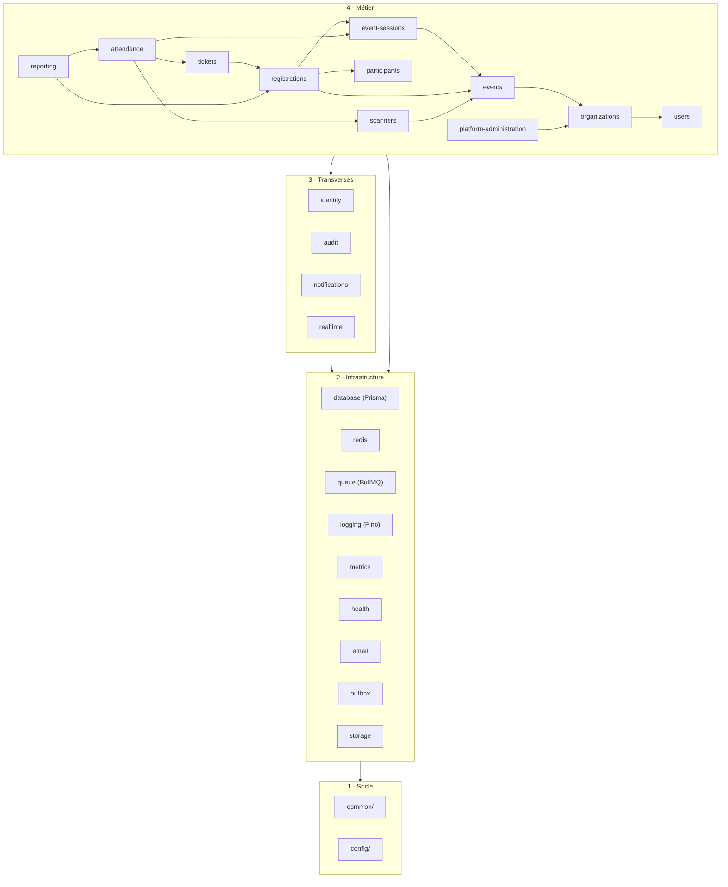
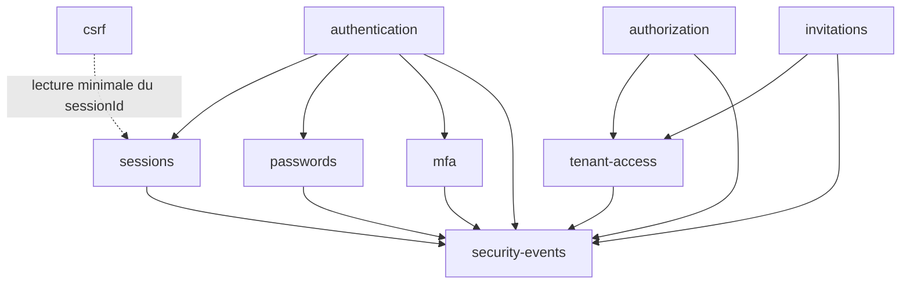

# Eventini — Carte des dépendances de modules

> **Statut :** Spécification normative · **Version :** 1.0 · **Date :** 30 juillet 2026
> **Application :** `backend/src/__architecture__/*.spec.ts`

Le corpus contenait cinq règles de dépendance éparses (Document B §10) et une arborescence recommandée (Document C §41). **Aucun graphe complet, aucun mécanisme d'application.** Ce document fournit les deux.

---

## 1. Les 4 strates

Les dépendances descendent. **Une flèche vers le haut est un bug d'architecture.**

```
┌─────────────────────────────────────────────────────────┐
│  4  MODULES MÉTIER            events, participants, …    │
├─────────────────────────────────────────────────────────┤
│  3  MODULES TRANSVERSES       identity, audit, realtime  │
├─────────────────────────────────────────────────────────┤
│  2  INFRASTRUCTURE            prisma, redis, queue, …    │
├─────────────────────────────────────────────────────────┤
│  1  SOCLE                     common, config             │
└─────────────────────────────────────────────────────────┘
```

| Strate | Peut importer | Ne peut jamais importer |
|---|---|---|
| 1 Socle | rien du projet | 2, 3, 4 |
| 2 Infrastructure | 1 | 3, 4 |
| 3 Transverses | 1, 2 | 4 |
| 4 Métier | 1, 2, 3, et l'`index.ts` d'un autre module métier | les **internes** d'un autre module |

**Test de conformité** : `common/` et `infrastructure/` ne contiennent aucun `import` depuis `modules/`. Actuellement vrai — parce qu'ils sont vides. Il faudra que cela le reste.

---

## 2. Graphe complet



---

## 3. Sous-modules d'`identity`

`identity` est le seul module à sous-modules internes. Ses dépendances internes sont également ordonnées.



| Règle | Motif |
|---|---|
| `authorization` → `tenant-access`, **jamais l'inverse** | l'autorisation a besoin du tenant résolu ; le tenant n'a pas besoin des permissions |
| `csrf` lit **uniquement** un identifiant de session minimal | le CSRF ne doit pas dépendre du cycle de vie complet des sessions |
| `security-events` ne dépend de **rien** | tout le monde en dépend ; une dépendance sortante créerait un cycle |
| `authentication` orchestre `sessions`, `passwords`, `mfa` | c'est le point d'entrée du domaine |

Ce graphe correspond au câblage DI **déjà présent** dans le dépôt. C'est le seul endroit où le code existant est conforme à sa cible.

---

## 4. Communication entre modules métier

Trois voies, dans cet ordre de préférence.

### 4.1 Import direct de l'`index.ts` — synchrone, même transaction

```ts
import { EventsService } from '../events';        // ✔ surface publique
import { EventRepository } from '../events/infrastructure/event.repository';  // �’ INTERDIT
```

Pour les dépendances fortes et acycliques. `attendance` a besoin de `tickets` : il l'importe.

### 4.2 Événement d'outbox — asynchrone, après commit

```ts
await this.outbox.append(ctx, tx, 'ATTENDANCE_RECORDED', payload);
```

Pour les effets de bord qui ne doivent pas coupler l'émetteur au consommateur : notification email, mise à jour temps réel, recalcul de rapport.

`attendance` ne connaît **pas** `notifications`. Il émet `ATTENDANCE_RECORDED` ; qui écoute est le problème de qui écoute.

### 4.3 Port et adaptateur — inversion de dépendance

Quand une dépendance créerait un cycle, le module consommateur définit un port dans son `domain/`, et le module fournisseur l'implémente.

```ts
// attendance/domain/ports/ticket-verifier.port.ts
export abstract class TicketVerifierPort {
  abstract verify(ctx: TenantContext, reference: string): Promise<TicketVerification>;
}
// tickets/infrastructure/ fournit l'implémentation, câblée dans le module
```

---

## 5. Arêtes interdites

| Arête interdite | Pourquoi |
|---|---|
| `common/` ou `config/` → `modules/` | inverse la hiérarchie ; rend le socle non testable isolément |
| `infrastructure/` → `modules/` | l'infrastructure ne connaît pas le métier |
| Module métier → **internes** d'un autre module | contourne la surface publique, fige les détails d'implémentation |
| `tenant-access` → `authorization` | cycle |
| `security-events` → n'importe quoi | cycle |
| Module métier → `identity/*/infrastructure/*` | expose le stockage des credentials |
| `controllers/` → Prisma | contourne les couches, saute la garde tenant |
| `domain/` → NestJS, Prisma, Express | rend le domaine non testable sans framework |
| Cycle entre deux modules métier | à résoudre par outbox ou port |

---

## 6. Application automatique

### 6.1 `modularity.spec.ts` — existe et fonctionne

C'est le **seul test réel du dépôt** (2 assertions). Il parcourt `src/modules`, extrait les imports par expression régulière, les résout, et vérifie :

1. aucun module n'importe les internes privés d'un autre — seul `index` / `index.ts` est autorisé ;
2. `src/shared` n'importe jamais `src/modules`.

À conserver et à étendre.

### 6.2 `forbidden-imports.spec.ts` — 3 `it.todo`, activé sprint 02

À implémenter : la matrice de strates du §1, les arêtes interdites du §5, et l'interdiction pour `domain/` de dépendre d'un framework.

### 6.3 `tenant-isolation.spec.ts` — 2 `it.todo`, activé sprint 06

Le test le plus important du dépôt. À implémenter :

1. tout modèle Prisma tenant-owned possède `organization_id` ;
2. toute méthode publique de repository sur un modèle tenant-owned prend un `TenantContext` en **premier** paramètre ;
3. aucun appel à `prisma.$unscoped` hors de la liste blanche des opérations plateforme.

### 6.4 Détection de cycles — sprint 02

`madge --circular src/` en CI. Un cycle entre modules métier fait échouer le build.

---

## 7. Modules frontend

Les mêmes règles s'appliquent à `web/src/features/`.

```
web/src/
├── config/  lib/          socle — n'importe jamais features/
├── components/ui/         kit — n'importe jamais features/
├── components/shared/     peut importer lib/ et config/
└── features/
    ├── authentication/    transverse — les autres peuvent l'importer
    └── organizations/ events/ event-sessions/ participants/
        registrations/ tickets/ scanners/ attendance/ reports/
```

| Règle | |
|---|---|
| Une feature importe une autre feature **uniquement par son `index.ts`** | |
| `components/ui/` n'importe **jamais** de feature | c'est du kit générique |
| `lib/` et `config/` n'importent **jamais** de feature | |
| `authentication` est la seule feature transverse | toutes peuvent en dépendre |
| Aucun cycle entre features | |

**Cycle existant à corriger** : `lib/permissions/permission-checker.ts` importe `Permission` depuis le barrel `@/features/authentication`, lequel réexporte `use-permissions.ts`, qui réimporte `hasPermission` depuis `permission-checker`. Le type est effacé à la compilation, mais le cycle est réel et traverse un barrel. Correction sprint 01 : `permission-checker` importe le type depuis `features/authentication/types/permission.types` directement.

---

## 8. Résumé par module

| Module | Strate | Dépend de | Est utilisé par |
|---|---|---|---|
| `common` | 1 | — | tout |
| `config` | 1 | — | tout |
| `database` | 2 | common, config | tous les modules |
| `redis` | 2 | common, config | identity, attendance, tickets |
| `queue` | 2 | common, config, redis | notifications, reporting, participants |
| `logging` | 2 | common, config | tout |
| `metrics` `health` | 2 | common, config | app |
| `email` | 2 | common, config, queue | notifications |
| `outbox` | 2 | common, database | tous les producteurs d'événements |
| `identity` | 3 | infrastructure | tous les modules métier |
| `audit` | 3 | infrastructure | tous les modules métier |
| `notifications` | 3 | infrastructure, queue, email | consomme l'outbox |
| `realtime` | 3 | infrastructure, redis | consomme l'outbox |
| `users` | 4 | identity, audit | organizations |
| `organizations` | 4 | identity, audit, users | events, platform-administration |
| `events` | 4 | identity, audit, organizations | event-sessions, registrations, scanners |
| `event-sessions` | 4 | events | registrations, attendance |
| `participants` | 4 | identity, audit, queue | registrations |
| `registrations` | 4 | events, event-sessions, participants | tickets, attendance, reporting |
| `tickets` | 4 | registrations | attendance |
| `scanners` | 4 | events, identity | attendance |
| `attendance` | 4 | tickets, scanners, event-sessions, outbox | reporting |
| `reporting` | 4 | attendance, registrations, queue | — |
| `platform-administration` | 4 | organizations, identity, audit | — |

**Aucun module ne dépend de `reporting` ni de `platform-administration`.** Ce sont des feuilles — les deux modules les plus faciles à extraire un jour si le monolithe devait se scinder.

`attendance` a le plus de dépendances entrantes indirectes : c'est le cœur métier, et c'est aussi pourquoi ses garanties d'idempotence et d'unicité sont portées par la base et non par du code.
