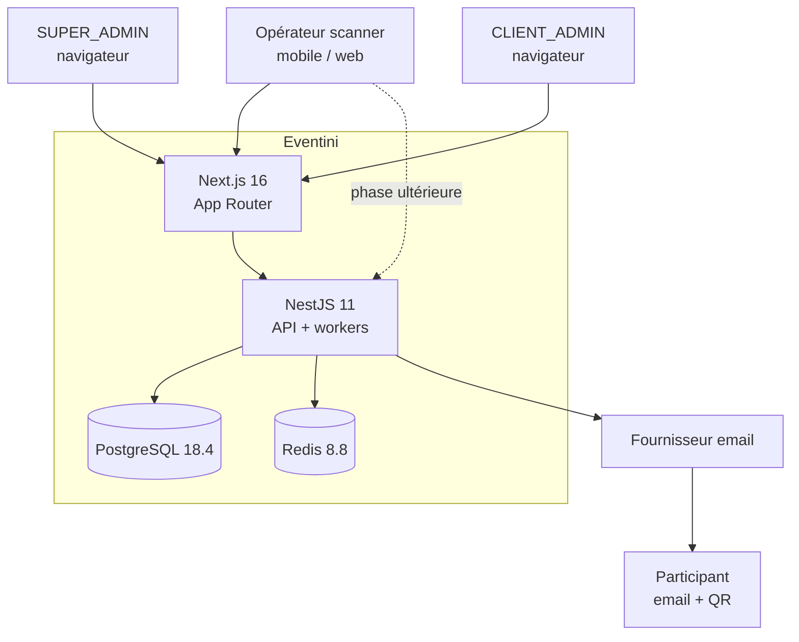

# Eventini — Architecture système

> **Statut :** Spécification normative + état vérifié · **Version :** 1.0 · **Date :** 30 juillet 2026
> **Style :** monolithe modulaire · **Point d'entrée documentaire :** [`PROJECT_DOCUMENTATION_INDEX.md`](../PROJECT_DOCUMENTATION_INDEX.md)

---

## 1. Vue d'ensemble

Eventini est un SaaS multi-tenant de gestion d'événements et de contrôle d'accès. Le cœur produit est une chaîne :

```
Platform → Organizations → Memberships et permissions scopées
  → Events → Sessions → Participants et inscriptions
    → Tickets et QR codes → Affectations scanner
      → Présence online/offline → Temps réel, rapports et audit
```

Trois acteurs : `SUPER_ADMIN` (plateforme), `CLIENT_ADMIN` (une organisation), `SCANNER` (un événement).

---

## 2. Contexte système — C4 niveau 1



Le client Flutter est **différé** : il ne démarre qu'après stabilisation des contrats d'authentification scanner, du modèle de ticket, de l'API de présence, de l'idempotence et de la synchronisation offline (contexte produit §12.5).

---

## 3. État réel du dépôt — audit du 30 juillet 2026

Cette section est **factuelle**. Chaque ligne est vérifiée par inspection de fichier, jamais déduite d'un nom de dossier.

### 3.1 Verdict

Le dépôt est un **squelette d'architecture**. Il est complet en dépendances et en arborescence, et vide en logique.

Sur 143 fichiers `.ts` dans `backend/src`, **trois** contiennent de la logique exécutable : `main.ts`, `app.module.ts`, et un test d'architecture. Le plus gros fichier source hors test fait **977 octets**.

### 3.2 Backend

| Élément | État |
|---|---|
| Routes HTTP atteignables | **0** — aucun décorateur `@Get`/`@Post`/`@Put`/`@Patch`/`@Delete` dans tout `backend/src` |
| `@Controller` déclarés | 2 (`identity/authentication`, `identity/csrf`) — **corps vides** |
| `main.ts` | 8 lignes. Ni Helmet, ni CORS, ni cookie-parser, ni `ValidationPipe`, ni préfixe global, ni Swagger, ni Pino, ni shutdown hooks |
| `app.module.ts` | importe **uniquement** `IdentityModule`. Pas de `ConfigModule`, pas de Prisma, pas de Throttler |
| `schema.prisma` | **inexistant** dans tout le dépôt |
| Migrations, seed, `PrismaService` | **inexistants** |
| `src/config/*` | 7 fichiers, chacun `export const xConfig = {};` |
| Validation d'environnement | **inexistante** |
| Fichiers de 0 octet | **13** — la totalité de `src/infrastructure/logging/` |
| Barrels `export {};` | **45** |
| Classes vides `export class X {}` | **50** |
| Décorateurs `@Injectable()` | **0** dans tout le backend |
| Rate limiting, idempotence, Lua | **0** — `@nestjs/throttler` installé, jamais importé |
| Assertions de test réelles | **2** (`__architecture__/modularity.spec.ts`) |
| `it.todo` | **31** |
| Seul corps de méthode non trivial | `throw new Error('Not implemented')` |

Le graphe d'imports est **sain** : tous les imports relatifs résolvent. Un `dist/` existe, preuve d'au moins une compilation.

### 3.3 Frontend

| Élément | État |
|---|---|
| Routes | 12 — **aucune avec de l'UI réelle** ; 8 retournent `<main />`, `<section />` ou `null` |
| `(public)` et `(scanner)` | **produisent zéro route** — ni `layout.tsx` ni `page.tsx` |
| `middleware.ts` | pass-through de 8 lignes, sans `matcher`, sans lecture de cookie, sans redirection |
| `AuthGuard` | déclare `requiredRole` dans ses props et **ne le lit jamais** — le garde `(super-admin)` est sans effet |
| `AppProviders` | correctement composé et **jamais monté** — le layout racine ne l'importe pas |
| Erreur bloquante | **7 fichiers** importent `../types`, barrel qui **n'existe pas** |
| Client API | fetch + `credentials: include` + CSRF corrects ; **pas de retry sur 401**, corps d'erreur jamais lu, pas de `put`/`patch` |
| Base URL | défaut `http://localhost:3000` — le **même port que le backend** ; sans `.env`, le front s'appelle lui-même |
| i18n | `next-intl` installé, `messages={{}}`, aucun fichier de traduction, aucun `useTranslations` |
| Offline / temps réel | **0** occurrence de `Dexie`, `EventSource`, `socket.io` |
| Kit UI | **63 composants Base UI réels** — c'est l'actif le plus abouti du dépôt |
| Features métier | 8 dossiers, 48 sous-répertoires vides, **0 ligne** |

### 3.4 Infrastructure

| Élément | État |
|---|---|
| `docker-compose.yml` | **réel et fonctionnel** — postgres 18.4, pgadmin 9.16, redis 8.8, healthchecks, volumes nommés |
| Dockerfile | **aucun** dans tout le dépôt — ni web, ni backend |
| `.github/` | **inexistant** avant ce lot |
| Racine | pas de `package.json`, pas de turbo/pnpm/nx — **ce n'est pas un monorepo**, mais deux projets npm indépendants |
| `docker/.env.example` | ✅ **rempli le 30 juillet 2026 à 16:36** (9 variables, valeurs factices). Était à 0 octet lors de l'audit du matin |
| `mobile/` | inexistant |

### 3.5 Deux blocages de dépôt

| # | Problème | Conséquence |
|---|---|---|
| **B-1** | `master` n'a **aucun commit**, et `web/.git` est un **dépôt git imbriqué distinct** | Committer `web/` aujourd'hui créerait un lien de sous-module vide : **aucune source frontend ne serait poussée** |
| ~~**B-2**~~ | ~~`docker/.env.example` fait 0 octet~~ — **résolu le 30 juillet 2026 à 16:36** | ~~`docker compose up` échoue sur un clone neuf~~ |

**B-1 reste ouvert et est traité au sprint 01.** C'est le blocage le plus important du dépôt : tant qu'il subsiste, aucune source frontend n'est réellement versionnée.

B-2 a été corrigé pendant la rédaction de cette documentation : `docker/.env.example` contient désormais les 9 variables avec des valeurs factices. Il reste à vérifier qu'un clone neuf démarre effectivement (`cp .env.example .env && docker compose up`) — c'est le critère de sortie du ticket EVT-007.

### 3.6 Écarts documentation ↔ réalité

| Documenté | Réel |
|---|---|
| Racine backend `api/` (Doc B §10, Doc D §37, migration folder) | **`backend/`** — aucun `api/` n'existe |
| Prisma comme ORM, 8 migrations | **aucun schéma**, aucune migration |
| `features/authentication` seul | 8 features supplémentaires non documentées |
| Arborescence `modules/`, `infrastructure/`, `common/` | **plus** un squelette DDD parallèle complet (`application/`, `domain/`, `presentation/`, `shared/`) non documenté |
| Cookies `__Host-eventini_access`, header `X-CSRF-Token` | **0 occurrence** dans `backend/src` |

---

## 4. Architecture cible — C4 niveau 2

```mermaid
flowchart TB
    subgraph WEB["Next.js 16 — web/"]
        RSC["Server Components<br/>rendu, pas de secret"]
        RCC["Client Components<br/>TanStack Query + Zustand"]
        MW["middleware.ts<br/>redirection UX seule"]
        APIC["API client<br/>cookies + CSRF + refresh"]
    end

    subgraph API["NestJS 11 — backend/"]
        direction TB
        BOOT["Bootstrap<br/>Helmet · CORS · cookies · ValidationPipe<br/>filtre d'exception · enveloppe · Pino"]
        GUARDS["Guards<br/>CSRF → Auth → Tenant → Permission → Resource"]
        MOD["14 modules métier"]
        INFRA["Infrastructure<br/>Prisma · Redis · BullMQ · logging · métriques · santé · mail"]
    end

    WRK["Workers BullMQ<br/>emails · imports · exports · outbox"]
    PG[("PostgreSQL<br/>source de vérité")]
    RD[("Redis<br/>état temporaire"))]

    RSC --> APIC
    RCC --> APIC
    MW -.-> RSC
    APIC -->|"HTTPS + cookies"| BOOT
    BOOT --> GUARDS --> MOD --> INFRA
    INFRA --> PG
    INFRA --> RD
    MOD -->|"outbox_events"| PG
    PG -->|"polling outbox"| WRK
    WRK --> RD
    WRK --> PG
```

---

## 5. Répartition PostgreSQL / Redis

C'est la frontière la plus importante de l'architecture.

| PostgreSQL — source de vérité | Redis — état temporaire |
|---|---|
| utilisateurs, credentials | rate limiting, lockout |
| organisations, memberships | cache de session |
| rôles, permissions | cache de permissions |
| événements, sessions | challenges MFA |
| participants, inscriptions | nonces anti-rejeu |
| tickets | court-circuit d'idempotence |
| appareils scanner | présence temps réel |
| **présence** | files BullMQ |
| sessions, rotations de token | verrous courts |
| **enregistrements d'idempotence** | déduplication |
| audit, security events | |
| outbox | |

**Test de conformité** : `FLUSHALL` en production doit provoquer une dégradation et une re-authentification, **jamais** une perte de donnée métier ni un double check-in. C'est le test 15 de [`REDIS_KEYS_AND_LUA_SCRIPTS.md`](../infrastructure/REDIS_KEYS_AND_LUA_SCRIPTS.md).

---

## 6. Cycle de vie d'une requête

```
 1  Reverse proxy         TLS, X-Forwarded-For (trust proxy explicite)
 2  Request ID            X-Request-Id conservé ou généré
 3  Helmet                en-têtes de sécurité
 4  CORS / Origin         égalité stricte schéma+hôte+port
 5  Rate limiting         AVANT tout traitement coûteux (Lua, un aller-retour)
 6  Cookie parser
 7  CSRF                  méthodes mutantes
 8  ValidationPipe        whitelist, forbidNonWhitelisted, transform
 9  AuthGuard             étapes 1-3 : token, session, utilisateur
10  TenantGuard           étapes 4-5 : organisation, membership
11  PermissionsGuard      étape 6 : permission effective (cache versionné)
12  Idempotency           réservation si Idempotency-Key
13  Controller            aucune logique métier — délégation seule
14  Use case              orchestration, transaction
15  Repository            Prisma, filtre tenant IMPOSÉ par l'extension
16  ResourceGuard         étapes 7-8 : propriété + état
17  Outbox                dans la même transaction
18  Intercepteur          enveloppe data/meta/error
19  Filtre d'exception    RFC 9457, jamais de trace
20  Pino                  une ligne de fin de requête
```

Les étapes 5, 9-11 et 16 sont les frontières de sécurité. Aucune n'est facultative, aucune n'est déléguée au frontend.

**Le rate limiting est en étape 5, avant Argon2id.** Une vérification Argon2id consomme 19 MiB et ~60 ms : la placer avant le rate limiting ferait de l'endpoint de login son propre vecteur de déni de service.

---

## 7. Temps réel

```
use case → COMMIT (métier + outbox_events, même transaction)
         → publieur outbox lit les PENDING
         → Redis pub/sub (fan-out inter-instances)
         → adaptateur SSE → navigateurs abonnés
```

**SSE** par défaut : le flux est serveur → tableau de bord, unidirectionnel. Socket.IO n'est introduit que si une bidirectionnalité réelle apparaît — `socket.io` est installé côté backend mais reste inutilisé.

L'outbox est indispensable : sans elle, un crash entre le commit et la publication perd l'événement en silence, et le tableau de bord diverge de la base sans que personne ne le sache.

**Aucune règle métier n'est dupliquée dans le transport temps réel.** L'adaptateur diffuse, il ne décide pas.

---

## 8. Traitements asynchrones

BullMQ pour : emails, imports lourds, exports, rapports, traitement de fichiers, notifications, nettoyage, publication d'outbox, purge d'idempotence.

Chaque job porte : identifiant stable, payload versionné, idempotence, retry avec backoff et jitter, logs, métriques, politique d'échec définitif.

| Contrainte | Valeur |
|---|---|
| Jobs concurrents par organisation | 3 |
| Tentatives | 5 |
| Timeout | 15 min |
| Backoff | exponentiel + jitter |

---

## 9. Observabilité

| Élément | Cible |
|---|---|
| Logs | Pino JSON → stdout → collecteur. Schéma de champs : Document D §9 |
| Corrélation | `requestId` propagé de la requête HTTP jusqu'aux jobs et événements internes |
| Traces | W3C Trace Context (`traceparent`), `traceId`/`spanId` injectés dans Pino |
| Métriques | Prometheus — 11 métriques nommées (Document D §36) |
| Santé | `/health/live` (processus), `/health/ready` (dépendances), `/health/startup` |
| Audit | `audit_logs` en PostgreSQL — **distinct** des logs applicatifs |
| Sécurité | `security_events` en PostgreSQL + 10 alertes |

Confondre `live` et `ready` fait redémarrer en boucle un service simplement dégradé. `live` répond tant que le processus vit ; `ready` échoue si PostgreSQL ou Redis manquent.

---

## 10. Décisions structurantes

| Décision | ADR |
|---|---|
| Monolithe modulaire, pas de microservices | contexte produit §12.1, §20 |
| Organisation active portée par la session | [0002](../adr/0002-active-organization-resolution.md) |
| Isolation applicative + garde Prisma, sans RLS | [0003](../adr/0003-tenant-isolation-strategy.md) |
| Permissions hors token, cache versionné | [0004](../adr/0004-permission-resolution-and-caching.md) |
| EdDSA via `jose`, `@nestjs/jwt` retiré | [0005](../adr/0005-token-signing-eddsa.md) |
| Enveloppe RFC 9457 | [0008](../adr/0008-response-envelope-rfc9457.md) |
| Lua pour les atomiques Redis | [0011](../adr/0011-redis-lua-atomic-operations.md) |
| Idempotence en PostgreSQL | [0012](../adr/0012-idempotency-storage.md) |

---

## 11. Non-objectifs

Microservices · Kubernetes · event sourcing complet · CQRS généralisé · GraphQL · billing complexe · marketplace · réseau social participant · biométrie · blockchain · IA générative métier · white-label avancé · multi-région actif-actif · Flutter avant stabilisation backend.

---

## 12. Tableau réel ↔ cible

| Capacité | Réel | Cible | Sprint |
|---|---|---|---:|
| Build vert | à vérifier | vert | 01 |
| Bootstrap sécurisé | `MISSING` | complet | 02 |
| Validation d'environnement | `MISSING` | bloquante au démarrage | 02 |
| Docker Compose | `IMPLEMENTED` | + Dockerfiles | 02 |
| Schéma Prisma | `MISSING` | 30 tables | 03 |
| Migrations | `MISSING` | 14 | 03 |
| Seed rôles/permissions | `MISSING` | idempotent | 03 |
| Logging Pino | `MISSING` (13 fichiers vides) | complet | 02 |
| Health checks | `MISSING` | 3 routes | 02 |
| Authentification | `SKELETON` | complète | 04 |
| CSRF | `SKELETON` | pré-session + session | 05 |
| Rate limiting + Lua | `MISSING` | 4 scripts (déjà écrits et testés) | 05 |
| Idempotence | `MISSING` | table + intercepteur | 05 |
| Multi-tenant | `SKELETON` | garde Prisma + tests | 06 |
| Autorisation scopée | `SKELETON` | chaîne en 8 étapes | 06 |
| Frontend auth | `BROKEN` (7 imports cassés) | fonctionnel | 07 |
| Organisations | `MISSING` | CRUD + invitations | 08 |
| Événements + sessions | `MISSING` | complet | 09 |
| Participants + imports | `MISSING` | complet | 10 |
| Tickets + scanners | `MISSING` | complet | 11 |
| Présence + offline | `MISSING` | complet | 12 |
| Temps réel SSE | `MISSING` | outbox + SSE | 12 |
| CI/CD | `MISSING` | 2 workflows | 01 |
| Flutter | `MISSING` | `DEFERRED` | — |

Statuts : `MISSING` absent · `SKELETON` structure sans logique · `PARTIAL` incomplet · `BROKEN` existe mais ne fonctionne pas · `IMPLEMENTED` code présent, validation incomplète · `DONE` critères satisfaits · `DEFERRED` reporté.
