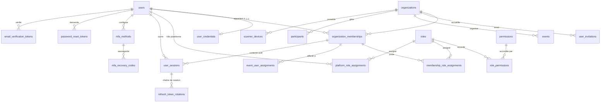
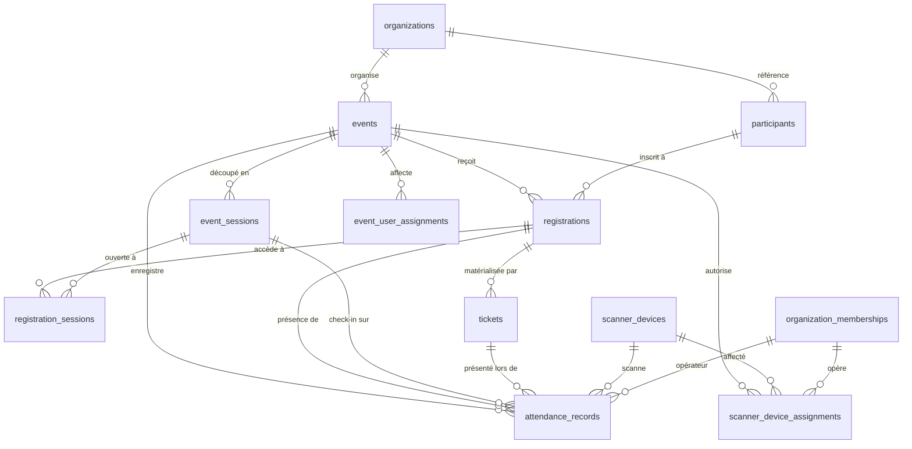

# Eventini — Relations entre entités

> **Statut :** Spécification normative · **Version :** 1.0 · **Date :** 30 juillet 2026
> **Complète :** [`DATABASE_SCHEMA.md`](DATABASE_SCHEMA.md) — définition des colonnes, index et contraintes

Ce document décrit **comment les tables se relient** et, surtout, **par quel chemin chaque table remonte à son tenant**. C'est cette chaîne qui rend l'isolation vérifiable.

---

## 1. Chaîne de propriété tenant

Toute donnée métier remonte à `organizations` par un chemin explicite. Le chemin **le plus court** est celui utilisé par l'extension Prisma de [ADR-0003](../adr/0003-tenant-isolation-strategy.md).

```
organizations
├── organization_memberships          organization_id           direct
│   ├── membership_role_assignments   via membership            transitif
│   └── event_user_assignments        organization_id           direct + dénormalisé
├── events                            organization_id           direct
│   ├── event_sessions                organization_id           direct + dénormalisé
│   ├── registrations                 organization_id           direct + dénormalisé
│   │   ├── registration_sessions     organization_id           direct + dénormalisé
│   │   └── tickets                   organization_id           direct + dénormalisé
│   └── attendance_records            organization_id           direct + dénormalisé
├── participants                      organization_id           direct
├── scanner_devices                   organization_id           direct
│   └── scanner_device_assignments    organization_id           direct + dénormalisé
├── user_invitations                  organization_id           direct
├── idempotency_records               organization_id           direct, nullable
└── outbox_events                     organization_id           direct, nullable

hors tenant
├── users                             PLATFORM
├── user_credentials                  PLATFORM
├── roles / permissions               GLOBAL-REFERENCE
├── platform_role_assignments         PLATFORM
├── password_reset_tokens             PLATFORM
├── email_verification_tokens         PLATFORM
├── mfa_methods / mfa_recovery_codes  PLATFORM
├── user_sessions                     mixte — NULL si session plateforme
├── security_events                   mixte
└── audit_logs                        mixte
```

**Aucune table métier n'a besoin d'une jointure pour connaître son tenant.** C'est délibéré : sans cette dénormalisation, la garde d'isolation devrait comprendre le graphe relationnel, donc être partielle, donc être contournable. La cohérence est maintenue par les invariants INV-01 à INV-12 de [`DATABASE_SCHEMA.md` §9](DATABASE_SCHEMA.md).

---

## 2. Diagramme — identité et autorisation



**Cardinalités notables**

| Relation | Cardinalité | Contrainte |
|---|---|---|
| `users` → `user_credentials` | 1 : 0..1 | `ux_user_credentials_user_id` |
| `users` ↔ `organizations` | N : M via `organization_memberships` | au plus un membership non supprimé par couple |
| `organization_memberships` → `membership_role_assignments` | 1 : N | un rôle actif au plus par couple |
| `user_sessions` → `refresh_token_rotations` | 1 : N | **un seul `ACTIVE`** par `token_family_id` |
| `mfa_methods` → `mfa_recovery_codes` | 1 : N | lot de 10, remplacé atomiquement |

---

## 3. Diagramme — événementiel et présence



**Cardinalités notables**

| Relation | Cardinalité | Contrainte |
|---|---|---|
| `events` → `event_sessions` | 1 : N | au moins 1 requis pour `DRAFT → ACTIVE` |
| `participants` ↔ `events` | N : M via `registrations` | au plus une inscription non annulée par couple |
| `registrations` → `tickets` | 1 : N | un seul `ISSUED`/`ACTIVE` à la fois, régénération par chaînage `replaced_by_ticket_id` |
| `registrations` → `attendance_records` | 1 : N | **un seul** `CHECK_IN` accepté par `(event, registration, event_session)` |
| `registrations` ↔ `event_sessions` | N : M via `registration_sessions` | absence de ligne `GRANTED` ⇒ refus |

---

## 4. Chemins de jointure de la chaîne d'autorisation

Les 8 étapes de [ADR-0004](../adr/0004-permission-resolution-and-caching.md) se traduisent en requêtes précises. Chacune doit être servie par un index existant — sinon l'index manque.

### 4.1 Session vers contexte tenant

```sql
SELECT s.id, s.user_id, s.organization_id, s.active_membership_id,
       s.status, s.idle_expires_at, s.absolute_expires_at, s.authentication_level
FROM user_sessions s
WHERE s.id = $1 AND s.status = 'ACTIVE';
```
Index : clé primaire. Une lecture, sur chaque requête authentifiée.

### 4.2 Validation utilisateur, organisation et membership

```sql
SELECT u.status AS user_status, u.version AS user_version,
       o.status AS org_status, o.is_enabled,
       m.status AS membership_status
FROM users u
LEFT JOIN organization_memberships m ON m.id = $2 AND m.deleted_at IS NULL
LEFT JOIN organizations o           ON o.id = m.organization_id AND o.deleted_at IS NULL
WHERE u.id = $1 AND u.deleted_at IS NULL;
```
Une seule requête pour les étapes 3, 4 et 5. Trois `LEFT JOIN` plutôt que trois allers-retours.

### 4.3 Permissions d'organisation

```sql
SELECT DISTINCT p.code
FROM membership_role_assignments mra
JOIN roles r            ON r.id = mra.role_id AND r.scope = 'ORGANIZATION'
JOIN role_permissions rp ON rp.role_id = r.id
JOIN permissions p       ON p.id = rp.permission_id
WHERE mra.membership_id = $1 AND mra.revoked_at IS NULL;
```
Index : `ix_membership_roles_membership(membership_id, revoked_at)`. Résultat mis en cache sous `perms:{membershipId}:v{n}`.

### 4.4 Permissions d'événement

```sql
SELECT DISTINCT p.code
FROM event_user_assignments eua
JOIN roles r             ON r.scope = 'EVENT' AND r.code = eua.assignment_type
JOIN role_permissions rp ON rp.role_id = r.id
JOIN permissions p       ON p.id = rp.permission_id
WHERE eua.membership_id = $1
  AND eua.event_id      = $2
  AND eua.revoked_at IS NULL
  AND eua.status = 'ACTIVE'
  AND (eua.valid_from  IS NULL OR eua.valid_from  <= now())
  AND (eua.valid_until IS NULL OR eua.valid_until >= now());
```
Index : `ix_event_assignments_membership(membership_id, status)`. **Les bornes de validité font partie du filtre**, pas d'un contrôle applicatif ultérieur.

### 4.5 Permissions plateforme

```sql
SELECT DISTINCT p.code
FROM platform_role_assignments pra
JOIN roles r             ON r.id = pra.role_id AND r.scope = 'PLATFORM'
JOIN role_permissions rp ON rp.role_id = r.id
JOIN permissions p       ON p.id = rp.permission_id
WHERE pra.user_id = $1 AND pra.revoked_at IS NULL AND pra.status = 'ACTIVE';
```

### 4.6 Propriété de ressource — étape 7

```sql
SELECT organization_id FROM events WHERE id = $1 AND deleted_at IS NULL;
-- puis : organization_id = ctx.organizationId ? poursuivre : 403
```
Le filtre tenant est **toujours** dans le `WHERE`, jamais une comparaison après lecture. C'est ce que la garde Prisma impose.

### 4.7 Autorisation de check-in — la requête la plus critique

```sql
SELECT
  e.status                    AS event_status,
  es.status                   AS session_status,
  es.check_in_opens_at, es.check_in_closes_at,
  r.status                    AS registration_status,
  rs.status                   AS session_access,
  t.status                    AS ticket_status, t.valid_from, t.valid_until,
  sda.id                      AS device_assignment_id
FROM tickets t
JOIN registrations r  ON r.id = t.registration_id
JOIN events e         ON e.id = t.event_id AND e.deleted_at IS NULL
LEFT JOIN event_sessions es       ON es.id = $2 AND es.deleted_at IS NULL
LEFT JOIN registration_sessions rs ON rs.registration_id = r.id
                                  AND rs.event_session_id = $2
                                  AND rs.status = 'GRANTED'
LEFT JOIN scanner_device_assignments sda ON sda.scanner_device_id = $3
                                        AND sda.event_id = t.event_id
                                        AND sda.revoked_at IS NULL
WHERE t.public_reference = $1
  AND t.organization_id  = $4;    -- filtre tenant, non négociable
```

Une seule requête produit **tous** les motifs de refus possibles. C'est ce qui permet un refus explicite et motivé plutôt qu'un `403` opaque, comme l'exige le contexte produit §9.10.

Index sollicités : `ux_tickets_public_reference`, `ix_registration_sessions_session`, `ux_scanner_assignment_active`.

### 4.8 Détection de doublon

Pas de `SELECT`. L'insertion tente d'écrire et laisse `ux_attendance_checkin_unique` trancher. Une violation d'unicité devient `result = DUPLICATE`. Un `SELECT` préalable serait sujet à une course entre deux instances.

---

## 5. Comportements de suppression référentielle

| Relation | `ON DELETE` | Motif |
|---|---|---|
| `user_credentials.user_id` → `users` | `CASCADE` | le secret n'a aucun sens sans son utilisateur |
| `mfa_recovery_codes.mfa_method_id` → `mfa_methods` | `CASCADE` | idem |
| `refresh_token_rotations.session_id` → `user_sessions` | `RESTRICT` | append-only, jamais purgé par cascade |
| `organization_memberships.*` | `RESTRICT` | soft delete uniquement |
| `events.organization_id` → `organizations` | `RESTRICT` | soft delete uniquement |
| `attendance_records.*` | `RESTRICT` | **jamais supprimable** — c'est la preuve de présence |
| `audit_logs.actor_user_id` → `users` | `SET NULL` | le journal survit à la suppression de l'acteur |
| `security_events.user_id` → `users` | `SET NULL` | idem |
| `tickets.registration_id` → `registrations` | `RESTRICT` | |
| `outbox_events.organization_id` → `organizations` | `SET NULL` | l'événement reste publiable |

**Aucun `CASCADE` sur une table métier.** Une suppression en cascade détruirait silencieusement des données de présence ou d'audit. Les seules cascades autorisées concernent des secrets qui n'ont aucune existence indépendante.

---

## 6. Machines à états

Les transitions non listées sont **interdites** et rejetées au niveau applicatif comme par trigger.

### `organizations.status`
```
ACTIVE ⇄ SUSPENDED
ACTIVE  → KILLED        (kill-switch, irréversible sans intervention plateforme)
SUSPENDED → KILLED
tout    → DELETED       (soft delete)
```

### `events.status`
```
DRAFT → ACTIVE          (exige ≥ 1 event_session)
ACTIVE → EXPIRED        (automatique ou manuel)
DRAFT | ACTIVE → CANCELLED
EXPIRED, CANCELLED : terminaux
```

### `event_sessions.status`
```
SCHEDULED → OPEN → CLOSED
CLOSED : terminal pour le check-in ; réouverture = nouvelle session
```

### `organization_memberships.status`
```
INVITED → ACTIVE
ACTIVE ⇄ SUSPENDED
ACTIVE | SUSPENDED → REVOKED
INVITED → EXPIRED
```

### `user_sessions.status`
```
ACTIVE → REFRESHED (implicite, reste ACTIVE avec nouvelle rotation)
ACTIVE → REVOKED | EXPIRED | REPLACED
ACTIVE → COMPROMISED → REVOKED
```

### `refresh_token_rotations.status`
```
ACTIVE → CONSUMED       (rotation normale)
ACTIVE → REVOKED | EXPIRED
CONSUMED | REVOKED → REUSED    (rejeu détecté ⇒ famille entière révoquée)
```

### `tickets.status`
```
ISSUED → ACTIVE → USED
ISSUED | ACTIVE → REVOKED | EXPIRED | REPLACED
```

### `registrations.status`
```
PENDING → CONFIRMED | REJECTED | WAITLISTED
WAITLISTED → CONFIRMED | CANCELLED
CONFIRMED → CANCELLED
```

---

## 7. Effets de bord des transitions

Chaque transition d'état déclenche des effets qui **doivent** appartenir à la même transaction que le changement lui-même.

| Transition | Effets obligatoires, même transaction |
|---|---|
| `organizations → SUSPENDED` ou `KILLED` | révoquer toutes les `user_sessions` de l'organisation · incrémenter `permissionsVersion` · `audit_logs` · `security_events: ORGANIZATION_SUSPENDED` |
| `organization_memberships → REVOKED` | révoquer les sessions dont `active_membership_id` pointe ici · révoquer les `event_user_assignments` · incrémenter `permissionsVersion` · `security_events: MEMBERSHIP_REVOKED` |
| assignation ou révocation de rôle | incrémenter `permissionsVersion` · `audit_logs` · `security_events: ROLE_CHANGED` |
| changement de mot de passe | révoquer les **autres** sessions · incrémenter `users.version` · `security_events: PASSWORD_CHANGED` |
| rejeu de refresh détecté | session `COMPROMISED` · **toute** la famille `REUSED` · `security_events: REFRESH_TOKEN_REUSE_DETECTED` (sévérité `CRITICAL`) |
| `events → CANCELLED` | révoquer les tickets `ISSUED`/`ACTIVE` · fermer les `event_sessions` · révoquer les `scanner_device_assignments` · `outbox_events: EVENT_CANCELLED` |
| `events → EXPIRED` | fermer les sessions · révoquer les contextes scanner · `outbox_events: EVENT_EXPIRED` |
| `attendance_records` inséré | `outbox_events: ATTENDANCE_RECORDED` — **dans la même transaction**, sinon le tableau de bord temps réel diverge sans alerte |
| `scanner_devices → REVOKED`/`LOST` | révoquer les assignations · révoquer les sessions `MOBILE_SCANNER` de cet appareil · `security_events: SCANNER_DEVICE_REVOKED` |

Ces 9 frontières transactionnelles complètent les 9 du Document B §39. Aucune ne doit être un traitement asynchrone : un job qui échoue laisserait le système dans un état incohérent en silence.
