<!-- ENTÊTE DE PROVENANCE — ajouté le 30 juillet 2026, contenu d'origine non modifié -->
> ### 🔖 Statut documentaire : `BASELINE — ÉTENDU ET CORRIGÉ`
>
> | | |
> |---|---|
> | **Chemin canonique** | `docs/database/USER_MANAGEMENT_DATA_MODEL.md` |
> | **Ancien chemin** | `docs/Eventini-User-Management-Authentication-Database-Specification.md` |
> | **Référence dans le corpus** | **Document A** |
> | **Fait autorité pour** | les 21 tables identité/autorisation, la convention d'index `ux_*` / `ix_*`, les colonnes transverses (§2.5), la politique de soft delete (§2.6, §9), les invariants inter-tables (§7), l'indexation tenant-first (§8) |
> | **Étendu par** | [`DATABASE_SCHEMA.md`](DATABASE_SCHEMA.md) — 9 tables supplémentaires (`events`, `event_sessions`, `participants`, `registrations`, `registration_sessions`, `tickets`, `attendance_records`, `idempotency_records`, `outbox_events`) |
> | **Corrigé sur** | `ux_scanner_device_identifier` non tenant-scopé (C-30) · index MFA bloquant le ré-enrôlement (C-28) · unicité `ACTIVE` par famille de refresh token non indexée (C-27) · nullabilité `user_sessions.organization_id` (C-29) · enum `security_events.event_type` incomplet (C-11) · table `events` référencée mais jamais définie (C-10) |
> | **Registre des conflits** | [`PROJECT_DOCUMENTATION_INDEX.md` §5](../PROJECT_DOCUMENTATION_INDEX.md) — entrées C-1 à C-31 |
>
> ⚠️ **Aucune de ces tables n'existe aujourd'hui.** Il n'y a pas de `schema.prisma` dans le dépôt. Ce document décrit une cible, pas un état.

---

# Eventini — Modèle de données User Management & Authentification

> **Version :** 1.0  
> **Statut :** Baseline d’architecture production  
> **Projet :** Eventini SaaS  
> **Périmètre :** User Management, authentification, sessions, rôles, permissions, invitations, MFA, scanners et audit  
> **Base de données :** PostgreSQL  
> **ORM :** Prisma  
> **Dernière mise à jour :** 28 juillet 2026

---

## Table des matières

1. [Objectif](#1-objectif)
2. [Principes de modélisation](#2-principes-de-modélisation)
3. [Vue générale des domaines](#3-vue-générale-des-domaines)
4. [Vue relationnelle simplifiée](#4-vue-relationnelle-simplifiée)
5. [Liste des tables obligatoires](#5-liste-des-tables-obligatoires)
6. [Détail des tables](#6-détail-des-tables)
7. [Contraintes inter-tables](#7-contraintes-inter-tables)
8. [Index transverses](#8-index-transverses)
9. [Règles de suppression](#9-règles-de-suppression)
10. [Règles de sécurité](#10-règles-de-sécurité)
11. [Ordre de création des migrations](#11-ordre-de-création-des-migrations)
12. [Checklist de validation](#12-checklist-de-validation)

---

# 1. Objectif

Ce document décrit les tables nécessaires pour implémenter correctement :

- la gestion des utilisateurs ;
- l’authentification Web ;
- l’authentification mobile Scanner ;
- le multi-tenancy ;
- les rôles et permissions ;
- les invitations ;
- les sessions ;
- la rotation des refresh tokens ;
- le MFA ;
- la récupération de mot de passe ;
- la vérification d’email ;
- la gestion des appareils Scanner ;
- les événements de sécurité ;
- l’audit administratif.

La conception vise une architecture :

- multi-tenant ;
- sécurisée ;
- scalable ;
- auditable ;
- compatible avec plusieurs instances NestJS ;
- compatible avec Redis et BullMQ ;
- cohérente avec PostgreSQL et Prisma.

---

# 2. Principes de modélisation

## 2.1 Identité globale

Un utilisateur Eventini est global à la plateforme.

La table `users` ne contient donc pas directement :

- `organization_id` ;
- `role` ;
- `permissions` ;
- `event_id`.

L’appartenance à une organisation est représentée par `organization_memberships`.

---

## 2.2 Séparation des concepts

Les concepts suivants doivent rester séparés :

```text
Utilisateur global
≠
Membership organisationnel
≠
Rôle
≠
Permission
≠
Affectation événementielle
≠
Session d’authentification
≠
Appareil Scanner
≠
Participant
```

---

## 2.3 PostgreSQL comme source de vérité

PostgreSQL conserve durablement :

- les utilisateurs ;
- les memberships ;
- les rôles ;
- les permissions ;
- les sessions ;
- les refresh tokens hashés ;
- les MFA ;
- les invitations ;
- les audits ;
- les événements de sécurité.

Redis reste réservé aux données temporaires :

- rate limiting ;
- lockout temporaire ;
- cache de session ;
- challenges MFA ;
- déduplication ;
- anti-replay ;
- BullMQ.

---

## 2.4 Convention d’identifiants

Recommandation :

- UUID v7, UUID v4 ou CUID2 ;
- même stratégie sur l’ensemble du projet ;
- identifiants non séquentiels exposables dans les API.

Exemple logique :

```text
usr_xxx
org_xxx
mbr_xxx
ses_xxx
rol_xxx
```

Les préfixes lisibles sont facultatifs, mais doivent rester cohérents.

---

## 2.5 Colonnes transverses

Les tables métier importantes doivent généralement inclure :

```text
id
created_at
created_by
updated_at
updated_by
deleted_at
deleted_by
version
```

Toutes les tables ne nécessitent pas obligatoirement l’ensemble de ces colonnes.

---

## 2.6 Soft delete

Le soft delete doit être utilisé lorsque l’historique, l’audit ou les relations doivent être conservés.

Colonnes recommandées :

```text
deleted_at
deleted_by
deletion_reason
```

Une ligne soft-deleted doit être exclue par défaut des requêtes métier.

---

# 3. Vue générale des domaines

## Domaine identité globale

```text
users
user_credentials
```

## Domaine multi-tenancy

```text
organizations
organization_memberships
```

## Domaine autorisation

```text
roles
permissions
role_permissions
membership_role_assignments
platform_role_assignments
event_user_assignments
```

## Domaine invitation

```text
user_invitations
```

## Domaine authentification

```text
user_sessions
refresh_token_rotations
password_reset_tokens
email_verification_tokens
mfa_methods
mfa_recovery_codes
```

## Domaine Scanner

```text
scanner_devices
scanner_device_assignments
```

## Domaine sécurité et audit

```text
security_events
audit_logs
```

---

# 4. Vue relationnelle simplifiée

```mermaid
erDiagram
    USERS ||--|| USER_CREDENTIALS : has
    USERS ||--o{ ORGANIZATION_MEMBERSHIPS : belongs_to
    ORGANIZATIONS ||--o{ ORGANIZATION_MEMBERSHIPS : contains

    ROLES ||--o{ ROLE_PERMISSIONS : grants
    PERMISSIONS ||--o{ ROLE_PERMISSIONS : assigned_to

    ORGANIZATION_MEMBERSHIPS ||--o{ MEMBERSHIP_ROLE_ASSIGNMENTS : receives
    ROLES ||--o{ MEMBERSHIP_ROLE_ASSIGNMENTS : assigned

    USERS ||--o{ PLATFORM_ROLE_ASSIGNMENTS : receives
    ROLES ||--o{ PLATFORM_ROLE_ASSIGNMENTS : assigned

    ORGANIZATION_MEMBERSHIPS ||--o{ EVENT_USER_ASSIGNMENTS : scoped_to
    EVENTS ||--o{ EVENT_USER_ASSIGNMENTS : grants_access

    USERS ||--o{ USER_INVITATIONS : invited_user
    ORGANIZATIONS ||--o{ USER_INVITATIONS : owns

    USERS ||--o{ USER_SESSIONS : opens
    ORGANIZATION_MEMBERSHIPS ||--o{ USER_SESSIONS : scopes
    USER_SESSIONS ||--o{ REFRESH_TOKEN_ROTATIONS : rotates

    USERS ||--o{ PASSWORD_RESET_TOKENS : requests
    USERS ||--o{ EMAIL_VERIFICATION_TOKENS : verifies
    USERS ||--o{ MFA_METHODS : enables
    MFA_METHODS ||--o{ MFA_RECOVERY_CODES : owns

    ORGANIZATIONS ||--o{ SCANNER_DEVICES : owns
    SCANNER_DEVICES ||--o{ SCANNER_DEVICE_ASSIGNMENTS : receives
    ORGANIZATION_MEMBERSHIPS ||--o{ SCANNER_DEVICE_ASSIGNMENTS : operates
    EVENTS ||--o{ SCANNER_DEVICE_ASSIGNMENTS : scopes

    USERS ||--o{ SECURITY_EVENTS : concerns
    USERS ||--o{ AUDIT_LOGS : acts
```



---

# 5. Liste des tables obligatoires

| N° | Table | Domaine | Priorité |
|---:|---|---|---|
| 1 | `users` | Identité | Critique |
| 2 | `user_credentials` | Identité/Auth | Critique |
| 3 | `organizations` | Multi-tenancy | Critique |
| 4 | `organization_memberships` | Multi-tenancy | Critique |
| 5 | `roles` | Autorisation | Critique |
| 6 | `permissions` | Autorisation | Critique |
| 7 | `role_permissions` | Autorisation | Critique |
| 8 | `membership_role_assignments` | Autorisation | Critique |
| 9 | `platform_role_assignments` | Autorisation | Critique |
| 10 | `event_user_assignments` | Autorisation événementielle | Critique |
| 11 | `user_invitations` | User Management | Critique |
| 12 | `user_sessions` | Authentification | Critique |
| 13 | `refresh_token_rotations` | Authentification | Critique |
| 14 | `password_reset_tokens` | Authentification | Critique |
| 15 | `email_verification_tokens` | Authentification | Critique |
| 16 | `mfa_methods` | Authentification | Critique |
| 17 | `mfa_recovery_codes` | Authentification | Critique |
| 18 | `scanner_devices` | Mobile Scanner | Critique |
| 19 | `scanner_device_assignments` | Mobile Scanner | Critique |
| 20 | `security_events` | Sécurité | Critique |
| 21 | `audit_logs` | Audit | Critique |

---

# 6. Détail des tables

# 6.1 `users`

## Rôle

Représente l’identité globale d’une personne sur Eventini.

Une seule ligne `users` doit exister pour une même identité, même si cette personne appartient à plusieurs organisations.

## Contexte d’utilisation

Utilisée pour :

- afficher le profil ;
- identifier l’utilisateur ;
- rattacher les memberships ;
- rattacher les sessions ;
- rattacher le MFA ;
- rattacher les rôles plateforme ;
- conserver le statut global du compte.

## Colonnes recommandées

| Colonne | Type logique | Obligatoire | Description |
|---|---|---:|---|
| `id` | UUID/CUID | Oui | Identifiant global |
| `primary_email` | String | Oui | Email affiché |
| `normalized_email` | String | Oui | Email normalisé pour recherche et unicité |
| `first_name` | String | Oui | Prénom |
| `last_name` | String | Oui | Nom |
| `display_name` | String | Non | Nom d’affichage |
| `status` | Enum | Oui | État global du compte |
| `email_verified_at` | Timestamp | Non | Date de vérification |
| `last_login_at` | Timestamp | Non | Dernière connexion réussie |
| `locale` | String | Non | Langue |
| `timezone` | String | Non | Fuseau horaire |
| `version` | Integer | Oui | Optimistic concurrency |
| `created_at` | Timestamp | Oui | Création |
| `created_by` | FK users | Non | Créateur |
| `updated_at` | Timestamp | Oui | Mise à jour |
| `updated_by` | FK users | Non | Dernier modificateur |
| `deleted_at` | Timestamp | Non | Soft delete |
| `deleted_by` | FK users | Non | Auteur suppression |
| `deletion_reason` | String | Non | Motif |

## Statuts recommandés

```text
PENDING
ACTIVE
LOCKED
SUSPENDED
DEACTIVATED
DELETED
```

## Relations

```text
users 1 — 1 user_credentials
users 1 — N organization_memberships
users 1 — N user_sessions
users 1 — N mfa_methods
users 1 — N password_reset_tokens
users 1 — N email_verification_tokens
users 1 — N platform_role_assignments
```

## Index recommandés

```text
UNIQUE INDEX ux_users_normalized_email_active
ON users(normalized_email)
WHERE deleted_at IS NULL
```

```text
INDEX ix_users_status
ON users(status)
```

```text
INDEX ix_users_created_at
ON users(created_at DESC)
```

```text
INDEX ix_users_last_login_at
ON users(last_login_at DESC)
WHERE last_login_at IS NOT NULL
```

## Contraintes importantes

- Email normalisé unique parmi les utilisateurs non supprimés.
- Un utilisateur supprimé ne doit pas pouvoir ouvrir de nouvelle session.
- Le frontend ne peut jamais modifier directement `status`.
- `version` doit être incrémenté lors des changements sensibles.

---

# 6.2 `user_credentials`

## Rôle

Stocke les secrets d’authentification liés au mot de passe.

## Contexte d’utilisation

Utilisée par :

- login email/mot de passe ;
- changement de mot de passe ;
- reset de mot de passe ;
- détection de rehash Argon2id ;
- invalidation de credentials.

## Colonnes recommandées

| Colonne | Type logique | Obligatoire | Description |
|---|---|---:|---|
| `id` | UUID/CUID | Oui | Identifiant |
| `user_id` | FK users | Oui | Utilisateur |
| `password_hash` | String | Oui | Hash Argon2id |
| `password_changed_at` | Timestamp | Oui | Dernier changement |
| `password_version` | Integer | Oui | Version de sécurité |
| `must_change_password` | Boolean | Oui | Changement forcé |
| `created_at` | Timestamp | Oui | Création |
| `updated_at` | Timestamp | Oui | Mise à jour |

## Relations

```text
user_credentials N — 1 users
```

## Index recommandés

```text
UNIQUE INDEX ux_user_credentials_user_id
ON user_credentials(user_id)
```

## Contraintes importantes

- Relation strictement 1:1 avec `users`.
- Jamais de mot de passe en clair.
- Jamais de hash retourné dans une API.
- Une modification de `password_version` peut invalider des sessions anciennes.

---

# 6.3 `organizations`

## Rôle

Représente un tenant Eventini.

## Contexte d’utilisation

Utilisée pour :

- isoler les données ;
- rattacher les memberships ;
- rattacher les événements ;
- rattacher les scanners ;
- appliquer la licence ;
- suspendre ou tuer un tenant.

## Colonnes recommandées

| Colonne | Type logique | Obligatoire | Description |
|---|---|---:|---|
| `id` | UUID/CUID | Oui | Identifiant tenant |
| `name` | String | Oui | Nom |
| `slug` | String | Oui | Identifiant URL |
| `status` | Enum | Oui | État |
| `license_plan` | String/Enum | Oui | Plan |
| `user_limit` | Integer | Non | Quota utilisateurs |
| `event_limit` | Integer | Non | Quota événements |
| `is_enabled` | Boolean | Oui | Kill-switch |
| `version` | Integer | Oui | Concurrence |
| `created_at` | Timestamp | Oui | Création |
| `created_by` | FK users | Non | Créateur |
| `updated_at` | Timestamp | Oui | Mise à jour |
| `deleted_at` | Timestamp | Non | Soft delete |
| `deleted_by` | FK users | Non | Auteur |

## Statuts recommandés

```text
ACTIVE
SUSPENDED
KILLED
DELETED
```

## Relations

```text
organizations 1 — N organization_memberships
organizations 1 — N events
organizations 1 — N scanner_devices
organizations 1 — N user_invitations
organizations 1 — N user_sessions
```

## Index recommandés

```text
UNIQUE INDEX ux_organizations_slug_active
ON organizations(slug)
WHERE deleted_at IS NULL
```

```text
INDEX ix_organizations_status
ON organizations(status)
```

```text
INDEX ix_organizations_is_enabled
ON organizations(is_enabled)
```

## Contraintes importantes

- Une organisation `SUSPENDED`, `KILLED` ou `DELETED` ne peut pas accepter de nouvelles sessions.
- Les requêtes métier doivent toujours inclure `organization_id`.

---

# 6.4 `organization_memberships`

## Rôle

Représente l’appartenance d’un utilisateur global à une organisation.

## Contexte d’utilisation

Utilisée pour :

- déterminer les tenants accessibles ;
- attribuer les rôles organisationnels ;
- suspendre un utilisateur dans une organisation sans bloquer ses autres organisations ;
- rattacher les accès événementiels ;
- résoudre le tenant context.

## Colonnes recommandées

| Colonne | Type logique | Obligatoire | Description |
|---|---|---:|---|
| `id` | UUID/CUID | Oui | Identifiant membership |
| `user_id` | FK users | Oui | Utilisateur |
| `organization_id` | FK organizations | Oui | Tenant |
| `status` | Enum | Oui | Statut membership |
| `joined_at` | Timestamp | Non | Activation |
| `invited_by` | FK users | Non | Inviteur |
| `activated_at` | Timestamp | Non | Activation |
| `activated_by` | FK users | Non | Activateur |
| `suspended_at` | Timestamp | Non | Suspension |
| `suspended_by` | FK users | Non | Auteur |
| `suspension_reason` | String | Non | Motif |
| `revoked_at` | Timestamp | Non | Révocation |
| `revoked_by` | FK users | Non | Auteur |
| `revocation_reason` | String | Non | Motif |
| `version` | Integer | Oui | Concurrence |
| `created_at` | Timestamp | Oui | Création |
| `updated_at` | Timestamp | Oui | Mise à jour |
| `deleted_at` | Timestamp | Non | Soft delete |
| `deleted_by` | FK users | Non | Auteur |

## Statuts recommandés

```text
INVITED
ACTIVE
SUSPENDED
REVOKED
EXPIRED
DELETED
```

## Relations

```text
organization_memberships N — 1 users
organization_memberships N — 1 organizations
organization_memberships 1 — N membership_role_assignments
organization_memberships 1 — N event_user_assignments
organization_memberships 1 — N user_sessions
organization_memberships 1 — N scanner_device_assignments
```

## Index recommandés

```text
UNIQUE INDEX ux_membership_user_org_active
ON organization_memberships(user_id, organization_id)
WHERE deleted_at IS NULL
```

```text
INDEX ix_memberships_org_status
ON organization_memberships(organization_id, status)
```

```text
INDEX ix_memberships_user_status
ON organization_memberships(user_id, status)
```

```text
INDEX ix_memberships_org_created
ON organization_memberships(organization_id, created_at DESC)
```

## Contraintes importantes

- Un utilisateur ne doit avoir qu’un membership actif logique par organisation.
- Un membership suspendu ou révoqué ne doit pas autoriser de refresh.
- Toute recherche admin doit inclure `organization_id`.

---

# 6.5 `roles`

## Rôle

Catalogue des rôles disponibles dans Eventini.

## Contexte d’utilisation

Utilisée pour :

- définir `SUPER_ADMIN` ;
- définir `CLIENT_ADMIN` ;
- définir `SCANNER` ;
- regrouper des permissions ;
- distinguer les scopes plateforme, organisation et événement.

## Colonnes recommandées

| Colonne | Type logique | Obligatoire | Description |
|---|---|---:|---|
| `id` | UUID/CUID | Oui | Identifiant |
| `code` | String | Oui | Code stable |
| `name` | String | Oui | Libellé |
| `scope` | Enum | Oui | Portée |
| `description` | String | Non | Description |
| `is_system` | Boolean | Oui | Rôle protégé |
| `created_at` | Timestamp | Oui | Création |
| `updated_at` | Timestamp | Oui | Mise à jour |

## Scopes recommandés

```text
PLATFORM
ORGANIZATION
EVENT
```

## Relations

```text
roles 1 — N role_permissions
roles 1 — N membership_role_assignments
roles 1 — N platform_role_assignments
```

## Index recommandés

```text
UNIQUE INDEX ux_roles_code
ON roles(code)
```

```text
INDEX ix_roles_scope
ON roles(scope)
```

```text
INDEX ix_roles_system
ON roles(is_system)
```

## Contraintes importantes

- Les rôles système ne doivent pas être supprimés par un client.
- `SUPER_ADMIN` doit avoir `scope = PLATFORM`.
- `CLIENT_ADMIN` doit avoir `scope = ORGANIZATION`.
- `SCANNER` peut être `ORGANIZATION` ou `EVENT` selon la stratégie retenue.

---

# 6.6 `permissions`

## Rôle

Catalogue des permissions atomiques.

## Contexte d’utilisation

Utilisée pour représenter des actions précises :

```text
users.read
users.invite
users.manage_roles
events.create
attendance.check_in
platform.kill_switch.execute
```

## Colonnes recommandées

| Colonne | Type logique | Obligatoire | Description |
|---|---|---:|---|
| `id` | UUID/CUID | Oui | Identifiant |
| `code` | String | Oui | Code permission |
| `resource` | String | Oui | Ressource |
| `action` | String | Oui | Action |
| `description` | String | Non | Description |
| `created_at` | Timestamp | Oui | Création |
| `updated_at` | Timestamp | Oui | Mise à jour |

## Relations

```text
permissions 1 — N role_permissions
```

## Index recommandés

```text
UNIQUE INDEX ux_permissions_code
ON permissions(code)
```

```text
INDEX ix_permissions_resource_action
ON permissions(resource, action)
```

## Contraintes importantes

- Les codes de permissions doivent être stables.
- Les permissions ne doivent pas être envoyées aveuglément dans de longs JWT.

---

# 6.7 `role_permissions`

## Rôle

Table de jonction entre rôles et permissions.

## Contexte d’utilisation

Utilisée pour construire la matrice RBAC.

## Colonnes recommandées

| Colonne | Type logique | Obligatoire | Description |
|---|---|---:|---|
| `role_id` | FK roles | Oui | Rôle |
| `permission_id` | FK permissions | Oui | Permission |
| `created_at` | Timestamp | Oui | Attribution |
| `created_by` | FK users | Non | Auteur |

## Relations

```text
role_permissions N — 1 roles
role_permissions N — 1 permissions
```

## Index recommandés

```text
PRIMARY KEY(role_id, permission_id)
```

```text
INDEX ix_role_permissions_permission
ON role_permissions(permission_id, role_id)
```

## Contraintes importantes

- Éviter les doublons.
- Toute modification des permissions d’un rôle doit invalider le cache d’autorisation.

---

# 6.8 `membership_role_assignments`

## Rôle

Attribue un ou plusieurs rôles organisationnels à un membership.

## Contexte d’utilisation

Utilisée pour :

- attribuer `CLIENT_ADMIN` ;
- attribuer `SCANNER` ;
- conserver l’historique d’attribution ;
- gérer plusieurs rôles si nécessaire.

## Colonnes recommandées

| Colonne | Type logique | Obligatoire | Description |
|---|---|---:|---|
| `id` | UUID/CUID | Oui | Identifiant |
| `membership_id` | FK memberships | Oui | Membership |
| `role_id` | FK roles | Oui | Rôle |
| `assigned_at` | Timestamp | Oui | Attribution |
| `assigned_by` | FK users | Oui | Auteur |
| `revoked_at` | Timestamp | Non | Révocation |
| `revoked_by` | FK users | Non | Auteur |
| `revocation_reason` | String | Non | Motif |
| `created_at` | Timestamp | Oui | Création |

## Relations

```text
membership_role_assignments N — 1 organization_memberships
membership_role_assignments N — 1 roles
```

## Index recommandés

```text
UNIQUE INDEX ux_membership_role_active
ON membership_role_assignments(membership_id, role_id)
WHERE revoked_at IS NULL
```

```text
INDEX ix_membership_roles_membership
ON membership_role_assignments(membership_id, revoked_at)
```

```text
INDEX ix_membership_roles_role
ON membership_role_assignments(role_id, revoked_at)
```

## Contraintes importantes

- Un rôle `PLATFORM` ne peut pas être attribué ici.
- Le changement de rôle doit être transactionnel et audité.
- La révocation doit invalider les sessions ou caches concernés.

---

# 6.9 `platform_role_assignments`

## Rôle

Attribue les rôles plateforme, notamment `SUPER_ADMIN`.

## Contexte d’utilisation

Utilisée uniquement pour les privilèges globaux.

## Colonnes recommandées

| Colonne | Type logique | Obligatoire | Description |
|---|---|---:|---|
| `id` | UUID/CUID | Oui | Identifiant |
| `user_id` | FK users | Oui | Utilisateur |
| `role_id` | FK roles | Oui | Rôle plateforme |
| `status` | Enum | Oui | État |
| `assigned_at` | Timestamp | Oui | Attribution |
| `assigned_by` | FK users | Oui | Auteur |
| `revoked_at` | Timestamp | Non | Révocation |
| `revoked_by` | FK users | Non | Auteur |
| `revocation_reason` | String | Non | Motif |
| `created_at` | Timestamp | Oui | Création |
| `updated_at` | Timestamp | Oui | Mise à jour |

## Relations

```text
platform_role_assignments N — 1 users
platform_role_assignments N — 1 roles
```

## Index recommandés

```text
UNIQUE INDEX ux_platform_role_user_active
ON platform_role_assignments(user_id, role_id)
WHERE revoked_at IS NULL
```

```text
INDEX ix_platform_roles_user_status
ON platform_role_assignments(user_id, status)
```

```text
INDEX ix_platform_roles_role_status
ON platform_role_assignments(role_id, status)
```

## Contraintes importantes

- Seul un processus plateforme sécurisé peut écrire dans cette table.
- MFA obligatoire pour tout rôle `SUPER_ADMIN`.
- Interdire la révocation du dernier `SUPER_ADMIN` actif.

---

# 6.10 `event_user_assignments`

## Rôle

Restreint un membership à certains événements ou fonctions événementielles.

## Contexte d’utilisation

Utilisée pour :

- limiter un Scanner à un événement ;
- limiter un administrateur à certains événements ;
- attribuer des responsabilités spécifiques ;
- éviter qu’un utilisateur organisationnel accède à tous les événements.

## Colonnes recommandées

| Colonne | Type logique | Obligatoire | Description |
|---|---|---:|---|
| `id` | UUID/CUID | Oui | Identifiant |
| `organization_id` | FK organizations | Oui | Tenant |
| `event_id` | FK events | Oui | Événement |
| `membership_id` | FK memberships | Oui | Membership |
| `assignment_type` | Enum | Oui | Type |
| `status` | Enum | Oui | État |
| `valid_from` | Timestamp | Non | Début validité |
| `valid_until` | Timestamp | Non | Fin validité |
| `assigned_at` | Timestamp | Oui | Attribution |
| `assigned_by` | FK users | Oui | Auteur |
| `revoked_at` | Timestamp | Non | Révocation |
| `revoked_by` | FK users | Non | Auteur |
| `created_at` | Timestamp | Oui | Création |
| `updated_at` | Timestamp | Oui | Mise à jour |

## Types recommandés

```text
EVENT_ADMIN
SCANNER
REPORT_VIEWER
SESSION_MANAGER
```

## Relations

```text
event_user_assignments N — 1 organizations
event_user_assignments N — 1 events
event_user_assignments N — 1 organization_memberships
```

## Index recommandés

```text
UNIQUE INDEX ux_event_assignment_active
ON event_user_assignments(event_id, membership_id, assignment_type)
WHERE revoked_at IS NULL
```

```text
INDEX ix_event_assignments_membership
ON event_user_assignments(membership_id, status)
```

```text
INDEX ix_event_assignments_event
ON event_user_assignments(event_id, status)
```

```text
INDEX ix_event_assignments_org_event
ON event_user_assignments(organization_id, event_id)
```

## Contraintes importantes

- `event.organization_id` doit correspondre à `organization_id`.
- Le membership doit appartenir à la même organisation.
- Un Scanner doit avoir au moins une affectation active avant d’accéder au scan.

---

# 6.11 `user_invitations`

## Rôle

Gère les invitations d’utilisateurs dans une organisation.

## Contexte d’utilisation

Utilisée pour :

- inviter un nouvel utilisateur ;
- rattacher un utilisateur existant ;
- préconfigurer rôle et événements ;
- gérer expiration, renvoi et révocation.

## Colonnes recommandées

| Colonne | Type logique | Obligatoire | Description |
|---|---|---:|---|
| `id` | UUID/CUID | Oui | Identifiant |
| `organization_id` | FK organizations | Oui | Tenant |
| `email` | String | Oui | Email affiché |
| `normalized_email` | String | Oui | Email normalisé |
| `invited_user_id` | FK users | Non | User existant |
| `membership_id` | FK memberships | Non | Membership préparé |
| `role_id` | FK roles | Oui | Rôle prévu |
| `token_hash` | String | Oui | Hash du secret |
| `status` | Enum | Oui | État |
| `expires_at` | Timestamp | Oui | Expiration |
| `accepted_at` | Timestamp | Non | Acceptation |
| `created_by` | FK users | Oui | Inviteur |
| `created_at` | Timestamp | Oui | Création |
| `updated_at` | Timestamp | Oui | Mise à jour |
| `revoked_at` | Timestamp | Non | Révocation |
| `revoked_by` | FK users | Non | Auteur |

## Statuts recommandés

```text
PENDING
ACCEPTED
EXPIRED
REVOKED
REPLACED
```

## Relations

```text
user_invitations N — 1 organizations
user_invitations N — 1 users
user_invitations N — 1 organization_memberships
user_invitations N — 1 roles
```

## Index recommandés

```text
UNIQUE INDEX ux_invitation_token_hash
ON user_invitations(token_hash)
```

```text
INDEX ix_invitations_org_status
ON user_invitations(organization_id, status)
```

```text
INDEX ix_invitations_email_status
ON user_invitations(normalized_email, status)
```

```text
INDEX ix_invitations_expires
ON user_invitations(expires_at)
WHERE status = 'PENDING'
```

## Contraintes importantes

- Token jamais stocké en clair.
- Invitation à usage unique.
- Renvoi d’invitation invalide l’ancienne.
- Le rôle attribué doit être compatible avec le scope de l’inviteur.

---

# 6.12 `user_sessions`

## Rôle

Représente une session d’authentification Web ou mobile.

## Contexte d’utilisation

Utilisée pour :

- vérifier qu’un JWT correspond à une session active ;
- logout ;
- logout-all ;
- afficher les appareils ;
- limiter la durée ;
- révoquer une session ;
- lier une session à un tenant ;
- détecter une compromission.

## Colonnes recommandées

| Colonne | Type logique | Obligatoire | Description |
|---|---|---:|---|
| `id` | UUID/CUID | Oui | Session ID |
| `user_id` | FK users | Oui | Utilisateur |
| `organization_id` | FK organizations | Non | Tenant actif |
| `active_membership_id` | FK memberships | Non | Membership actif |
| `token_family_id` | UUID/CUID | Oui | Famille refresh |
| `client_type` | Enum | Oui | WEB/MOBILE_SCANNER |
| `status` | Enum | Oui | État |
| `device_id` | FK scanner_devices | Non | Appareil mobile |
| `device_name` | String | Non | Nom affiché |
| `user_agent` | String | Non | User-Agent normalisé |
| `ip_address` | Inet/String | Non | IP ou représentation réduite |
| `authentication_level` | Enum/String | Oui | Niveau auth |
| `mfa_verified_at` | Timestamp | Non | MFA récent |
| `created_at` | Timestamp | Oui | Création |
| `last_seen_at` | Timestamp | Oui | Dernière activité |
| `idle_expires_at` | Timestamp | Oui | Expiration inactivité |
| `absolute_expires_at` | Timestamp | Oui | Expiration absolue |
| `revoked_at` | Timestamp | Non | Révocation |
| `revoked_by` | FK users | Non | Auteur |
| `revocation_reason` | String | Non | Motif |
| `created_by_request_id` | String | Non | Traçabilité |
| `updated_at` | Timestamp | Oui | Mise à jour |

## Statuts recommandés

```text
ACTIVE
REVOKED
EXPIRED
COMPROMISED
REPLACED
```

## Relations

```text
user_sessions N — 1 users
user_sessions N — 1 organizations
user_sessions N — 1 organization_memberships
user_sessions N — 1 scanner_devices
user_sessions 1 — N refresh_token_rotations
```

## Index recommandés

```text
INDEX ix_sessions_user_status
ON user_sessions(user_id, status)
```

```text
INDEX ix_sessions_membership_status
ON user_sessions(active_membership_id, status)
```

```text
INDEX ix_sessions_org_status
ON user_sessions(organization_id, status)
```

```text
INDEX ix_sessions_family
ON user_sessions(token_family_id)
```

```text
INDEX ix_sessions_idle_expiry
ON user_sessions(idle_expires_at)
WHERE status = 'ACTIVE'
```

```text
INDEX ix_sessions_absolute_expiry
ON user_sessions(absolute_expires_at)
WHERE status = 'ACTIVE'
```

```text
INDEX ix_sessions_device_status
ON user_sessions(device_id, status)
WHERE device_id IS NOT NULL
```

## Contraintes importantes

- Un JWT valide ne suffit pas si la session n’est pas `ACTIVE`.
- `organization_id` et `active_membership_id` doivent être cohérents.
- Une session `MOBILE_SCANNER` doit être liée à un appareil autorisé.

---

# 6.13 `refresh_token_rotations`

## Rôle

Conserve l’historique sécurisé des refresh tokens d’une session.

## Contexte d’utilisation

Utilisée pour :

- rotation à usage unique ;
- détection de réutilisation ;
- révocation d’une famille ;
- analyse de compromission ;
- contrôle de concurrence.

## Colonnes recommandées

| Colonne | Type logique | Obligatoire | Description |
|---|---|---:|---|
| `id` | UUID/CUID | Oui | Identifiant rotation |
| `session_id` | FK user_sessions | Oui | Session |
| `token_family_id` | UUID/CUID | Oui | Famille |
| `token_hash` | String | Oui | Hash ou HMAC |
| `previous_token_id` | FK self | Non | Token précédent |
| `status` | Enum | Oui | État |
| `issued_at` | Timestamp | Oui | Émission |
| `expires_at` | Timestamp | Oui | Expiration |
| `consumed_at` | Timestamp | Non | Consommation |
| `replaced_by_token_id` | FK self | Non | Remplaçant |
| `revoked_at` | Timestamp | Non | Révocation |
| `reuse_detected_at` | Timestamp | Non | Détection |
| `created_at` | Timestamp | Oui | Création |

## Statuts recommandés

```text
ACTIVE
CONSUMED
REVOKED
EXPIRED
REUSED
```

## Relations

```text
refresh_token_rotations N — 1 user_sessions
refresh_token_rotations N — 1 refresh_token_rotations
```

## Index recommandés

```text
UNIQUE INDEX ux_refresh_token_hash
ON refresh_token_rotations(token_hash)
```

```text
INDEX ix_refresh_session_status
ON refresh_token_rotations(session_id, status)
```

```text
INDEX ix_refresh_family_status
ON refresh_token_rotations(token_family_id, status)
```

```text
INDEX ix_refresh_expires
ON refresh_token_rotations(expires_at)
WHERE status = 'ACTIVE'
```

```text
INDEX ix_refresh_previous
ON refresh_token_rotations(previous_token_id)
WHERE previous_token_id IS NOT NULL
```

## Contraintes importantes

- Jamais de token brut.
- Un seul token `ACTIVE` logique par session/famille.
- La rotation doit être transactionnelle.
- La réutilisation d’un token consommé doit compromettre la famille.

---

# 6.14 `password_reset_tokens`

## Rôle

Gère la réinitialisation du mot de passe.

## Contexte d’utilisation

Utilisée pour :

- forgot password ;
- reset password ;
- expiration ;
- usage unique ;
- révocation des anciens tokens.

## Colonnes recommandées

| Colonne | Type logique | Obligatoire | Description |
|---|---|---:|---|
| `id` | UUID/CUID | Oui | Identifiant |
| `user_id` | FK users | Oui | Utilisateur |
| `token_hash` | String | Oui | Hash |
| `status` | Enum | Oui | État |
| `expires_at` | Timestamp | Oui | Expiration |
| `used_at` | Timestamp | Non | Utilisation |
| `revoked_at` | Timestamp | Non | Révocation |
| `requested_ip` | Inet/String | Non | Contexte |
| `created_at` | Timestamp | Oui | Création |

## Statuts recommandés

```text
PENDING
USED
EXPIRED
REVOKED
REPLACED
```

## Relations

```text
password_reset_tokens N — 1 users
```

## Index recommandés

```text
UNIQUE INDEX ux_password_reset_token_hash
ON password_reset_tokens(token_hash)
```

```text
INDEX ix_password_reset_user_status
ON password_reset_tokens(user_id, status)
```

```text
INDEX ix_password_reset_expires
ON password_reset_tokens(expires_at)
WHERE status = 'PENDING'
```

## Contraintes importantes

- Token hashé.
- Usage unique.
- Réponse publique anti-enumeration.
- Reset réussi → révocation des sessions.

---

# 6.15 `email_verification_tokens`

## Rôle

Gère la vérification d’email.

## Contexte d’utilisation

Utilisée pour :

- activation de compte ;
- changement d’email ;
- validation d’une invitation ;
- vérification après modification d’adresse.

## Colonnes recommandées

| Colonne | Type logique | Obligatoire | Description |
|---|---|---:|---|
| `id` | UUID/CUID | Oui | Identifiant |
| `user_id` | FK users | Oui | Utilisateur |
| `email` | String | Oui | Email ciblé |
| `normalized_email` | String | Oui | Forme normalisée |
| `token_hash` | String | Oui | Hash |
| `status` | Enum | Oui | État |
| `expires_at` | Timestamp | Oui | Expiration |
| `verified_at` | Timestamp | Non | Vérification |
| `created_at` | Timestamp | Oui | Création |
| `revoked_at` | Timestamp | Non | Révocation |

## Index recommandés

```text
UNIQUE INDEX ux_email_verification_token_hash
ON email_verification_tokens(token_hash)
```

```text
INDEX ix_email_verification_user_status
ON email_verification_tokens(user_id, status)
```

```text
INDEX ix_email_verification_email_status
ON email_verification_tokens(normalized_email, status)
```

## Contraintes importantes

- Usage unique.
- Le token vérifie une adresse précise, pas seulement un utilisateur.
- Toute nouvelle demande peut invalider la précédente.

---

# 6.16 `mfa_methods`

## Rôle

Stocke les méthodes MFA configurées.

## Contexte d’utilisation

Utilisée pour :

- TOTP ;
- état d’enrôlement ;
- activation ;
- désactivation ;
- compromission ;
- politique MFA SUPER_ADMIN.

## Colonnes recommandées

| Colonne | Type logique | Obligatoire | Description |
|---|---|---:|---|
| `id` | UUID/CUID | Oui | Identifiant |
| `user_id` | FK users | Oui | Utilisateur |
| `type` | Enum | Oui | TOTP |
| `status` | Enum | Oui | État |
| `encrypted_secret` | String | Oui | Secret chiffré |
| `verified_at` | Timestamp | Non | Confirmation |
| `enabled_at` | Timestamp | Non | Activation |
| `disabled_at` | Timestamp | Non | Désactivation |
| `created_at` | Timestamp | Oui | Création |
| `updated_at` | Timestamp | Oui | Mise à jour |

## Statuts recommandés

```text
PENDING
ACTIVE
DISABLED
COMPROMISED
```

## Relations

```text
mfa_methods N — 1 users
mfa_methods 1 — N mfa_recovery_codes
```

## Index recommandés

```text
UNIQUE INDEX ux_mfa_user_type_active
ON mfa_methods(user_id, type)
WHERE status IN ('PENDING', 'ACTIVE')
```

```text
INDEX ix_mfa_user_status
ON mfa_methods(user_id, status)
```

## Contraintes importantes

- Le secret TOTP doit être chiffré, pas hashé.
- Un `SUPER_ADMIN` doit posséder au moins une méthode MFA active.
- La désactivation doit nécessiter une réauthentification.

---

# 6.17 `mfa_recovery_codes`

## Rôle

Stocke les codes de récupération MFA.

## Contexte d’utilisation

Utilisée lorsque l’utilisateur ne peut pas accéder à son application TOTP.

## Colonnes recommandées

| Colonne | Type logique | Obligatoire | Description |
|---|---|---:|---|
| `id` | UUID/CUID | Oui | Identifiant |
| `mfa_method_id` | FK mfa_methods | Oui | Méthode |
| `code_hash` | String | Oui | Hash |
| `used_at` | Timestamp | Non | Utilisation |
| `revoked_at` | Timestamp | Non | Révocation |
| `created_at` | Timestamp | Oui | Création |

## Relations

```text
mfa_recovery_codes N — 1 mfa_methods
```

## Index recommandés

```text
UNIQUE INDEX ux_mfa_recovery_code_hash
ON mfa_recovery_codes(code_hash)
```

```text
INDEX ix_mfa_recovery_method_available
ON mfa_recovery_codes(mfa_method_id, used_at, revoked_at)
```

## Contraintes importantes

- Code hashé.
- Usage unique.
- Consommation atomique.
- Nouvelle génération → révocation de l’ancien lot.

---

# 6.18 `scanner_devices`

## Rôle

Représente un appareil Scanner enregistré.

## Contexte d’utilisation

Utilisée pour :

- identifier un appareil ;
- révoquer un téléphone perdu ;
- rattacher une session mobile ;
- contrôler version et activité ;
- séparer l’opérateur humain de l’appareil.

## Colonnes recommandées

| Colonne | Type logique | Obligatoire | Description |
|---|---|---:|---|
| `id` | UUID/CUID | Oui | Appareil |
| `organization_id` | FK organizations | Oui | Tenant |
| `name` | String | Oui | Nom affiché |
| `device_identifier` | String | Oui | Identifiant applicatif |
| `platform` | Enum/String | Oui | Android/iOS |
| `app_version` | String | Non | Version |
| `status` | Enum | Oui | État |
| `registered_at` | Timestamp | Oui | Enregistrement |
| `registered_by` | FK users | Oui | Auteur |
| `last_seen_at` | Timestamp | Non | Dernière activité |
| `revoked_at` | Timestamp | Non | Révocation |
| `revoked_by` | FK users | Non | Auteur |
| `revocation_reason` | String | Non | Motif |
| `created_at` | Timestamp | Oui | Création |
| `updated_at` | Timestamp | Oui | Mise à jour |

## Statuts recommandés

```text
PENDING
ACTIVE
SUSPENDED
REVOKED
LOST
```

## Relations

```text
scanner_devices N — 1 organizations
scanner_devices 1 — N scanner_device_assignments
scanner_devices 1 — N user_sessions
```

## Index recommandés

```text
UNIQUE INDEX ux_scanner_device_identifier
ON scanner_devices(device_identifier)
```

```text
INDEX ix_scanner_devices_org_status
ON scanner_devices(organization_id, status)
```

```text
INDEX ix_scanner_devices_last_seen
ON scanner_devices(last_seen_at DESC)
```

## Contraintes importantes

- Un appareil révoqué ne peut pas refresh.
- Le device identifier ne doit pas être considéré comme secret.
- Les tokens restent liés à une session serveur.

---

# 6.19 `scanner_device_assignments`

## Rôle

Associe un appareil Scanner, un membership et un événement.

## Contexte d’utilisation

Utilisée pour :

- affecter un opérateur à un appareil ;
- limiter l’appareil à un événement ;
- définir des dates de validité ;
- révoquer une affectation sans supprimer l’appareil.

## Colonnes recommandées

| Colonne | Type logique | Obligatoire | Description |
|---|---|---:|---|
| `id` | UUID/CUID | Oui | Identifiant |
| `scanner_device_id` | FK scanner_devices | Oui | Appareil |
| `membership_id` | FK memberships | Oui | Opérateur |
| `event_id` | FK events | Oui | Événement |
| `status` | Enum | Oui | État |
| `assigned_at` | Timestamp | Oui | Affectation |
| `assigned_by` | FK users | Oui | Auteur |
| `valid_from` | Timestamp | Non | Début |
| `valid_until` | Timestamp | Non | Fin |
| `revoked_at` | Timestamp | Non | Révocation |
| `revoked_by` | FK users | Non | Auteur |
| `created_at` | Timestamp | Oui | Création |

## Relations

```text
scanner_device_assignments N — 1 scanner_devices
scanner_device_assignments N — 1 organization_memberships
scanner_device_assignments N — 1 events
```

## Index recommandés

```text
UNIQUE INDEX ux_scanner_assignment_active
ON scanner_device_assignments(scanner_device_id, event_id, membership_id)
WHERE revoked_at IS NULL
```

```text
INDEX ix_scanner_assignment_device_status
ON scanner_device_assignments(scanner_device_id, status)
```

```text
INDEX ix_scanner_assignment_membership
ON scanner_device_assignments(membership_id, status)
```

```text
INDEX ix_scanner_assignment_event
ON scanner_device_assignments(event_id, status)
```

## Contraintes importantes

- Appareil, membership et événement doivent appartenir à la même organisation.
- Une session Scanner doit vérifier cette affectation.

---

# 6.20 `security_events`

## Rôle

Conserve les événements liés à l’authentification et à la sécurité.

## Contexte d’utilisation

Utilisée pour :

- détection ;
- investigation ;
- alerting ;
- métriques ;
- conformité ;
- forensic.

## Colonnes recommandées

| Colonne | Type logique | Obligatoire | Description |
|---|---|---:|---|
| `id` | UUID/CUID | Oui | Identifiant |
| `event_type` | String/Enum | Oui | Type |
| `severity` | Enum | Oui | Niveau |
| `result` | Enum | Oui | Succès/échec |
| `reason_code` | String | Non | Motif machine |
| `user_id` | FK users | Non | Utilisateur |
| `session_id` | FK sessions | Non | Session |
| `organization_id` | FK organizations | Non | Tenant |
| `membership_id` | FK memberships | Non | Membership |
| `device_id` | FK scanner_devices | Non | Appareil |
| `request_id` | String | Non | Requête |
| `trace_id` | String | Non | Trace |
| `ip_address` | Inet/String | Non | IP |
| `user_agent` | String | Non | User agent |
| `metadata` | JSONB | Non | Métadonnées sûres |
| `occurred_at` | Timestamp | Oui | Date événement |
| `created_at` | Timestamp | Oui | Persistance |

## Types d’événements

```text
LOGIN_SUCCEEDED
LOGIN_FAILED
ACCOUNT_LOCKED
MFA_FAILED
SESSION_CREATED
SESSION_REFRESHED
SESSION_REVOKED
REFRESH_TOKEN_REUSE_DETECTED
CSRF_VALIDATION_FAILED
ORIGIN_VALIDATION_FAILED
TENANT_ACCESS_DENIED
PASSWORD_RESET_COMPLETED
```

## Index recommandés

```text
INDEX ix_security_events_type_time
ON security_events(event_type, occurred_at DESC)
```

```text
INDEX ix_security_events_user_time
ON security_events(user_id, occurred_at DESC)
WHERE user_id IS NOT NULL
```

```text
INDEX ix_security_events_org_time
ON security_events(organization_id, occurred_at DESC)
WHERE organization_id IS NOT NULL
```

```text
INDEX ix_security_events_severity_time
ON security_events(severity, occurred_at DESC)
```

```text
INDEX ix_security_events_request
ON security_events(request_id)
WHERE request_id IS NOT NULL
```

## Contraintes importantes

- Aucun secret dans `metadata`.
- Table append-only logique.
- Rétention définie.
- Les modifications doivent être strictement contrôlées.

---

# 6.21 `audit_logs`

## Rôle

Conserve l’historique des actions administratives et métier.

## Contexte d’utilisation

Utilisée pour :

- changement de rôle ;
- suspension ;
- révocation ;
- invitation ;
- modification d’organisation ;
- affectation événementielle ;
- suppression ;
- restauration ;
- kill-switch.

## Colonnes recommandées

| Colonne | Type logique | Obligatoire | Description |
|---|---|---:|---|
| `id` | UUID/CUID | Oui | Identifiant |
| `actor_user_id` | FK users | Non | Acteur |
| `actor_session_id` | FK sessions | Non | Session |
| `actor_role` | String | Non | Snapshot rôle |
| `organization_id` | FK organizations | Non | Tenant |
| `target_type` | String | Oui | Type cible |
| `target_id` | String | Oui | ID cible |
| `action` | String | Oui | Action |
| `previous_values` | JSONB | Non | Avant |
| `new_values` | JSONB | Non | Après |
| `reason` | String | Non | Justification |
| `request_id` | String | Non | Requête |
| `ip_address` | Inet/String | Non | IP |
| `occurred_at` | Timestamp | Oui | Date |

## Index recommandés

```text
INDEX ix_audit_org_time
ON audit_logs(organization_id, occurred_at DESC)
```

```text
INDEX ix_audit_actor_time
ON audit_logs(actor_user_id, occurred_at DESC)
```

```text
INDEX ix_audit_target
ON audit_logs(target_type, target_id, occurred_at DESC)
```

```text
INDEX ix_audit_action_time
ON audit_logs(action, occurred_at DESC)
```

```text
INDEX ix_audit_request
ON audit_logs(request_id)
WHERE request_id IS NOT NULL
```

## Contraintes importantes

- Append-only logique.
- Ne pas supprimer avec l’utilisateur.
- Stocker un snapshot minimal de l’acteur.
- Éviter les données personnelles inutiles dans les JSONB.

---

# 7. Contraintes inter-tables

## 7.1 Cohérence membership et organisation

Pour toute ligne :

```text
event_user_assignments.organization_id
=
organization_memberships.organization_id
=
events.organization_id
```

Cette règle doit être vérifiée dans le service métier et, lorsque possible, renforcée par des contraintes ou une conception de clés cohérente.

---

## 7.2 Cohérence session et membership

Pour toute session avec tenant actif :

```text
user_sessions.user_id
=
organization_memberships.user_id
```

et :

```text
user_sessions.organization_id
=
organization_memberships.organization_id
```

---

## 7.3 Cohérence Scanner

Pour toute affectation Scanner :

```text
scanner_devices.organization_id
=
organization_memberships.organization_id
=
events.organization_id
```

---

## 7.4 Rôles par scope

- `PLATFORM` → uniquement `platform_role_assignments`
- `ORGANIZATION` → `membership_role_assignments`
- `EVENT` → `event_user_assignments` ou rôle événementiel explicite

---

## 7.5 Suppression et références

Les entités historiques ne doivent pas perdre leurs références essentielles.

Exemple :

- un audit reste lisible après anonymisation ;
- un check-in reste lié à un identifiant technique ;
- un security event reste conservé.

---

# 8. Index transverses

## 8.1 Index tenant-first

Sur les tables multi-tenant, les index doivent généralement commencer par `organization_id`.

Exemples :

```text
(organization_id, status)
(organization_id, created_at)
(organization_id, event_id)
```

---

## 8.2 Index de statut

Ajouter un index de statut uniquement lorsqu’il sert réellement aux requêtes fréquentes.

Les colonnes à faible cardinalité ne justifient pas toujours un index isolé. Elles sont souvent plus utiles dans un index composite.

---

## 8.3 Partial indexes

PostgreSQL permet des index partiels très utiles :

```text
WHERE deleted_at IS NULL
WHERE revoked_at IS NULL
WHERE status = 'ACTIVE'
WHERE status = 'PENDING'
```

Prisma peut nécessiter une migration SQL personnalisée pour certains index partiels.

---

## 8.4 Index JSONB

Ne pas créer un index GIN sur tous les champs JSONB par défaut.

Ajouter un index GIN uniquement si des requêtes réelles utilisent fréquemment le JSONB.

---

## 8.5 Index temporels

Tables concernées :

- sessions ;
- refresh tokens ;
- invitations ;
- reset tokens ;
- security events ;
- audit logs.

Les index temporels facilitent :

- nettoyage ;
- expiration ;
- recherche chronologique ;
- investigation.

---

# 9. Règles de suppression

## Soft delete recommandé

Tables concernées :

- `users`
- `organizations`
- `organization_memberships`
- éventuellement `scanner_devices`

## Révocation plutôt que suppression

Tables concernées :

- `membership_role_assignments`
- `platform_role_assignments`
- `event_user_assignments`
- `user_sessions`
- `scanner_device_assignments`
- `user_invitations`

## Append-only logique

Tables concernées :

- `security_events`
- `audit_logs`
- `refresh_token_rotations`

---

# 10. Règles de sécurité

## 10.1 Secrets interdits en clair

Ne jamais stocker en clair :

- mot de passe ;
- refresh token ;
- reset token ;
- invitation token ;
- recovery code.

## 10.2 Secret MFA

Le secret TOTP doit être chiffré, car le serveur doit pouvoir le relire pour valider un code.

## 10.3 Tenant isolation

Chaque repository tenant-scoped doit recevoir un `tenantContext` validé.

Ne jamais utiliser uniquement :

```text
findUnique({ id })
```

pour une ressource multi-tenant.

Préférer une recherche conceptuelle :

```text
WHERE id = requested_id
AND organization_id = tenant_context.organization_id
```

## 10.4 Audit

Les changements sensibles doivent produire un `audit_logs` et, si nécessaire, un `security_events`.

## 10.5 Concurrence

Utiliser `version`, transactions, contraintes uniques et verrouillage de lignes lorsque nécessaire.

---

# 11. Ordre de création des migrations

## Migration 1 — Identité et organisations

```text
users
user_credentials
organizations
organization_memberships
```

## Migration 2 — Rôles et permissions

```text
roles
permissions
role_permissions
membership_role_assignments
platform_role_assignments
```

## Migration 3 — Événements et affectations

```text
events
event_user_assignments
```

## Migration 4 — Invitations

```text
user_invitations
email_verification_tokens
```

## Migration 5 — Sessions

```text
user_sessions
refresh_token_rotations
```

## Migration 6 — Password recovery et MFA

```text
password_reset_tokens
mfa_methods
mfa_recovery_codes
```

## Migration 7 — Scanner

```text
scanner_devices
scanner_device_assignments
```

## Migration 8 — Sécurité et audit

```text
security_events
audit_logs
```

Après chaque migration :

1. vérifier les foreign keys ;
2. vérifier les index ;
3. vérifier les contraintes uniques ;
4. vérifier le rollback ;
5. exécuter les tests d’intégration ;
6. vérifier les plans d’exécution des requêtes principales.

---

# 12. Checklist de validation

## Modèle utilisateur

- [ ] `users` ne contient pas `organization_id`
- [ ] `users` ne contient pas de rôle direct
- [ ] email normalisé unique
- [ ] soft delete pris en charge
- [ ] optimistic concurrency présent

## Multi-tenancy

- [ ] membership séparé
- [ ] index `organization_id`
- [ ] requêtes tenant-scoped
- [ ] tests avec ID valide d’un autre tenant
- [ ] organisation suspendue bloque l’accès

## Autorisation

- [ ] rôles séparés des permissions
- [ ] rôle plateforme séparé
- [ ] rôle organisationnel séparé
- [ ] affectation événementielle séparée
- [ ] invalidation des caches après changement

## Authentification

- [ ] session serveur
- [ ] refresh token hashé
- [ ] rotation
- [ ] reuse detection
- [ ] expiration idle et absolute
- [ ] logout serveur

## MFA

- [ ] secret chiffré
- [ ] recovery codes hashés
- [ ] consommation atomique
- [ ] MFA obligatoire SUPER_ADMIN

## Scanner

- [ ] appareil séparé de l’utilisateur
- [ ] affectation événementielle
- [ ] révocation distante
- [ ] session mobile liée à l’appareil

## Audit

- [ ] événements sécurité
- [ ] audit administratif
- [ ] aucun secret dans les logs
- [ ] index temporels
- [ ] politique de rétention

---

# Conclusion

Le noyau de la gestion des utilisateurs Eventini repose sur la chaîne suivante :

```text
users
  ↓
organization_memberships
  ↓
membership_role_assignments
  ↓
event_user_assignments
  ↓
user_sessions
  ↓
refresh_token_rotations
```

La séparation entre identité, tenant, rôle, événement, session et appareil permet :

- d’éviter les doublons ;
- d’assurer l’isolation multi-tenant ;
- de révoquer précisément les accès ;
- de supporter plusieurs organisations par utilisateur ;
- de sécuriser les scanners ;
- de conserver un historique fiable ;
- de faire évoluer Eventini sans refonte majeure.
