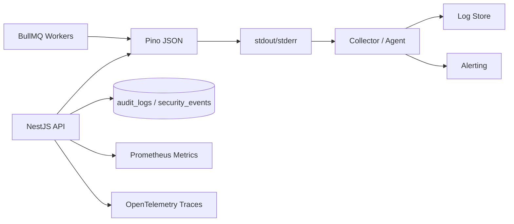

<!-- ENTÊTE DE PROVENANCE — ajouté le 30 juillet 2026, contenu d'origine non modifié -->
> ### 🔖 Statut documentaire : `BASELINE — FAIT AUTORITÉ`
>
> | | |
> |---|---|
> | **Chemin canonique** | `docs/observability/PINO_LOGGING_SPECIFICATION.md` |
> | **Ancien chemin** | `docs/Eventini-Pino-Logging-System-Specification.md` |
> | **Référence dans le corpus** | **Document D** |
> | **Fait autorité pour** | niveaux et politique de niveaux (§6-7), catégories (§8), **schéma canonique des champs (§9)**, event codes (§10), request ID (§11), trace context (§12), politiques par dépendance (§19, §23-27), redaction (§30), minimisation PII (§31), sampling (§32), rétention (§34), alertes (§35), métriques (§36), variables `LOG_*` (§38) |
> | **Arbitrage gagné** | le verrou terminologique de la §3.2 (`organizationId`, jamais `orgId` / `tenant` / `tenantId` / `organization`) l'emporte sur le `tenantId` du Document C — voir [ADR-0006](../adr/0006-organizationid-terminology.md) |
> | **Arbitrage gagné** | le schéma de log de la §9 l'emporte sur celui du Document C §36.1 (C-7) |
> | **Corrections nécessaires** | les chemins de redaction de la §30 mélangent chemins réels (`req.headers.authorization`) et clés nues (`password`, `accessToken`) — ces dernières ne sont **pas** des `redact.paths` Pino valides sans wildcard (C-24) · la §37 promet `log-serializers.ts` mais aucun serializer n'est spécifié (C-25) · l'arborescence dit `api/`, le répertoire réel est `backend/` |
> | **Registre des conflits** | [`PROJECT_DOCUMENTATION_INDEX.md` §5](../PROJECT_DOCUMENTATION_INDEX.md) — entrées C-1 à C-31 |
>
> ⚠️ Les 13 fichiers de `backend/src/infrastructure/logging/` existent et font **0 octet**. Rien de ce document n'est implémenté.

---

# Eventini — Spécification du système de logging avec Pino

> **Document de référence pour agent IA et équipe d’ingénierie**  
> **Version :** 1.0  
> **Statut :** Baseline d’implémentation production  
> **Projet :** Eventini SaaS  
> **Stack cible :** NestJS 11, Pino, nestjs-pino, pino-http, PostgreSQL, Redis, BullMQ, Prometheus  
> **Périmètre :** API, workers, sécurité, audit, intégrations, temps réel et opérations  
> **Dernière mise à jour :** 28 juillet 2026

---

## Table des matières

1. [Objet](#1-objet)
2. [Objectifs du système de logging](#2-objectifs-du-système-de-logging)
3. [Principes directeurs](#3-principes-directeurs)
4. [Architecture cible](#4-architecture-cible)
5. [Rôles de Pino, de l’audit et des métriques](#5-rôles-de-pino-de-laudit-et-des-métriques)
6. [Niveaux de logs](#6-niveaux-de-logs)
7. [Politique de niveaux](#7-politique-de-niveaux)
8. [Catégories de logs](#8-catégories-de-logs)
9. [Schéma canonique d’un log](#9-schéma-canonique-dun-log)
10. [Event codes](#10-event-codes)
11. [Request ID et corrélation](#11-request-id-et-corrélation)
12. [Trace ID et OpenTelemetry](#12-trace-id-et-opentelemetry)
13. [Contexte multi-tenant](#13-contexte-multi-tenant)
14. [Configuration locale](#14-configuration-locale)
15. [Configuration test et CI](#15-configuration-test-et-ci)
16. [Configuration staging](#16-configuration-staging)
17. [Configuration production](#17-configuration-production)
18. [Mode diagnostic temporaire](#18-mode-diagnostic-temporaire)
19. [Logs HTTP](#19-logs-http)
20. [Logs métier](#20-logs-métier)
21. [Logs de sécurité](#21-logs-de-sécurité)
22. [Logs d’audit](#22-logs-daudit)
23. [Logs PostgreSQL et Prisma](#23-logs-postgresql-et-prisma)
24. [Logs Redis](#24-logs-redis)
25. [Logs BullMQ](#25-logs-bullmq)
26. [Logs temps réel et SSE](#26-logs-temps-réel-et-sse)
27. [Logs des intégrations externes](#27-logs-des-intégrations-externes)
28. [Journalisation des erreurs](#28-journalisation-des-erreurs)
29. [Gestion des erreurs fatales](#29-gestion-des-erreurs-fatales)
30. [Redaction et données sensibles](#30-redaction-et-données-sensibles)
31. [Protection des données personnelles](#31-protection-des-données-personnelles)
32. [Sampling et réduction du bruit](#32-sampling-et-réduction-du-bruit)
33. [Transport et centralisation](#33-transport-et-centralisation)
34. [Rotation et rétention](#34-rotation-et-rétention)
35. [Alertes](#35-alertes)
36. [Métriques liées aux logs](#36-métriques-liées-aux-logs)
37. [Structure des dossiers](#37-structure-des-dossiers)
38. [Variables d’environnement](#38-variables-denvironnement)
39. [Tests obligatoires](#39-tests-obligatoires)
40. [Ordre d’implémentation](#40-ordre-dimplémentation)
41. [Règles pour l’agent IA](#41-règles-pour-lagent-ia)
42. [Critères d’acceptation](#42-critères-dacceptation)
43. [Checklist de production](#43-checklist-de-production)
44. [Runbook d’incident](#44-runbook-dincident)
45. [Conclusion](#45-conclusion)

---

# 1. Objet

Ce document définit l’architecture, les conventions, les exigences de sécurité, les règles d’exploitation et les critères d’acceptation du système de logging Eventini.

Il doit être utilisé par :

- l’agent IA chargé d’implémenter le système ;
- les développeurs backend ;
- les développeurs workers BullMQ ;
- les responsables sécurité ;
- les responsables DevOps et observabilité ;
- les responsables support et exploitation.

Le document couvre :

- Pino ;
- `nestjs-pino` ;
- `pino-http` ;
- les niveaux de logs ;
- la corrélation ;
- la redaction ;
- les logs HTTP ;
- les logs métier ;
- les logs de sécurité ;
- les logs d’audit ;
- Redis ;
- PostgreSQL ;
- BullMQ ;
- SSE ;
- les intégrations ;
- la centralisation ;
- la rétention ;
- les alertes ;
- les tests.

---

# 2. Objectifs du système de logging

Le système doit permettre de répondre rapidement aux questions suivantes :

- Quelle requête a échoué ?
- Quelle instance a traité la requête ?
- Quel utilisateur, tenant, événement ou appareil était concerné ?
- Quel use case a échoué ?
- Quelle dépendance est responsable ?
- L’erreur est-elle fonctionnelle, technique ou sécuritaire ?
- La requête était-elle un retry ?
- Une opération idempotente a-t-elle été rejouée ?
- Un job BullMQ a-t-il été retenté ?
- Une session ou une organisation a-t-elle été suspendue ?
- Une donnée sensible a-t-elle été exposée dans les logs ?
- Peut-on corréler le log avec une trace distribuée ?
- L’événement nécessite-t-il une alerte ?

Le système doit être :

- structuré ;
- centralisé ;
- sécurisé ;
- multi-tenant ;
- observable ;
- performant ;
- compatible multi-instance ;
- testable ;
- exploitable en local et en production.

---

# 3. Principes directeurs

## 3.1 Logs structurés

Tous les logs production doivent être émis en JSON structuré.

Interdit :

```text
"Something failed for user 123 in org 456"
```

Recommandé :

```json
{
  "eventCode": "USER_OPERATION_FAILED",
  "userId": "usr_123",
  "organizationId": "org_456",
  "result": "FAILURE",
  "msg": "User operation failed"
}
```

## 3.2 Une seule terminologie

Les mêmes champs doivent être utilisés partout :

```text
requestId
traceId
organizationId
eventId
userId
sessionId
deviceId
jobId
eventCode
category
result
durationMs
```

Ne pas utiliser alternativement :

```text
orgId
tenant
tenantId
organization
```

La convention Eventini doit rester stable.

## 3.3 Pas de secrets

Aucun log ne doit contenir :

- mot de passe ;
- access token ;
- refresh token ;
- cookie ;
- Authorization header ;
- secret MFA ;
- code MFA ;
- recovery code ;
- token d’invitation ;
- token de reset ;
- secret QR ;
- clé privée ;
- credential d’intégration.

## 3.4 Une erreur, un log

Une erreur ne doit pas être journalisée à chaque couche.

Mauvais exemple :

```text
Repository -> error
Service -> error
Controller -> error
Exception Filter -> error
```

Le même incident ne doit pas produire quatre lignes identiques.

## 3.5 Le logger n’est pas l’audit

Pino sert à l’exploitation.

Les événements critiques doivent aussi être persistés dans :

```text
audit_logs
security_events
```

## 3.6 Standard output

En production, l’application doit écrire sur :

```text
stdout / stderr
```

Le collecteur externe prend en charge :

- l’acheminement ;
- le buffering ;
- la rotation ;
- la rétention ;
- l’indexation ;
- les alertes.

---

# 4. Architecture cible



Architecture recommandée :

```text
NestJS / Worker
    ↓
nestjs-pino + pino-http
    ↓
JSON NDJSON
    ↓
stdout
    ↓
Docker / Kubernetes / systemd
    ↓
Vector / Fluent Bit / Filebeat / Promtail / agent fournisseur
    ↓
Loki / OpenSearch / Elasticsearch / Datadog / autre
```

---

# 5. Rôles de Pino, de l’audit et des métriques

## Pino

Utilisé pour :

- diagnostic ;
- exploitation ;
- requêtes HTTP ;
- erreurs techniques ;
- jobs ;
- dépendances ;
- performance ;
- sécurité opérationnelle.

## `audit_logs`

Utilisé pour :

- changements administratifs ;
- modifications de rôles ;
- suspension ;
- révocation ;
- suppression ;
- changement d’état métier critique ;
- actions SUPER_ADMIN.

## `security_events`

Utilisé pour :

- login échoué ;
- compte verrouillé ;
- MFA échoué ;
- réutilisation refresh token ;
- CSRF refusé ;
- Origin refusée ;
- accès inter-tenant ;
- détection de compromission.

## Prometheus

Utilisé pour :

- compter ;
- mesurer les taux ;
- calculer les latences ;
- déclencher des alertes sur seuil.

## OpenTelemetry

Utilisé pour :

- suivre un flux distribué ;
- corréler API, DB, Redis, queues et intégrations.

---

# 6. Niveaux de logs

| Niveau Pino | Valeur | Équivalent NestJS | Usage |
|---|---:|---|---|
| `trace` | 10 | `verbose` | Détails très fins |
| `debug` | 20 | `debug` | Diagnostic technique |
| `info` | 30 | `log` | Fonctionnement normal |
| `warn` | 40 | `warn` | Situation anormale récupérable |
| `error` | 50 | `error` | Opération échouée |
| `fatal` | 60 | `fatal` | Processus incapable de continuer |
| `silent` | ∞ | Aucun | Aucun log |

Le niveau configuré agit comme un seuil.

Exemple :

```text
LOG_LEVEL=info
```

autorise :

```text
info
warn
error
fatal
```

et masque :

```text
debug
trace
```

---

# 7. Politique de niveaux

# 7.1 `trace`

Utiliser pour :

- entrée dans une méthode interne ;
- détail de résolution tenant ;
- détail de cache ;
- étapes d’une transaction ;
- construction d’une policy ;
- détail d’un mapping.

Ne pas activer globalement en production normale.

Exemple :

```json
{
  "level": 10,
  "context": "TenantContextService",
  "category": "APPLICATION",
  "eventCode": "TENANT_RESOLUTION_STEP",
  "step": "MEMBERSHIP_LOOKUP",
  "msg": "Tenant resolution step completed"
}
```

# 7.2 `debug`

Utiliser pour :

- cache hit/miss ;
- décision technique ;
- déduplication ;
- retry préparé ;
- fallback activé ;
- sélection d’une stratégie ;
- état détaillé d’un workflow.

Exemple :

```json
{
  "level": 20,
  "context": "SessionService",
  "category": "CACHE",
  "eventCode": "SESSION_CACHE_MISS",
  "sessionId": "ses_123",
  "fallback": "POSTGRESQL",
  "msg": "Session was not found in cache"
}
```

# 7.3 `info`

Utiliser pour :

- démarrage réussi ;
- arrêt propre ;
- opération métier importante réussie ;
- session créée ;
- job démarré ;
- import terminé ;
- appareil enregistré ;
- organisation créée.

Exemple :

```json
{
  "level": 30,
  "category": "BUSINESS",
  "eventCode": "ORGANIZATION_CREATED",
  "organizationId": "org_123",
  "result": "SUCCESS",
  "msg": "Organization created"
}
```

# 7.4 `warn`

Utiliser pour :

- comportement inhabituel ;
- retry ;
- ressource approchant une limite ;
- accès refusé suspect ;
- Redis indisponible avec fallback ;
- latence élevée ;
- rate limit atteint ;
- doublons dans une synchronisation.

Exemple :

```json
{
  "level": 40,
  "category": "SECURITY",
  "eventCode": "RATE_LIMIT_EXCEEDED",
  "requestId": "req_123",
  "policy": "LOGIN_BY_IP_AND_EMAIL",
  "msg": "Authentication rate limit exceeded"
}
```

# 7.5 `error`

Utiliser pour :

- transaction échouée ;
- opération non terminée ;
- job final échoué ;
- dépendance indisponible sans fallback ;
- erreur non gérée ;
- intégration externe définitivement en échec.

Exemple :

```json
{
  "level": 50,
  "category": "DATABASE",
  "eventCode": "DATABASE_TRANSACTION_FAILED",
  "operation": "rotateSession",
  "requestId": "req_123",
  "err": {
    "type": "PrismaClientKnownRequestError",
    "message": "Transaction failed",
    "stack": "..."
  },
  "msg": "Database transaction failed"
}
```

# 7.6 `fatal`

Utiliser uniquement si l’instance ne peut pas continuer :

- secret critique absent ;
- configuration non valide ;
- connexion DB obligatoire impossible au démarrage ;
- corruption critique ;
- bootstrap échoué ;
- uncaught exception nécessitant arrêt.

Exemple :

```json
{
  "level": 60,
  "category": "SYSTEM",
  "eventCode": "APPLICATION_STARTUP_FAILED",
  "errorCode": "DATABASE_UNAVAILABLE",
  "msg": "Application startup failed"
}
```

Après `fatal`, le processus doit généralement s’arrêter avec un code non nul.

---

# 8. Catégories de logs

Utiliser le champ `category`.

Valeurs recommandées :

```text
SYSTEM
HTTP_ACCESS
APPLICATION
BUSINESS
SECURITY
AUDIT
DATABASE
CACHE
QUEUE
REALTIME
INTEGRATION
PERFORMANCE
```

Le niveau exprime la gravité.

La catégorie exprime la nature.

L’`eventCode` exprime l’événement exact.

---

# 9. Schéma canonique d’un log

Exemple complet :

```json
{
  "level": 30,
  "time": 1785268800000,
  "service": "eventini-api",
  "serviceVersion": "1.0.0",
  "environment": "production",
  "instanceId": "api-7f8d96",
  "context": "CreateResourceUseCase",
  "category": "BUSINESS",
  "eventCode": "RESOURCE_CREATED",
  "msg": "Resource created successfully",

  "requestId": "req_01JABC",
  "traceId": "4bf92f3577b34da6a3ce929d0e0e4736",
  "spanId": "00f067aa0ba902b7",

  "organizationId": "org_01",
  "eventId": "evt_01",
  "membershipId": "mbr_01",
  "userId": "usr_01",
  "sessionId": "ses_01",
  "deviceId": "dev_01",

  "operation": "createResource",
  "result": "SUCCESS",
  "durationMs": 43
}
```

## 9.1 Champs globaux

```text
level
time
service
serviceVersion
environment
instanceId
context
category
eventCode
msg
```

## 9.2 Champs de corrélation

```text
requestId
traceId
spanId
```

## 9.3 Champs tenant

```text
organizationId
eventId
membershipId
```

## 9.4 Champs identité

```text
userId
sessionId
deviceId
scannerId
```

## 9.5 Champs jobs

```text
jobId
queueName
jobName
attempt
maxAttempts
deduplicationId
```

## 9.6 Champs résultat

```text
operation
result
reasonCode
errorCode
durationMs
```

---

# 10. Event codes

Les messages changent.

Les `eventCode` doivent rester stables.

Exemples :

```text
APPLICATION_STARTED
APPLICATION_STOPPING
HTTP_REQUEST_COMPLETED
HTTP_REQUEST_FAILED
DATABASE_CONNECTED
DATABASE_CONNECTION_FAILED
REDIS_CONNECTED
REDIS_FALLBACK_ACTIVATED
JOB_STARTED
JOB_RETRY_SCHEDULED
JOB_SUCCEEDED
JOB_FAILED_FINAL
LOGIN_SUCCEEDED
LOGIN_FAILED
ACCOUNT_LOCKED
SESSION_CREATED
SESSION_REVOKED
REFRESH_TOKEN_REUSE_DETECTED
CSRF_VALIDATION_FAILED
TENANT_ACCESS_DENIED
ROLE_CHANGED
ORGANIZATION_SUSPENDED
SLOW_DATABASE_QUERY
SLOW_HTTP_REQUEST
```

Créer un catalogue central :

```text
log-event-codes.ts
```

et une documentation :

```text
docs/observability/log-event-catalogue.md
```

---

# 11. Request ID et corrélation

Chaque requête doit posséder un `requestId`.

Flux :

```text
Requête entrante
    ↓
Header X-Request-Id valide ?
    ├── oui : le conserver
    └── non : générer un identifiant
    ↓
Attacher au contexte
    ↓
Retourner dans la réponse
    ↓
Inclure dans tous les logs
```

Le `requestId` doit apparaître dans :

- log HTTP ;
- log use case ;
- log repository si nécessaire ;
- audit ;
- security event ;
- job créé ;
- réponse API `meta.requestId`.

Le request ID client doit être validé :

- taille maximale ;
- caractères autorisés ;
- absence de contrôle ;
- absence de données personnelles.

Le serveur peut remplacer un ID non conforme.

---

# 12. Trace ID et OpenTelemetry

Le `traceId` suit une opération distribuée.

Exemple :

```text
Next.js
  → NestJS
  → PostgreSQL
  → Redis
  → BullMQ
  → Worker
  → Email provider
```

Champs recommandés :

```text
traceId
spanId
traceFlags
```

Propagation :

```text
traceparent
tracestate
```

Ordre recommandé :

1. implémenter `requestId` ;
2. structurer les logs ;
3. ajouter OpenTelemetry ;
4. injecter `traceId` et `spanId` dans Pino ;
5. corréler logs et traces.

---

# 13. Contexte multi-tenant

Tous les logs tenant-scoped doivent inclure :

```text
organizationId
```

Ajouter lorsque pertinent :

```text
eventId
membershipId
userId
sessionId
deviceId
```

Ne pas extraire aveuglément le tenant depuis une donnée client.

Le tenant loggué doit être le tenant résolu côté serveur.

Mauvais exemple :

```text
organizationId = req.body.organizationId
```

Bon exemple :

```text
organizationId = tenantContext.organizationId
```

---

# 14. Configuration locale

Recommandation :

```text
LOG_LEVEL=debug
LOG_FORMAT=pretty
LOG_PRETTY=true
```

Utiliser `pino-pretty`.

Affichage souhaité :

```text
21:30:22 INFO  [AuthenticationService] Session created
21:30:22 DEBUG [SessionRepository] Session persisted
21:30:22 WARN  [RateLimiter] Threshold approached
```

En local :

- couleurs autorisées ;
- timestamps lisibles ;
- contexte visible ;
- request ID visible ;
- pas de secret ;
- redaction active.

`trace` peut être activé temporairement.

---

# 15. Configuration test et CI

## Tests unitaires

```text
LOG_LEVEL=silent
```

ou :

```text
LOG_LEVEL=error
```

Le logger peut être mocké.

Les tests doivent pouvoir vérifier :

- eventCode ;
- niveau ;
- contexte ;
- redaction ;
- corrélation.

## CI

Recommandation :

```text
LOG_LEVEL=warn
LOG_FORMAT=json
LOG_PRETTY=false
```

En cas d’échec :

- conserver les logs comme artefact ;
- conserver request ID et trace ID ;
- ne pas afficher de secrets ;
- éviter le bruit inutile.

---

# 16. Configuration staging

Staging doit être proche de production :

```text
LOG_LEVEL=info
LOG_FORMAT=json
LOG_PRETTY=false
LOG_REDACTION_ENABLED=true
```

Autorisé temporairement :

```text
LOG_LEVEL=debug
```

La redaction ne doit jamais être désactivée.

---

# 17. Configuration production

Baseline :

```text
LOG_LEVEL=info
LOG_FORMAT=json
LOG_PRETTY=false
LOG_REDACTION_ENABLED=true
LOG_HTTP_ENABLED=true
```

Règles :

- NDJSON ;
- stdout ;
- aucune pretty print ;
- aucun body complet ;
- redaction stricte ;
- centralisation ;
- request ID ;
- trace ID si disponible ;
- audit PostgreSQL séparé ;
- alertes actives.

---

# 18. Mode diagnostic temporaire

Prévoir une capacité contrôlée :

```text
LOG_LEVEL=debug
LOG_DEBUG_MODULES=identity,sessions,redis
LOG_DEBUG_EXPIRES_AT=2026-07-29T02:00:00Z
```

Exigences :

- activation protégée ;
- durée maximale ;
- expiration automatique ;
- audit de l’activation ;
- redaction toujours active ;
- scope limité ;
- retour automatique à `info`.

Ne pas créer une route publique permettant de modifier librement le niveau.

---

# 19. Logs HTTP

Une requête doit généralement produire une ligne de fin.

Exemple :

```json
{
  "level": 30,
  "category": "HTTP_ACCESS",
  "eventCode": "HTTP_REQUEST_COMPLETED",
  "requestId": "req_01",
  "method": "GET",
  "route": "/api/v1/resources/:resourceId",
  "statusCode": 200,
  "durationMs": 38,
  "msg": "HTTP request completed"
}
```

## Politique de niveaux HTTP

| Statut | Niveau recommandé |
|---|---|
| `2xx` | `info` |
| `3xx` | `info` ou ignoré |
| `400`, `404`, `409`, `422` attendus | `info` |
| `401`, `403` isolés | `info` |
| `401`, `403` suspects ou répétés | `warn` via log sécurité |
| `429` | `warn` |
| `5xx` | `error` |

## Routes à ignorer ou sampler

```text
/health/live
/health/ready
/metrics
```

## Body HTTP

Ne pas logguer automatiquement :

```text
req.body
res.body
```

Logguer uniquement un résumé explicitement construit.

---

# 20. Logs métier

Les logs métier doivent signaler une transition importante.

Exemples :

```text
RESOURCE_CREATED
RESOURCE_UPDATED
RESOURCE_ACTIVATED
RESOURCE_SUSPENDED
IMPORT_STARTED
IMPORT_COMPLETED
INVITATION_QUEUED
CHECK_IN_ACCEPTED
```

Exemple :

```json
{
  "level": 30,
  "category": "BUSINESS",
  "eventCode": "IMPORT_COMPLETED",
  "organizationId": "org_01",
  "jobId": "job_01",
  "processedCount": 1200,
  "successCount": 1187,
  "failureCount": 13,
  "durationMs": 8200,
  "msg": "Import completed"
}
```

Ne pas logguer la liste des données importées.

---

# 21. Logs de sécurité

Événements recommandés :

```text
LOGIN_FAILED
ACCOUNT_LOCKED
MFA_FAILED
CSRF_VALIDATION_FAILED
ORIGIN_VALIDATION_FAILED
TENANT_ACCESS_DENIED
REFRESH_TOKEN_REUSE_DETECTED
SESSION_COMPROMISED
ROLE_ESCALATION_ATTEMPTED
RATE_LIMIT_EXCEEDED
```

Exemple :

```json
{
  "level": 40,
  "category": "SECURITY",
  "eventCode": "TENANT_ACCESS_DENIED",
  "requestId": "req_01",
  "userId": "usr_01",
  "organizationId": "org_allowed",
  "targetOrganizationId": "org_denied",
  "reasonCode": "RESOURCE_OUTSIDE_TENANT",
  "msg": "Cross-tenant access attempt denied"
}
```

Les événements critiques doivent aussi être enregistrés dans `security_events`.

---

# 22. Logs d’audit

Pino peut produire une ligne d’exploitation :

```json
{
  "level": 30,
  "category": "AUDIT",
  "eventCode": "ROLE_CHANGED",
  "actorUserId": "usr_admin",
  "targetUserId": "usr_target",
  "organizationId": "org_01",
  "previousRole": "SCANNER",
  "newRole": "CLIENT_ADMIN",
  "msg": "User role changed"
}
```

Mais la preuve durable doit être dans `audit_logs`.

Les logs d’audit ne doivent pas être échantillonnés.

---

# 23. Logs PostgreSQL et Prisma

Politique :

```text
requête normale → aucun log
requête lente → warn
conflit métier attendu → info ou warn
erreur DB inattendue → error
connexion impossible au démarrage → fatal
```

Exemple :

```json
{
  "level": 40,
  "category": "DATABASE",
  "eventCode": "SLOW_DATABASE_QUERY",
  "operation": "listResources",
  "model": "Resource",
  "durationMs": 1280,
  "thresholdMs": 500,
  "msg": "Database operation exceeded latency threshold"
}
```

Ne pas logguer :

- SQL complet contenant des données ;
- paramètres bruts ;
- URL DB ;
- mot de passe ;
- ligne Prisma complète.

---

# 24. Logs Redis

Politique :

```text
GET/SET normal → aucun log
cache hit/miss → debug
fallback → warn
indisponibilité critique → error
connexion impossible au démarrage si obligatoire → fatal
```

Exemple :

```json
{
  "level": 40,
  "category": "CACHE",
  "eventCode": "REDIS_FALLBACK_ACTIVATED",
  "operation": "getSession",
  "fallback": "POSTGRESQL",
  "msg": "Redis unavailable; fallback activated"
}
```

Ne pas logguer :

- valeur de session ;
- token ;
- clé contenant un secret ;
- contenu du cache.

---

# 25. Logs BullMQ

Chaque job doit inclure :

```text
jobId
queueName
jobName
attempt
maxAttempts
organizationId
eventId
requestId
traceId
deduplicationId
```

## Démarrage

```json
{
  "level": 30,
  "category": "QUEUE",
  "eventCode": "JOB_STARTED",
  "queueName": "notifications",
  "jobName": "send-message",
  "jobId": "job_01",
  "attempt": 1,
  "msg": "Queue job started"
}
```

## Retry

```json
{
  "level": 40,
  "category": "QUEUE",
  "eventCode": "JOB_RETRY_SCHEDULED",
  "jobId": "job_01",
  "attempt": 2,
  "maxAttempts": 5,
  "retryDelayMs": 30000,
  "errorCode": "PROVIDER_TIMEOUT",
  "msg": "Queue job retry scheduled"
}
```

## Échec final

```json
{
  "level": 50,
  "category": "QUEUE",
  "eventCode": "JOB_FAILED_FINAL",
  "jobId": "job_01",
  "attempt": 5,
  "msg": "Queue job exhausted all retries"
}
```

Ne pas logguer le payload complet du job.

---

# 26. Logs temps réel et SSE

Politique :

```text
connexion ouverte → debug
connexion fermée normalement → debug
erreur d’écriture → warn ou error
backpressure → warn
nombre de connexions → métrique
chaque événement diffusé → pas en info
```

Exemple :

```json
{
  "level": 20,
  "category": "REALTIME",
  "eventCode": "SSE_CLIENT_CONNECTED",
  "organizationId": "org_01",
  "connectionId": "sse_01",
  "msg": "Realtime client connected"
}
```

Métriques préférables :

```text
active_sse_connections
sse_events_sent_total
sse_delivery_errors_total
```

---

# 27. Logs des intégrations externes

Pour chaque appel externe :

- nom du fournisseur ;
- opération ;
- durée ;
- statut ;
- retry ;
- timeout ;
- request ID externe si disponible.

Exemple :

```json
{
  "level": 40,
  "category": "INTEGRATION",
  "eventCode": "EXTERNAL_PROVIDER_RETRY",
  "provider": "email-provider",
  "operation": "sendEmail",
  "attempt": 2,
  "durationMs": 5000,
  "errorCode": "TIMEOUT",
  "msg": "External provider call will be retried"
}
```

Ne pas logguer :

- API key ;
- Authorization ;
- body sensible ;
- réponse complète non contrôlée.

---

# 28. Journalisation des erreurs

## Erreur métier attendue

Exemples :

```text
RESOURCE_ALREADY_EXISTS
VERSION_CONFLICT
SESSION_ALREADY_REVOKED
```

Politique :

- `info` ou `warn` ;
- pas de stack obligatoire ;
- code métier ;
- contexte ;
- résultat.

## Erreur technique inattendue

Politique :

- `error` ;
- objet `err` ;
- stack interne ;
- operation ;
- requestId ;
- dépendance ;
- contexte tenant.

## Règle de log unique

La couche choisie doit posséder assez de contexte.

Recommandation :

- repository transforme l’erreur ;
- use case ajoute le contexte ;
- global exception filter loggue l’erreur non gérée ;
- controller ne reloggue pas.

---

# 29. Gestion des erreurs fatales

Événements :

```text
uncaughtException
unhandledRejection
startup failure
configuration invalid
dependency mandatory unavailable
```

Procédure :

1. produire un `fatal` ;
2. arrêter d’accepter de nouvelles requêtes ;
3. signaler not-ready ;
4. arrêter workers ;
5. fermer HTTP ;
6. fermer Prisma ;
7. fermer Redis ;
8. tenter de flush les logs ;
9. quitter avec code non nul ;
10. laisser l’orchestrateur redémarrer.

Ne pas continuer après un état potentiellement corrompu.

---

# 30. Redaction et données sensibles

Configurer une redaction centrale.

Chemins à supprimer ou masquer :

```text
req.headers.authorization
req.headers.cookie
req.headers.x-api-key
res.headers.set-cookie

password
currentPassword
newPassword
passwordConfirmation
passwordHash

accessToken
refreshToken
token
tokenHash
jwt

csrfToken
x-csrf-token

mfaSecret
totpSecret
totpCode
recoveryCode
recoveryCodes

invitationToken
passwordResetToken
emailVerificationToken

qrPayload
qrSignature
qrSecret

smtpPassword
databaseUrl
redisUrl
apiKey
clientSecret
privateKey
```

Pour les headers et secrets, préférer la suppression complète.

La redaction est une défense secondaire.

La première règle est de ne pas transmettre le secret au logger.

---

# 31. Protection des données personnelles

Données à minimiser :

```text
email
phone
IP
user-agent
nom
adresse
identifiants externes
```

Recommandations :

- email pseudonymisé ou partiellement masqué ;
- IP tronquée selon usage ;
- pas de body complet ;
- pas de profil complet ;
- pas de recherche plein texte dans les logs ;
- rétention limitée ;
- accès RBAC aux logs ;
- audit des accès au système de logs.

Exemple :

```text
m***@example.com
197.0.x.x
```

Les identifiants techniques sont préférables aux données personnelles.

---

# 32. Sampling et réduction du bruit

Peuvent être samplés :

- requêtes HTTP `2xx` fréquentes ;
- cache hits ;
- health checks ;
- polling ;
- connexions SSE normales ;
- logs debug volumineux.

Ne doivent pas être samplés :

- `error` ;
- `fatal` ;
- événements sécurité critiques ;
- audit ;
- changement de rôle ;
- révocation ;
- kill-switch ;
- refresh token reuse ;
- job final échoué.

Le sampling peut être réalisé dans le collector.

---

# 33. Transport et centralisation

Recommandation :

```text
Pino
  → stdout
  → collector
  → log store
```

Éviter :

```text
application
  → connexion directe obligatoire vers Elasticsearch
```

Avantages :

- découplage ;
- résilience ;
- buffering ;
- configuration centralisée ;
- credentials limités ;
- routage indépendant.

Destinations possibles :

- Loki ;
- OpenSearch ;
- Elasticsearch ;
- Datadog ;
- Splunk ;
- autre plateforme.

Le choix du backend ne doit pas modifier le contrat Pino interne.

---

# 34. Rotation et rétention

La rotation ne doit généralement pas être gérée par NestJS dans un conteneur.

La rétention dépend de la catégorie.

Exemple indicatif :

| Catégorie | Rétention |
|---|---:|
| trace/debug | 3 à 7 jours |
| HTTP access | 14 à 30 jours |
| application info | 30 à 90 jours |
| erreurs | 90 jours ou plus |
| sécurité | 6 à 12 mois selon politique |
| audit DB | selon exigences métier et légales |

Exigences :

- chiffrement au repos ;
- contrôle d’accès ;
- suppression automatique ;
- sauvegarde si nécessaire ;
- classification des données ;
- politique documentée.

---

# 35. Alertes

## Alertes immédiates

```text
APPLICATION_STARTUP_FAILED
DATABASE_CONNECTION_FAILED
REFRESH_TOKEN_REUSE_DETECTED
JOB_FAILED_FINAL sur job critique
ORGANIZATION_KILL_SWITCH_EXECUTED
Aucun SUPER_ADMIN actif
hausse soudaine de 5xx
```

## Alertes par seuil

```text
LOGIN_FAILED en hausse
CSRF_VALIDATION_FAILED en hausse
TENANT_ACCESS_DENIED en hausse
RATE_LIMIT_EXCEEDED en hausse
p95 HTTP élevé
queue backlog élevé
Redis fallback fréquent
slow queries fréquentes
```

Ne pas créer une alerte par erreur utilisateur ordinaire.

---

# 36. Métriques liées aux logs

Créer des métriques séparées plutôt que de compter uniquement dans les logs.

Exemples :

```text
http_requests_total
http_request_duration_seconds
application_errors_total
security_events_total
login_failures_total
refresh_token_reuse_total
queue_jobs_failed_total
queue_job_duration_seconds
redis_fallback_total
slow_queries_total
active_sse_connections
```

Labels autorisés :

```text
route
method
status
category
eventCode contrôlé
queueName
service
environment
```

Éviter :

```text
userId
requestId
resourceId
email
```

---

# 37. Structure des dossiers

```text
api/src/infrastructure/logging/
├── logging.module.ts
├── logging.config.ts
├── logging.constants.ts
├── logging.types.ts
├── log-event-codes.ts
├── log-categories.ts
├── log-redaction.config.ts
├── log-serializers.ts
├── request-id.middleware.ts
├── request-context.service.ts
├── request-context.interceptor.ts
├── http-logging.config.ts
├── exception-logging.filter.ts
├── pino-bootstrap.ts
└── index.ts
```

Documentation :

```text
docs/observability/logging-architecture.md
docs/observability/log-event-catalogue.md
docs/observability/log-redaction-policy.md
docs/observability/log-retention-policy.md
docs/operations/logging-runbook.md
```

---

# 38. Variables d’environnement

Variables recommandées :

```text
LOG_LEVEL
LOG_FORMAT
LOG_PRETTY
LOG_SERVICE_NAME
LOG_SERVICE_VERSION
LOG_REDACTION_ENABLED
LOG_HTTP_ENABLED
LOG_HTTP_SUCCESS_ENABLED
LOG_SLOW_REQUEST_THRESHOLD_MS
LOG_SLOW_QUERY_THRESHOLD_MS
LOG_DEBUG_MODULES
LOG_DEBUG_EXPIRES_AT
```

## Local

```text
LOG_LEVEL=debug
LOG_FORMAT=pretty
LOG_PRETTY=true
LOG_REDACTION_ENABLED=true
```

## Test

```text
LOG_LEVEL=silent
LOG_FORMAT=json
LOG_PRETTY=false
LOG_REDACTION_ENABLED=true
```

## Staging

```text
LOG_LEVEL=info
LOG_FORMAT=json
LOG_PRETTY=false
LOG_REDACTION_ENABLED=true
```

## Production

```text
LOG_LEVEL=info
LOG_FORMAT=json
LOG_PRETTY=false
LOG_REDACTION_ENABLED=true
LOG_HTTP_ENABLED=true
```

La configuration doit être validée au démarrage.

---

# 39. Tests obligatoires

## 39.1 Structure

Vérifier :

- champs globaux ;
- eventCode ;
- category ;
- context ;
- requestId ;
- tenant context ;
- niveau.

## 39.2 Redaction

Injecter des valeurs de test dans :

```text
Authorization
Cookie
password
refreshToken
csrfToken
mfaSecret
privateKey
```

Vérifier qu’elles n’apparaissent jamais.

## 39.3 HTTP

Vérifier :

- ligne de fin de requête ;
- route template ;
- status ;
- durée ;
- request ID ;
- pas de body.

## 39.4 Erreurs

Vérifier :

- stack dans log interne ;
- stack absente réponse API ;
- log unique ;
- niveau correct ;
- errorCode ;
- contexte.

## 39.5 Environnements

Vérifier :

- pretty uniquement local ;
- JSON production ;
- debug absent en prod normale ;
- redaction active partout ;
- silent ou error en tests.

## 39.6 Corrélation

Vérifier :

- même request ID dans API et use case ;
- propagation vers BullMQ ;
- présence du tenant résolu ;
- trace ID si OTel activé.

## 39.7 BullMQ

Vérifier :

- started ;
- retry ;
- success ;
- final failure ;
- pas de payload sensible.

## 39.8 Audit

Vérifier :

- événement critique dans `audit_logs` ;
- log Pino associé ;
- request ID commun ;
- aucune dépendance à Pino seul.

---

# 40. Ordre d’implémentation

## Phase 1 — Fondation

1. installer/configurer `nestjs-pino` ;
2. configurer `pino-http` ;
3. remplacer le logger NestJS ;
4. définir JSON canonique ;
5. créer les constantes de niveaux et catégories.

## Phase 2 — Corrélation

1. générer request ID ;
2. propager dans AsyncLocalStorage ou mécanisme équivalent ;
3. ajouter contexte NestJS ;
4. retourner request ID dans la réponse.

## Phase 3 — Redaction

1. définir la politique ;
2. configurer Pino ;
3. ajouter serializers sûrs ;
4. écrire les tests de fuite de secrets.

## Phase 4 — HTTP

1. auto logging ;
2. mapping status → level ;
3. ignorer health/metrics ;
4. slow request warning ;
5. pas de body.

## Phase 5 — Application

1. event codes ;
2. logs métier ;
3. logs sécurité ;
4. logs erreurs ;
5. règle de log unique.

## Phase 6 — Dépendances

1. Prisma ;
2. Redis ;
3. BullMQ ;
4. intégrations ;
5. SSE.

## Phase 7 — Centralisation

1. stdout ;
2. collector ;
3. log store ;
4. dashboards ;
5. recherche ;
6. alertes.

## Phase 8 — Observabilité avancée

1. Prometheus ;
2. OpenTelemetry ;
3. trace correlation ;
4. runbooks ;
5. tests d’incident.

---

# 41. Règles pour l’agent IA

L’agent doit :

1. inspecter la configuration actuelle ;
2. réutiliser `nestjs-pino` et Pino existants ;
3. éviter un second logger ;
4. créer une configuration centrale ;
5. conserver les niveaux standards ;
6. créer des `eventCode` stables ;
7. implémenter la redaction avant les logs métier ;
8. ne pas logguer les bodies ;
9. propager request ID ;
10. préparer trace ID ;
11. instrumenter API et workers ;
12. tester les secrets ;
13. produire la documentation ;
14. maintenir la compilation.

L’agent ne doit pas :

- ajouter Winston ;
- créer des logs texte non structurés en production ;
- logger un objet utilisateur complet ;
- logger les headers complets ;
- logger les tokens ;
- créer un niveau `AUDIT` personnalisé sans justification ;
- écrire directement vers Elasticsearch depuis le métier ;
- journaliser la même erreur à toutes les couches ;
- activer `trace` en production permanente ;
- désactiver la redaction pour le debug ;
- utiliser `console.log` dans le code métier ;
- considérer les logs comme preuve d’audit unique.

Avant modification, l’agent doit fournir :

- fichiers créés ;
- fichiers modifiés ;
- risques ;
- compatibilité ;
- stratégie de rollback ;
- tests prévus.

Après modification, l’agent doit exécuter :

- format ;
- lint ;
- compilation ;
- tests unitaires ;
- tests E2E ;
- tests de redaction ;
- vérification de sortie JSON ;
- vérification absence de secrets.

---

# 42. Critères d’acceptation

Le système est accepté si :

- Pino est le logger unique ;
- production utilise JSON NDJSON ;
- local utilise `pino-pretty` ;
- request ID est généré et propagé ;
- tenant context est inclus lorsqu’applicable ;
- eventCode et category sont stables ;
- redaction couvre les secrets ;
- aucun body HTTP complet n’est loggué ;
- aucune erreur n’est dupliquée ;
- les `5xx` sont en `error` ;
- les erreurs fatales entraînent un arrêt propre ;
- BullMQ est corrélé ;
- Redis et Prisma sont instrumentés sans fuite ;
- logs et audit sont séparés ;
- audit critique est persistant ;
- métriques et alertes existent ;
- tests de redaction passent ;
- logs production sont centralisés ;
- politique de rétention est documentée ;
- aucun `console.log` métier ne reste ;
- aucun secret n’apparaît dans les artefacts CI.

---

# 43. Checklist de production

## Configuration

- [ ] `LOG_LEVEL=info`
- [ ] JSON activé
- [ ] pretty désactivé
- [ ] redaction activée
- [ ] service name défini
- [ ] version définie
- [ ] instance ID défini

## Corrélation

- [ ] request ID
- [ ] trace ID
- [ ] span ID
- [ ] tenant context
- [ ] user/session context
- [ ] job context

## Sécurité

- [ ] Authorization supprimé
- [ ] Cookie supprimé
- [ ] Set-Cookie supprimé
- [ ] password supprimé
- [ ] tokens supprimés
- [ ] MFA supprimé
- [ ] QR secrets supprimés
- [ ] clés privées supprimées
- [ ] tests de fuite passés

## HTTP

- [ ] route template
- [ ] status
- [ ] duration
- [ ] pas de body
- [ ] health ignoré
- [ ] metrics ignoré
- [ ] slow requests warn

## Dépendances

- [ ] Prisma slow query
- [ ] Prisma error
- [ ] Redis fallback
- [ ] Redis error
- [ ] BullMQ retry
- [ ] BullMQ final failure
- [ ] intégrations timeout

## Exploitation

- [ ] collector configuré
- [ ] stockage central
- [ ] dashboard
- [ ] alertes
- [ ] rétention
- [ ] accès RBAC
- [ ] runbook incident
- [ ] graceful shutdown

---

# 44. Runbook d’incident

Lors d’un incident :

1. récupérer le request ID ;
2. rechercher tous les logs associés ;
3. récupérer le trace ID ;
4. identifier le tenant ;
5. identifier l’instance ;
6. identifier le use case ;
7. vérifier PostgreSQL, Redis et BullMQ ;
8. vérifier les security events ;
9. vérifier les audit logs ;
10. vérifier les alertes ;
11. activer `debug` ciblé si nécessaire ;
12. définir une expiration automatique ;
13. ne jamais désactiver la redaction ;
14. corriger ;
15. revenir à `info` ;
16. documenter l’incident ;
17. ajouter un test de non-régression.

Pour une suspicion de fuite de secret :

1. considérer le secret compromis ;
2. le révoquer ou le faire tourner ;
3. restreindre l’accès aux logs ;
4. mesurer la période exposée ;
5. rechercher les accès ;
6. corriger la redaction ;
7. ajouter un test automatique ;
8. documenter l’incident de sécurité.

---

# 45. Conclusion

La baseline Eventini est :

```text
Pino JSON
+ nestjs-pino
+ pino-http
+ request context
+ tenant context
+ event codes
+ redaction stricte
+ stdout
+ collector central
+ audit PostgreSQL
+ security events
+ Prometheus
+ OpenTelemetry progressif
```

La réussite du système de logging dépend principalement de cinq règles :

1. logs structurés ;
2. corrélation complète ;
3. aucun secret ;
4. séparation exploitation / audit ;
5. alertes et rétention maîtrisées.

Le système ne doit pas seulement produire des logs. Il doit permettre de diagnostiquer, investiguer, sécuriser et exploiter Eventini en production.
