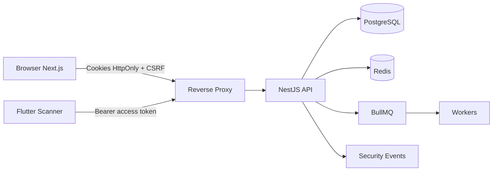
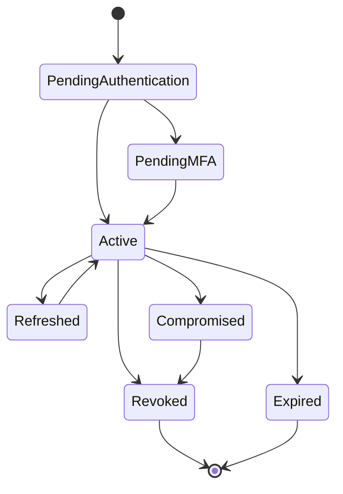

<!-- ENTÊTE DE PROVENANCE — ajouté le 30 juillet 2026, contenu d'origine non modifié -->
> ### 🔖 Statut documentaire : `BASELINE — PARTIELLEMENT SUPERSÉDÉ`
>
> | | |
> |---|---|
> | **Chemin canonique** | `docs/security/AUTHENTICATION_SECURITY_BASELINE.md` |
> | **Ancien chemin** | `docs/Eventini-Authentication-Security-Implementation-Specification.md` |
> | **Référence dans le corpus** | **Document B** |
> | **Fait autorité pour** | cookies (§14), CSRF (§15), rotation et reuse detection (§18, §23, §24), cycle de vie de session (§20), flux login/refresh/logout (§21, §23, §25), MFA (§22), séparation des clés (§40), modèle de menace STRIDE (§48), NFR (§49) |
> | **Supersédé sur** | enveloppe d'erreur (§36) → [`API_CONVENTIONS.md`](../api/API_CONVENTIONS.md) · nommage des routes auth (§44) → [ADR-0010](../adr/0010-auth-route-naming.md) · liste d'entités Prisma (§37) → [`DATABASE_SCHEMA.md`](../database/DATABASE_SCHEMA.md) · claim `tenantId` (§17) → [ADR-0006](../adr/0006-organizationid-terminology.md) · arborescence `api/` (§10) → le répertoire réel est `backend/` |
> | **Trous comblés ailleurs** | paramètres Argon2id, algorithme JWT, TTL des tokens, seuils de rate limiting et de lockout — tous absents de ce document, désormais définis dans [`AUTHENTICATION_AUTHORIZATION.md`](AUTHENTICATION_AUTHORIZATION.md) et [`RATE_LIMITING_AND_ABUSE_PREVENTION.md`](RATE_LIMITING_AND_ABUSE_PREVENTION.md) |
> | **Registre des conflits** | [`PROJECT_DOCUMENTATION_INDEX.md` §5](../PROJECT_DOCUMENTATION_INDEX.md) — entrées C-1 à C-31 |
>
> Les invariants `AUTH-INV-001` à `AUTH-INV-012` de la §9 restent normatifs et ne doivent **jamais** être renumérotés.

---

# Eventini — Spécification d’architecture et de sécurité du module d’authentification

> **Document de référence pour agent IA et équipe d’ingénierie**  
> **Version :** 2.0  
> **Statut :** Baseline d’implémentation production  
> **Projet :** Eventini  
> **Périmètre :** Backend NestJS, frontend Next.js et client mobile Flutter  
> **Niveau de sécurité visé :** OWASP ASVS niveau 2, avec contrôles renforcés pour les fonctions `SUPER_ADMIN`  
> **Dernière mise à jour :** 28 juillet 2026

---

## Table des matières

1. [Objet du document](#1-objet-du-document)
2. [Contexte Eventini](#2-contexte-eventini)
3. [Objectifs](#3-objectifs)
4. [Périmètre](#4-périmètre)
5. [Terminologie](#5-terminologie)
6. [Principes architecturaux](#6-principes-architecturaux)
7. [Acteurs et niveaux de privilège](#7-acteurs-et-niveaux-de-privilège)
8. [Architecture de confiance](#8-architecture-de-confiance)
9. [Invariants de sécurité](#9-invariants-de-sécurité)
10. [Architecture des dossiers backend](#10-architecture-des-dossiers-backend)
11. [Architecture des dossiers frontend](#11-architecture-des-dossiers-frontend)
12. [Responsabilités des modules](#12-responsabilités-des-modules)
13. [Modèle d’authentification Web](#13-modèle-dauthentification-web)
14. [Stratégie des cookies](#14-stratégie-des-cookies)
15. [Protection CSRF](#15-protection-csrf)
16. [CORS et validation de l’origine](#16-cors-et-validation-de-lorigine)
17. [Access tokens](#17-access-tokens)
18. [Refresh tokens](#18-refresh-tokens)
19. [Registre des sessions](#19-registre-des-sessions)
20. [Cycle de vie d’une session](#20-cycle-de-vie-dune-session)
21. [Flux de connexion](#21-flux-de-connexion)
22. [Flux MFA](#22-flux-mfa)
23. [Flux de renouvellement](#23-flux-de-renouvellement)
24. [Détection de réutilisation d’un refresh token](#24-détection-de-réutilisation-dun-refresh-token)
25. [Déconnexion et révocation](#25-déconnexion-et-révocation)
26. [Gestion des mots de passe](#26-gestion-des-mots-de-passe)
27. [Réinitialisation du mot de passe](#27-réinitialisation-du-mot-de-passe)
28. [Réauthentification sensible](#28-réauthentification-sensible)
29. [Invitations](#29-invitations)
30. [Authentification mobile Scanner](#30-authentification-mobile-scanner)
31. [Multi-tenancy](#31-multi-tenancy)
32. [Autorisation](#32-autorisation)
33. [Rate limiting et verrouillage](#33-rate-limiting-et-verrouillage)
34. [Protection contre les principales attaques](#34-protection-contre-les-principales-attaques)
35. [Validation des entrées](#35-validation-des-entrées)
36. [Gestion des erreurs](#36-gestion-des-erreurs)
37. [PostgreSQL et Prisma](#37-postgresql-et-prisma)
38. [Redis](#38-redis)
39. [Transactions et concurrence](#39-transactions-et-concurrence)
40. [Cryptographie et gestion des clés](#40-cryptographie-et-gestion-des-clés)
41. [Journalisation et audit](#41-journalisation-et-audit)
42. [Observabilité](#42-observabilité)
43. [En-têtes de sécurité](#43-en-têtes-de-sécurité)
44. [Contrats API](#44-contrats-api)
45. [Exigences frontend](#45-exigences-frontend)
46. [Stratégie de tests](#46-stratégie-de-tests)
47. [Matrice de tests de sécurité](#47-matrice-de-tests-de-sécurité)
48. [Modèle de menace STRIDE](#48-modèle-de-menace-stride)
49. [Exigences non fonctionnelles](#49-exigences-non-fonctionnelles)
50. [Ordre d’implémentation](#50-ordre-dimplémentation)
51. [Règles d’exécution pour l’agent IA](#51-règles-dexécution-pour-lagent-ia)
52. [Livrables obligatoires](#52-livrables-obligatoires)
53. [Critères d’acceptation](#53-critères-dacceptation)
54. [Checklist de mise en production](#54-checklist-de-mise-en-production)
55. [Références](#55-références)

---

# 1. Objet du document

Ce document constitue la **source de vérité fonctionnelle, technique et sécuritaire** pour l’implémentation du module d’authentification d’Eventini.

Il doit être utilisé par :

- l’agent IA chargé de générer ou modifier le code ;
- l’équipe backend ;
- l’équipe frontend ;
- l’équipe mobile ;
- le responsable sécurité ;
- le chef d’équipe effectuant la revue d’architecture ;
- les personnes chargées des tests d’intégration et de sécurité.

Le document ne décrit pas uniquement un écran de connexion. Il définit un système complet comprenant :

- l’authentification ;
- la gestion des sessions ;
- les cookies sécurisés ;
- la protection CSRF ;
- la rotation des refresh tokens ;
- la révocation ;
- le MFA ;
- les mots de passe ;
- les invitations ;
- le multi-tenancy ;
- les rôles et permissions ;
- le contexte organisationnel ;
- la journalisation de sécurité ;
- les tests de sécurité ;
- l’authentification mobile des scanners.

---

# 2. Contexte Eventini

Eventini est un SaaS multi-tenant de gestion d’événements.

La hiérarchie métier principale est :

```text
Plateforme Eventini
└── Organisations
    └── Événements
        └── Sessions événementielles
            └── Participants et présences
```

Les rôles initiaux sont :

- `SUPER_ADMIN` : administration globale de la plateforme ;
- `CLIENT_ADMIN` : administration d’une organisation ;
- `SCANNER` : accès limité à un événement, un dispositif ou un ensemble de sessions.

Le module d’authentification doit rester fiable lorsque la plateforme comportera :

- plusieurs milliers d’organisations ;
- plusieurs événements simultanés ;
- plusieurs administrateurs par organisation ;
- plusieurs scanners connectés ;
- des opérations de check-in en temps réel ;
- des synchronisations offline ;
- plusieurs instances backend ;
- plusieurs workers BullMQ ;
- un Redis partagé ;
- une base PostgreSQL managée ou répliquée.

---

# 3. Objectifs

## 3.1 Objectifs fonctionnels

Le module doit permettre :

- la connexion ;
- la déconnexion ;
- le renouvellement de session ;
- l’affichage de l’utilisateur courant ;
- la consultation des appareils et sessions ;
- la révocation d’une session ;
- la révocation de toutes les sessions ;
- le changement de mot de passe ;
- la réinitialisation du mot de passe ;
- l’activation du MFA ;
- la vérification du MFA ;
- la désactivation du MFA ;
- l’utilisation de codes de récupération ;
- l’acceptation d’une invitation ;
- l’authentification des scanners mobiles ;
- la résolution de l’organisation active ;
- le contrôle des rôles et permissions.

## 3.2 Objectifs de sécurité

Le module doit :

- empêcher le vol direct des tokens Web par JavaScript ;
- limiter l’impact d’un access token compromis ;
- détecter la réutilisation d’un refresh token ;
- empêcher les actions CSRF ;
- empêcher la fixation de session ;
- empêcher les accès inter-tenant ;
- empêcher l’élévation de privilèges ;
- empêcher l’énumération des comptes ;
- ralentir ou bloquer le brute force ;
- révoquer rapidement les sessions compromises ;
- conserver une piste d’audit ;
- protéger les secrets MFA ;
- empêcher le replay de codes de récupération ;
- ne jamais persister un refresh token en clair ;
- ne jamais dépendre exclusivement d’un JWT pour l’autorisation durable.

## 3.3 Objectifs d’ingénierie

Le module doit être :

- modulaire ;
- testable ;
- observable ;
- documenté ;
- extensible ;
- scalable horizontalement ;
- compatible avec plusieurs instances NestJS ;
- compatible avec Redis et BullMQ ;
- indépendant du code UI ;
- résistant aux erreurs partielles ;
- cohérent avec Prisma et PostgreSQL ;
- compatible avec les conventions globales Eventini.

---

# 4. Périmètre

## 4.1 Inclus dans la première version

- Login email/mot de passe
- Access token court
- Refresh token rotatif
- Cookies `HttpOnly`
- Cookie CSRF
- Header `X-CSRF-Token`
- Vérification `Origin`
- Vérification `Referer` en secours
- CORS strict
- Session registry
- Révocation
- Logout courant
- Logout global
- MFA TOTP
- Codes de récupération
- Changement de mot de passe
- Mot de passe oublié
- Invitations
- Rate limiting
- Lockout temporaire
- Audit
- Multi-tenancy
- RBAC et permissions
- Sessions Web
- Sessions mobiles Scanner
- Tests unitaires
- Tests d’intégration
- Tests E2E
- Tests d’architecture

## 4.2 Hors périmètre initial

Les éléments suivants ne doivent pas être ajoutés sans décision d’architecture :

- OAuth social ;
- OpenID Connect ;
- SAML ;
- SSO entreprise ;
- WebAuthn/passkeys ;
- authentification biométrique côté serveur ;
- authentification par SMS ;
- authentification sans mot de passe ;
- fédération d’identité ;
- délégation externe d’identité ;
- moteur ABAC complet ;
- synchronisation SCIM.

---

# 5. Terminologie

| Terme | Définition |
|---|---|
| Access token | Jeton de courte durée autorisant l’accès à l’API |
| Refresh token | Secret de longue durée permettant d’obtenir un nouvel access token |
| Session | Représentation serveur d’une connexion utilisateur ou appareil |
| Token family | Chaîne logique regroupant les refresh tokens successifs d’une même session |
| Rotation | Remplacement du refresh token après chaque renouvellement |
| Reuse detection | Détection de l’utilisation d’un ancien refresh token déjà consommé |
| CSRF | Requête forgée exécutée avec les cookies d’un utilisateur authentifié |
| Tenant | Organisation dans laquelle une action est effectuée |
| Membership | Relation entre un utilisateur et une organisation |
| Tenant context | Contexte serveur validé contenant l’organisation et le membership actifs |
| Réauthentification | Nouvelle vérification récente de l’identité avant une action sensible |
| MFA | Authentification multifacteur |
| TOTP | Code temporaire généré par une application d’authentification |
| Session fixation | Attaque imposant ou conservant un identifiant de session contrôlé |
| Idle timeout | Expiration après une période d’inactivité |
| Absolute timeout | Durée maximale d’une session, indépendamment de l’activité |
| Security event | Événement technique ou métier lié à la sécurité |

---

# 6. Principes architecturaux

## 6.1 Séparation des responsabilités

L’authentification, les sessions, le CSRF, le MFA, les mots de passe et l’autorisation ne doivent pas être concentrés dans un seul service.

```text
identity/
├── authentication
├── sessions
├── csrf
├── passwords
├── mfa
├── invitations
├── tenant-access
├── authorization
└── security-events
```

## 6.2 Source de vérité

- PostgreSQL est la source de vérité durable.
- Redis accélère les contrôles et stocke des états temporaires.
- Le JWT ne constitue pas la source de vérité des permissions.
- Le frontend n’est jamais la source de vérité de l’autorisation.

## 6.3 Fail closed

En cas d’incertitude ou d’indisponibilité d’un composant critique, le système refuse l’accès.

Exemples :

- session non vérifiable → refus ;
- organisation non chargée → refus ;
- membership inconnu → refus ;
- CSRF invalide → refus ;
- origin non autorisée → refus ;
- rôle non résolu → refus ;
- token réutilisé → révocation et refus.

## 6.4 Défense en profondeur

Exemple pour CSRF :

```text
SameSite
+ token CSRF
+ header personnalisé
+ vérification Origin
+ CORS strict
+ méthodes HTTP correctes
```

Exemple pour une session :

```text
JWT signé
+ session serveur active
+ utilisateur actif
+ organisation active
+ membership actif
+ tenant valide
+ permission valide
```

---

# 7. Acteurs et niveaux de privilège

## 7.1 SUPER_ADMIN

### Portée

Globale.

### Exigences de sécurité

- MFA obligatoire ;
- durée de session réduite ;
- réauthentification pour toute action critique ;
- justification obligatoire pour kill-switch ou suppression définitive ;
- journalisation renforcée ;
- notification de sécurité pour les actions à fort impact ;
- aucun compte partagé ;
- restriction réseau possible.

## 7.2 CLIENT_ADMIN

### Portée

Une organisation, éventuellement limitée à certains événements.

### Exigences de sécurité

- vérification systématique du tenant ;
- MFA recommandé et configurable comme obligatoire ;
- interdiction d’accéder aux autres organisations ;
- révocation des sessions après retrait du membership ;
- audit des changements de rôle.

## 7.3 SCANNER

### Portée

Organisation + événement + appareil.

### Exigences de sécurité

- session liée à un appareil logique ;
- permissions minimales ;
- scope événementiel ;
- révocation distante ;
- access token court ;
- refresh token en secure storage mobile ;
- idempotency key pour les synchronisations ;
- aucune permission d’administration générale.

---

# 8. Architecture de confiance



Frontières de confiance :

1. navigateur → reverse proxy ;
2. mobile → reverse proxy ;
3. reverse proxy → API ;
4. API → PostgreSQL ;
5. API → Redis ;
6. API → workers ;
7. tenant A → tenant B ;
8. rôle standard → rôle privilégié.

---

# 9. Invariants de sécurité

## AUTH-INV-001 — Aucun token Web dans le stockage JavaScript

Interdiction de stocker access token ou refresh token dans :

- `localStorage` ;
- `sessionStorage` ;
- Zustand ;
- Redux ;
- IndexedDB ;
- cache TanStack Query.

## AUTH-INV-002 — Refresh token jamais stocké en clair

Seul son hash ou un vérificateur non réversible est persisté.

## AUTH-INV-003 — Rotation obligatoire

Chaque refresh token est à usage unique.

## AUTH-INV-004 — Session serveur obligatoire

Un JWT valide ne suffit pas si la session est révoquée.

## AUTH-INV-005 — Tenant résolu côté serveur

Le tenant fourni par le client n’est jamais considéré comme fiable.

## AUTH-INV-006 — CSRF obligatoire pour les mutations Web

Toute mutation authentifiée par cookie doit être protégée.

## AUTH-INV-007 — Aucun changement d’état via GET

`GET`, `HEAD` et `OPTIONS` ne modifient jamais l’état.

## AUTH-INV-008 — MFA obligatoire pour SUPER_ADMIN

Aucune route de contournement.

## AUTH-INV-009 — Révocation après compromission

La réutilisation d’un refresh token déclenche une réaction de sécurité.

## AUTH-INV-010 — Logs sans secrets

Aucun mot de passe, token, cookie ou secret MFA n’est journalisé.

## AUTH-INV-011 — Autorisation backend uniquement

La visibilité d’un bouton frontend n’est jamais une autorisation.

## AUTH-INV-012 — Transactions atomiques

Rotation, révocation et consommation de secrets à usage unique sont atomiques.

---

# 10. Architecture des dossiers backend

```text
api/src/
├── main.ts
├── app.module.ts
├── modules/
│   ├── identity/
│   │   ├── identity.module.ts
│   │   ├── index.ts
│   │   ├── authentication/
│   │   │   ├── controllers/
│   │   │   ├── application/
│   │   │   ├── domain/
│   │   │   ├── infrastructure/
│   │   │   │   ├── jwt/
│   │   │   │   ├── passport/
│   │   │   │   └── cookies/
│   │   │   ├── dto/
│   │   │   └── index.ts
│   │   ├── sessions/
│   │   │   ├── controllers/
│   │   │   ├── application/
│   │   │   ├── domain/
│   │   │   ├── infrastructure/
│   │   │   ├── dto/
│   │   │   └── index.ts
│   │   ├── csrf/
│   │   │   ├── controllers/
│   │   │   ├── guards/
│   │   │   ├── services/
│   │   │   ├── decorators/
│   │   │   └── index.ts
│   │   ├── passwords/
│   │   ├── mfa/
│   │   ├── invitations/
│   │   ├── tenant-access/
│   │   ├── authorization/
│   │   └── security-events/
│   ├── users/
│   ├── organizations/
│   ├── event-sessions/
│   ├── events/
│   ├── participants/
│   └── attendance/
├── infrastructure/
│   ├── database/
│   ├── redis/
│   ├── queue/
│   ├── logging/
│   ├── metrics/
│   ├── email/
│   └── http/
├── common/
├── config/
└── __architecture__/
```

### Règles de dépendance

- Aucun contrôleur ne doit appeler Prisma.
- Aucun guard ne doit contenir de logique métier volumineuse.
- Les modules métier n’importent pas les implémentations internes de `identity`.
- `authorization` dépend de `tenant-access`, pas l’inverse.
- `csrf` peut lire l’identifiant minimal de session.
- Les services de domaine évitent les dépendances NestJS inutiles.

---

# 11. Architecture des dossiers frontend

```text
web/src/
├── app/
│   ├── (auth)/
│   │   ├── login/
│   │   ├── forgot-password/
│   │   ├── reset-password/
│   │   ├── verify-mfa/
│   │   └── accept-invitation/
│   ├── (admin)/
│   │   └── account/
│   │       ├── profile/
│   │       ├── security/
│   │       └── sessions/
│   ├── (super-admin)/
│   └── unauthorized/
├── features/
│   └── authentication/
│       ├── api/
│       ├── components/
│       ├── hooks/
│       ├── schemas/
│       ├── stores/
│       ├── types/
│       ├── constants/
│       ├── utils/
│       └── index.ts
├── lib/
│   ├── api/
│   │   ├── api-client.ts
│   │   ├── api-error.ts
│   │   └── csrf-client.ts
│   ├── query/
│   └── permissions/
├── providers/
└── middleware.ts
```

### Règles frontend

- `credentials: include` pour les requêtes Web.
- Les cookies `HttpOnly` ne sont jamais lus.
- Seul le cookie CSRF peut être lu.
- `X-CSRF-Token` est ajouté aux méthodes mutantes.
- Une seule tentative de refresh par requête.
- Les refresh simultanés sont dédupliqués.
- Les boucles `401 → refresh → 401` sont interdites.
- Zustand ne contient aucun token.
- Le middleware Next.js ne remplace jamais l’autorisation backend.

---

# 12. Responsabilités des modules

| Module | Responsabilités principales |
|---|---|
| authentication | Login, logout, refresh, utilisateur courant, orchestration |
| sessions | Création, rotation, révocation, liste, expiration, reuse detection |
| csrf | Token, signature, session binding, Origin, Referer |
| passwords | Argon2id, changement, reset, politique |
| mfa | TOTP, recovery codes, activation, désactivation |
| invitations | Invitation, acceptation, expiration, consommation |
| tenant-access | Résolution tenant, membership, organisation active |
| authorization | Rôles, permissions, policies |
| security-events | Événements de sécurité et publication durable |

---

# 13. Modèle d’authentification Web

```text
Access token court dans cookie HttpOnly
+
Refresh token rotatif dans cookie HttpOnly
+
Token CSRF dans cookie lisible + header
+
Session serveur dans PostgreSQL
```

Le cookie `HttpOnly` réduit l’exposition directe du token à JavaScript, mais ne neutralise pas une XSS. La CSP, l’échappement, la validation des sorties et la réduction des scripts restent obligatoires.

---

# 14. Stratégie des cookies

## 14.1 Cookie d’accès

Nom recommandé :

```text
__Host-eventini_access
```

| Propriété | Valeur |
|---|---|
| HttpOnly | `true` |
| Secure | `true` en production |
| SameSite | `Lax` par défaut |
| Path | `/` |
| Domain | absent |
| Durée | 5 à 15 minutes |
| Lisible par JavaScript | non |

## 14.2 Cookie de refresh

Nom recommandé :

```text
__Secure-eventini_refresh
```

| Propriété | Valeur |
|---|---|
| HttpOnly | `true` |
| Secure | `true` en production |
| SameSite | `Strict` ou `Lax` |
| Path | endpoint de refresh |
| Durée | 7 à 30 jours |
| Rotation | obligatoire |
| Lisible par JavaScript | non |

## 14.3 Cookie CSRF

Nom recommandé :

```text
eventini_csrf
```

| Propriété | Valeur |
|---|---|
| HttpOnly | `false` |
| Secure | `true` en production |
| SameSite | `Lax` |
| Donnée sensible | aucune |
| Liaison session | obligatoire |
| Lisible par JavaScript | oui |

## 14.4 Suppression correcte

Le backend doit réutiliser les mêmes attributs de cookie lors de la suppression :

- nom ;
- Path ;
- Domain ;
- SameSite ;
- Secure.

---

# 15. Protection CSRF

## 15.1 Stratégie

Utiliser un **signed double-submit cookie lié à la session**, ou un mécanisme offrant des garanties équivalentes.

Le token doit être :

- aléatoire ;
- signé ;
- lié à la session ;
- renouvelable ;
- non prédictible ;
- non global ;
- sans donnée d’autorisation.

## 15.2 Requêtes protégées

Protéger :

- `POST`
- `PUT`
- `PATCH`
- `DELETE`

Le frontend envoie :

```text
Cookie: eventini_csrf=<valeur>
X-CSRF-Token: <valeur>
```

## 15.3 Validations backend

Vérifier :

1. cookie d’authentification ;
2. session active ;
3. cookie CSRF ;
4. header CSRF ;
5. correspondance ;
6. signature ;
7. liaison à la session ;
8. méthode HTTP ;
9. Origin ;
10. expiration éventuelle.

## 15.4 Exemptions

Exemptions possibles uniquement si documentées :

- health checks ;
- endpoints publics read-only ;
- webhooks signés ;
- endpoints mobiles Bearer sans cookies.

Ne jamais exempter :

- changement de mot de passe ;
- logout ;
- refresh Web ;
- changement de rôle ;
- création ou modification d’événement ;
- kill-switch.

---

# 16. CORS et validation de l’origine

## 16.1 CORS

- origines exactes ;
- jamais `*` avec credentials ;
- méthodes explicites ;
- headers explicites ;
- environnements séparés ;
- preflight correctement géré.

Exemple :

```text
https://app.eventini.com
https://admin.eventini.com
```

## 16.2 Origin

Comparer :

- schéma ;
- hôte ;
- port.

Ne jamais utiliser un test naïf comme :

```text
origin.includes("eventini.com")
```

## 16.3 Referer

Utilisé uniquement comme fallback contrôlé lorsque `Origin` est absent.

---

# 17. Access tokens

## 17.1 Claims minimaux

```text
sub
sid
tenantId
tokenVersion
clientType
authLevel
iat
exp
iss
aud
```

## 17.2 Claims interdits

- mot de passe ;
- hash ;
- secret MFA ;
- codes de récupération ;
- refresh token ;
- données personnelles inutiles ;
- liste massive de permissions.

## 17.3 Validation

- algorithme explicite ;
- signature ;
- issuer ;
- audience ;
- expiration ;
- session ID ;
- version ;
- client type ;
- cohérence tenant.

---

# 18. Refresh tokens

## 18.1 Propriétés

- haute entropie ;
- opaque ;
- à usage unique ;
- lié à une session ;
- lié à une famille ;
- révocable ;
- expirable ;
- hashé ;
- non journalisé.

## 18.2 Rotation

Chaque refresh doit :

1. vérifier le token courant ;
2. verrouiller la session ;
3. marquer l’ancien token comme consommé ;
4. générer un nouveau token ;
5. persister son hash ;
6. émettre un nouvel access token ;
7. mettre à jour la session ;
8. journaliser l’événement.

## 18.3 Concurrence

Deux refresh simultanés avec le même token ne doivent jamais réussir tous les deux.

---

# 19. Registre des sessions

PostgreSQL est la source de vérité.

Champs recommandés :

```text
id
userId
organizationId
activeMembershipId
tokenFamilyId
currentRefreshTokenHash
clientType
deviceId
deviceName
userAgentNormalized
ipAddressOrPrefix
createdAt
lastSeenAt
idleExpiresAt
absoluteExpiresAt
revokedAt
revokedBy
revocationReason
mfaVerifiedAt
authenticationLevel
createdByRequestId
updatedAt
```

Statuts :

```text
ACTIVE
REVOKED
EXPIRED
COMPROMISED
REPLACED
```

Indexes nécessaires :

- `userId`
- `organizationId`
- `tokenFamilyId`
- sessions actives
- dates d’expiration
- recherche de token selon le mécanisme choisi

---

# 20. Cycle de vie d’une session



---

# 21. Flux de connexion

1. Valider le body.
2. Normaliser l’email.
3. Appliquer le rate limit.
4. Vérifier le lockout.
5. Rechercher l’utilisateur.
6. Retourner une erreur publique générique.
7. Vérifier Argon2id.
8. Vérifier utilisateur actif.
9. Vérifier organisation active.
10. Vérifier membership actif.
11. Déterminer si MFA est requis.
12. Si MFA requis, créer un challenge court.
13. Ne pas créer de session complète avant MFA.
14. Créer la session.
15. Générer le refresh token.
16. Hasher le refresh token.
17. Persister atomiquement.
18. Générer l’access token.
19. Générer le CSRF.
20. Émettre les cookies.
21. Produire l’événement de sécurité.
22. Retourner un profil minimal.

---

# 22. Flux MFA

## 22.1 TOTP

Supporter :

- enrôlement ;
- confirmation ;
- vérification ;
- désactivation ;
- récupération.

## 22.2 Secret MFA

Le secret doit être :

- chiffré au repos ;
- non journalisé ;
- non retourné après confirmation ;
- associé à un utilisateur unique ;
- inaccessible aux autres tenants.

## 22.3 Recovery codes

- haute entropie ;
- affichés une fois ;
- stockés hashés ;
- à usage unique ;
- remplaçables par une nouvelle série ;
- consommation atomique.

## 22.4 Challenge MFA

- durée courte ;
- nombre limité de tentatives ;
- liaison au login ;
- anti-replay ;
- aucun access token complet avant succès.

---

# 23. Flux de renouvellement

1. Lire le refresh cookie.
2. Vérifier CSRF et Origin.
3. Appliquer un rate limit.
4. Charger la session.
5. Vérifier son état.
6. Vérifier le hash du token.
7. Vérifier user, organisation et membership.
8. Verrouiller la rotation.
9. Consommer l’ancien token.
10. Générer le nouveau token.
11. Mettre à jour la session.
12. Émettre les nouveaux cookies.
13. Auditer.

---

# 24. Détection de réutilisation d’un refresh token

Si un ancien token déjà consommé réapparaît :

1. détecter la réutilisation ;
2. marquer la session `COMPROMISED` ;
3. révoquer la famille ;
4. invalider le cache Redis ;
5. supprimer les cookies côté Web ;
6. journaliser un événement haute sévérité ;
7. exiger une nouvelle connexion ;
8. notifier l’utilisateur si la politique le prévoit.

Aucun nouveau token ne doit être émis.

---

# 25. Déconnexion et révocation

## 25.1 Logout courant

- révoquer la session dans PostgreSQL ;
- invalider Redis ;
- supprimer access cookie ;
- supprimer refresh cookie ;
- supprimer CSRF cookie ;
- produire un audit.

## 25.2 Logout global

- révoquer toutes les sessions actives ;
- invalider tous les caches concernés ;
- mettre à jour une version de sécurité si utilisée ;
- supprimer les cookies de la session courante ;
- produire un audit.

## 25.3 Déclencheurs automatiques de révocation

- changement de mot de passe ;
- reset de mot de passe ;
- désactivation utilisateur ;
- suppression du membership ;
- changement critique de rôle ;
- suspension organisation ;
- réutilisation de refresh token ;
- appareil perdu ;
- kill-switch ;
- compromission détectée.

---

# 26. Gestion des mots de passe

Utiliser `Argon2id`.

Exigences :

- paramètres configurables ;
- pas de mot de passe dans les logs ;
- jamais de hash dans les réponses ;
- rehash automatique si paramètres obsolètes ;
- longueur minimale raisonnable ;
- mots de passe longs autorisés ;
- pas de règles de composition arbitraires excessives ;
- recherche de mot de passe compromis possible ultérieurement.

Le changement de mot de passe doit :

- demander le mot de passe courant ou une réauthentification ;
- révoquer les autres sessions par défaut ;
- enregistrer un événement ;
- notifier l’utilisateur si nécessaire.

---

# 27. Réinitialisation du mot de passe

Le token de reset doit être :

- aléatoire ;
- à usage unique ;
- court ;
- hashé ;
- lié à l’utilisateur ;
- expirant ;
- remplacé par toute nouvelle demande ;
- protégé contre l’énumération.

Après reset :

- invalider le token ;
- révoquer les sessions ;
- incrémenter la version de sécurité si utilisée ;
- auditer ;
- notifier l’utilisateur.

---

# 28. Réauthentification sensible

Exiger une authentification récente pour :

- changement de mot de passe ;
- désactivation MFA ;
- régénération des recovery codes ;
- changement d’email ;
- attribution `SUPER_ADMIN` ;
- kill-switch ;
- suppression définitive ;
- rotation des clés QR ;
- impersonation ;
- révocation globale.

La preuve de réauthentification est :

- liée à la session ;
- de courte durée ;
- non transférable ;
- enregistrée dans l’audit.

---

# 29. Invitations

Une invitation doit :

- être liée à une organisation ;
- être liée à un rôle autorisé ;
- avoir une expiration ;
- être à usage unique ;
- être stockée hashée si elle repose sur un secret ;
- être invalidée après consommation ;
- être refusée si l’organisation est suspendue ;
- produire un audit.

Le backend vérifie que le rôle invité peut être attribué par l’émetteur.

---

# 30. Authentification mobile Scanner

Le client Flutter utilise :

- Bearer access token ;
- refresh token rotatif ;
- secure storage natif ;
- device/scanner ID ;
- scope organisation ;
- scope événement ;
- révocation distante.

Pas de cookies Web et pas de CSRF classique.

Le mobile doit néanmoins protéger :

- replay ;
- token theft ;
- synchronisation offline ;
- duplication des check-ins ;
- perte d’appareil ;
- session expirée ;
- changement de scope.

---

# 31. Multi-tenancy

Le traitement d’une requête doit établir :

```text
Session active
-> User actif
-> Membership actif
-> Organisation active
-> Tenant Context
-> Permission
-> Resource ownership
```

Ne jamais faire confiance à :

- `organizationId` dans le body ;
- `tenantId` dans la query ;
- état frontend ;
- route param seul ;
- claim JWT ancien seul.

Chaque requête Prisma tenant-scoped doit contenir le filtre tenant.

Tests critiques :

- utiliser un ID valide appartenant à un autre tenant ;
- vérifier que le système refuse malgré la validité de l’ID ;
- vérifier les exports, sessions, événements, participants et scanners.

---

# 32. Autorisation

Supporter :

- rôle ;
- permission ;
- ownership ;
- scope organisation ;
- scope événement ;
- scope appareil ;
- réauthentification.

Exemples de permissions :

```text
organizations.read
organizations.manage
users.read
users.invite
users.manage_roles
events.read
events.create
events.update
events.activate
participants.read
participants.import
attendance.check_in
attendance.override
reports.read
platform.organizations.manage
platform.kill_switch.execute
```

Les policies métier restent dans leur module :

```text
events/policies/
attendance/policies/
organizations/policies/
```

---

# 33. Rate limiting et verrouillage

Appliquer plusieurs dimensions :

- IP ;
- email normalisé ;
- couple IP + email ;
- session ;
- appareil ;
- tenant ;
- endpoint.

Endpoints prioritaires :

- login ;
- verify MFA ;
- refresh ;
- forgot password ;
- reset password ;
- accept invitation ;
- regenerate recovery codes.

Le verrouillage doit :

- être temporaire ;
- ne pas permettre un DoS trivial sur une victime ;
- utiliser des seuils progressifs ;
- être audité ;
- être compatible multi-instance via Redis.

---

# 34. Protection contre les principales attaques

## 34.1 Brute force

- rate limiting ;
- backoff progressif ;
- lockout temporaire ;
- MFA ;
- logs et alertes ;
- réponse générique.

## 34.2 Credential stuffing

- détection d’anomalies ;
- limitation multi-dimensionnelle ;
- MFA ;
- mot de passe compromis ;
- notification de connexion inhabituelle.

## 34.3 CSRF

- SameSite ;
- token lié à la session ;
- header ;
- Origin ;
- CORS ;
- aucune mutation par GET.

## 34.4 XSS

- cookies HttpOnly ;
- CSP ;
- encodage des sorties ;
- pas de HTML non fiable ;
- dépendances surveillées ;
- pas de tokens dans le stockage JS.

## 34.5 Session fixation

- générer une nouvelle session après authentification ;
- ne jamais accepter un session ID fourni par le client ;
- renouveler après élévation de privilège ;
- invalider les états pré-authentification.

## 34.6 Replay

- refresh token à usage unique ;
- recovery code à usage unique ;
- challenge MFA court ;
- idempotency keys ;
- nonces si nécessaire.

## 34.7 SQL injection

- Prisma paramétré ;
- pas de SQL brut non maîtrisé ;
- validation stricte ;
- revue des requêtes raw ;
- moindre privilège DB.

## 34.8 Mass assignment

- DTO explicites ;
- whitelist ;
- rejet des propriétés inconnues ;
- mapping manuel vers les commandes métier.

## 34.9 Broken access control

- tenant context ;
- policy ;
- ownership ;
- tests inter-tenant ;
- aucun contrôle uniquement frontend.

## 34.10 SSRF

Pour toute intégration externe :

- allowlist ;
- protocole restreint ;
- timeout ;
- blocage des réseaux privés ;
- validation DNS/IP ;
- aucune URL libre provenant du client.

---

# 35. Validation des entrées

- `class-validator` ;
- `class-transformer` ;
- whitelist ;
- rejet des propriétés inconnues ;
- limites de taille ;
- normalisation email ;
- validation UUID ;
- enums strictes ;
- pas de coercition implicite dangereuse ;
- body size limité ;
- content type vérifié.

---

# 36. Gestion des erreurs

Format recommandé :

```json
{
  "data": null,
  "meta": {
    "requestId": "req_..."
  },
  "error": {
    "code": "AUTH_INVALID_CREDENTIALS",
    "message": "Identifiants invalides"
  }
}
```

Ne jamais exposer :

- stack trace ;
- erreur Prisma ;
- raison exacte du login ;
- détails de signature JWT ;
- présence d’un compte ;
- existence d’une invitation sensible.

Codes internes possibles :

```text
AUTH_INVALID_CREDENTIALS
AUTH_SESSION_EXPIRED
AUTH_SESSION_REVOKED
AUTH_MFA_REQUIRED
AUTH_MFA_INVALID
AUTH_CSRF_INVALID
AUTH_ORIGIN_DENIED
AUTH_REFRESH_REUSE_DETECTED
AUTH_ACCOUNT_LOCKED
AUTH_TENANT_DENIED
AUTH_PERMISSION_DENIED
```

---

# 37. PostgreSQL et Prisma

Entités minimales :

- User
- Organization
- Membership
- Role
- Permission
- RolePermission
- UserSession
- RefreshTokenRotation ou historique équivalent
- PasswordResetToken
- MFA configuration
- MFA RecoveryCode
- Invitation
- SecurityEvent

Exigences :

- foreign keys ;
- tenant-scoped uniqueness ;
- indexation ;
- transactions ;
- soft delete cohérent ;
- `deletedAt` et `deletedBy` si requis ;
- contrainte d’unicité des memberships ;
- relations explicites ;
- aucun token brut.

Avant toute migration :

1. produire un plan ;
2. expliquer les changements ;
3. évaluer le risque ;
4. vérifier le rollback ;
5. exécuter les tests.

---

# 38. Redis

Utilisations autorisées :

- rate limiting ;
- lockouts ;
- cache de session ;
- cache de révocation ;
- challenges MFA ;
- nonces ;
- anti-replay ;
- BullMQ ;
- déduplication ;
- locks distribués justifiés.

Redis ne doit pas être la seule source de vérité pour :

- sessions ;
- memberships ;
- rôles ;
- organisations ;
- refresh token state ;
- audit.

Connexions séparées recommandées :

- app ;
- BullMQ producer ;
- BullMQ worker ;
- pub ;
- sub.

---

# 39. Transactions et concurrence

Transactions obligatoires pour :

- création de session ;
- rotation refresh ;
- reuse detection ;
- changement de mot de passe + révocation ;
- reset + révocation ;
- confirmation MFA ;
- consommation recovery code ;
- changement rôle + audit ;
- révocation membership + sessions.

Protéger contre :

- refresh simultané ;
- logout double ;
- reset double ;
- replay MFA ;
- recovery code réutilisé ;
- révocation concurrente.

Redis lock ne remplace jamais une contrainte PostgreSQL.

---

# 40. Cryptographie et gestion des clés

## 40.1 Principes

- aucun secret dans Git ;
- secrets via secret manager ou variables sécurisées ;
- rotation documentée ;
- séparation des clés par usage ;
- clés différentes entre environnements ;
- algorithmes explicitement autorisés ;
- pas de fallback silencieux.

## 40.2 Usages séparés

Prévoir des secrets distincts pour :

- signature access token ;
- CSRF ;
- chiffrement MFA ;
- HMAC refresh token si utilisé ;
- invitation ;
- reset password ;
- QR signing.

## 40.3 Rotation

La rotation doit prévoir :

- identifiant de clé ;
- période de coexistence ;
- validation ancienne/nouvelle clé ;
- révocation d’urgence ;
- audit ;
- runbook.

---

# 41. Journalisation et audit

Événements recommandés :

```text
LOGIN_SUCCEEDED
LOGIN_FAILED
ACCOUNT_LOCKED
MFA_CHALLENGE_CREATED
MFA_SUCCEEDED
MFA_FAILED
SESSION_CREATED
SESSION_REFRESHED
SESSION_REVOKED
ALL_SESSIONS_REVOKED
REFRESH_TOKEN_REUSE_DETECTED
PASSWORD_CHANGED
PASSWORD_RESET_REQUESTED
PASSWORD_RESET_COMPLETED
MFA_ENABLED
MFA_DISABLED
ROLE_CHANGED
MEMBERSHIP_REVOKED
ORGANIZATION_SUSPENDED
CSRF_VALIDATION_FAILED
ORIGIN_VALIDATION_FAILED
TENANT_ACCESS_DENIED
REAUTHENTICATION_REQUIRED
```

Métadonnées sûres :

```text
requestId
traceId
userId
sessionId
organizationId
eventId
clientType
deviceId
timestamp
result
reasonCode
severity
```

Interdit dans les logs :

- mot de passe ;
- access token ;
- refresh token ;
- cookie complet ;
- secret MFA ;
- recovery code ;
- token reset ;
- token invitation ;
- payload QR complet.

---

# 42. Observabilité

Métriques :

- succès login ;
- échec login ;
- lockouts ;
- échec MFA ;
- succès refresh ;
- échec refresh ;
- échec CSRF ;
- origin refusée ;
- reuse detected ;
- sessions actives ;
- sessions révoquées ;
- resets demandés ;
- resets complétés ;
- refus d’autorisation ;
- refus tenant.

Éviter les labels haute cardinalité comme `userId`, `email` ou `sessionId`.

Health checks :

- liveness ;
- readiness ;
- startup.

---

# 43. En-têtes de sécurité

Utiliser Helmet avec une configuration adaptée.

Contrôles à considérer :

- HSTS ;
- Content-Security-Policy ;
- X-Content-Type-Options ;
- Referrer-Policy ;
- Permissions-Policy ;
- frame-ancestors ;
- suppression de `X-Powered-By`.

La CSP doit être compatible avec Next.js sans être inutilement permissive.

---

# 44. Contrats API

## 44.1 Pré-authentification

```text
POST /auth/login
POST /auth/mfa/verify
POST /auth/password/forgot
POST /auth/password/reset
GET  /auth/csrf
POST /auth/invitations/accept
```

## 44.2 Authentifié

```text
POST   /auth/logout
POST   /auth/refresh
GET    /auth/me
GET    /auth/sessions
DELETE /auth/sessions/:sessionId
DELETE /auth/sessions
POST   /auth/password/change
POST   /auth/mfa/enroll
POST   /auth/mfa/confirm
POST   /auth/mfa/disable
POST   /auth/mfa/recovery-codes/regenerate
```

## 44.3 Réponse de succès

```json
{
  "data": {
    "user": {
      "id": "usr_...",
      "displayName": "..."
    }
  },
  "meta": {
    "requestId": "req_..."
  },
  "error": null
}
```

Ne jamais retourner le refresh token dans le JSON Web.

---

# 45. Exigences frontend

Le client API doit :

- ajouter `credentials: include` ;
- lire le cookie CSRF ;
- envoyer `X-CSRF-Token` ;
- sérialiser les erreurs ;
- dédupliquer le refresh ;
- empêcher les boucles ;
- réinitialiser le cache après logout ;
- ne jamais exposer les tokens.

TanStack Query :

- utilisateur courant ;
- sessions ;
- paramètres de sécurité.

Zustand :

- modale login ;
- étape MFA ;
- UI temporaire.

Jamais :

- token ;
- secret ;
- rôle utilisé comme sécurité absolue.

---

# 46. Stratégie de tests

## 46.1 Unitaires

- password policy ;
- Argon2 adapter ;
- JWT ;
- cookie policy ;
- CSRF ;
- Origin validator ;
- session policy ;
- rotation ;
- MFA ;
- recovery code ;
- permission ;
- tenant context.

## 46.2 Intégration

- Prisma session repository ;
- transaction refresh ;
- password reset ;
- Redis rate limit ;
- cache session ;
- MFA secret ;
- recovery code consumption ;
- session revocation ;
- suspension organisation.

## 46.3 E2E

### Login

- succès ;
- mauvais email ;
- mauvais mot de passe ;
- compte désactivé ;
- organisation suspendue ;
- membership désactivé ;
- lockout ;
- rate limit ;
- réponse générique.

### Cookies

- HttpOnly ;
- Secure ;
- SameSite ;
- Path refresh ;
- expiration ;
- suppression logout.

### CSRF

- token valide ;
- cookie absent ;
- header absent ;
- mismatch ;
- signature invalide ;
- mauvaise session ;
- mauvaise Origin ;
- GET sûr.

### Refresh

- rotation ;
- ancien token refusé ;
- concurrence ;
- reuse detection ;
- famille révoquée ;
- session expirée ;
- session révoquée ;
- organisation suspendue.

### MFA

- enrollment ;
- confirmation ;
- TOTP invalide ;
- TOTP valide ;
- recovery code single-use ;
- disable avec réauthentification ;
- SUPER_ADMIN obligatoire.

### Multi-tenancy

- tenant A ne lit pas B ;
- tenant A ne révoque pas B ;
- ID valide de B refusé ;
- `organizationId` forgé ignoré ou rejeté ;
- rôle JWT obsolète ne suffit pas.

---

# 47. Matrice de tests de sécurité

| Contrôle | Test attendu | Résultat |
|---|---|---|
| HttpOnly | JS ne lit pas access/refresh | Obligatoire |
| Secure | Cookies prod uniquement HTTPS | Obligatoire |
| CSRF | Mutation sans header refusée | Obligatoire |
| Origin | Origine étrangère refusée | Obligatoire |
| Rotation | Ancien refresh consommé | Obligatoire |
| Reuse detection | Famille révoquée | Obligatoire |
| Tenant isolation | Ressource autre tenant refusée | Obligatoire |
| MFA | SUPER_ADMIN sans MFA refusé | Obligatoire |
| Rate limiting | Seuil dépassé refusé | Obligatoire |
| Logs | Aucun secret présent | Obligatoire |
| Session revocation | JWT seul ne suffit pas | Obligatoire |
| Recovery codes | Réutilisation refusée | Obligatoire |
| Password reset | Token single-use | Obligatoire |
| Mass assignment | Champ inattendu rejeté | Obligatoire |

---

# 48. Modèle de menace STRIDE

## Spoofing

Menaces :

- vol de mot de passe ;
- token volé ;
- appareil cloné ;
- session fixation.

Contrôles :

- Argon2id ;
- MFA ;
- rotation ;
- session registry ;
- device binding ;
- réauthentification.

## Tampering

Menaces :

- modification token ;
- modification CSRF ;
- manipulation tenant.

Contrôles :

- signature ;
- HMAC ;
- tenant server-side ;
- validation stricte ;
- transactions.

## Repudiation

Menace :

- utilisateur nie une action.

Contrôles :

- audit structuré ;
- request ID ;
- session ID ;
- horodatage ;
- justification action critique.

## Information Disclosure

Menaces :

- logs sensibles ;
- tokens exposés ;
- enumeration.

Contrôles :

- redaction ;
- erreurs génériques ;
- HttpOnly ;
- minimisation.

## Denial of Service

Menaces :

- brute force ;
- refresh flood ;
- reset flood.

Contrôles :

- rate limiting ;
- backoff ;
- queues ;
- limites de taille ;
- timeouts.

## Elevation of Privilege

Menaces :

- rôle forgé ;
- tenant forgé ;
- access à ressource étrangère.

Contrôles :

- backend authorization ;
- tenant context ;
- policies ;
- tests inter-tenant ;
- re-authentication.

---

# 49. Exigences non fonctionnelles

## Performance

- login p95 cible < 500 ms hors dépendance externe ;
- refresh p95 cible < 300 ms ;
- validation access token légère ;
- requêtes DB indexées ;
- pas de N+1 dans tenant context.

## Scalabilité

- aucune session en mémoire locale uniquement ;
- Redis partagé ;
- PostgreSQL source de vérité ;
- compatible multi-instance ;
- pas d’affinité obligatoire.

## Disponibilité

- liveness/readiness ;
- retry contrôlé ;
- timeouts ;
- degradation safe ;
- runbooks.

## Maintenabilité

- architecture modulaire ;
- tests ;
- documentation ;
- noms explicites ;
- APIs publiques contrôlées.

---

# 50. Ordre d’implémentation

## Phase 1 — Fondation

1. configuration validée ;
2. Helmet ;
3. cookie parser ;
4. rate limiting ;
5. request ID ;
6. redaction logs ;
7. format d’erreur.

## Phase 2 — Data model

1. sessions ;
2. rotation ;
3. reset token ;
4. MFA ;
5. security events ;
6. invitations.

## Phase 3 — Core auth

1. Argon2id ;
2. login ;
3. access token ;
4. refresh token ;
5. session creation ;
6. `/auth/me` ;
7. logout.

## Phase 4 — CSRF

1. token ;
2. signature ;
3. session binding ;
4. Origin ;
5. guard ;
6. frontend client.

## Phase 5 — Session lifecycle

1. rotation ;
2. reuse detection ;
3. session list ;
4. revoke one ;
5. revoke all ;
6. cleanup.

## Phase 6 — Password recovery

1. forgot ;
2. token ;
3. reset ;
4. revoke sessions ;
5. notify.

## Phase 7 — MFA

1. enrollment ;
2. confirmation ;
3. challenge login ;
4. recovery codes ;
5. disable ;
6. SUPER_ADMIN policy.

## Phase 8 — Multi-tenancy

1. tenant context ;
2. membership ;
3. role guard ;
4. permission guard ;
5. resource policies ;
6. tests isolation.

## Phase 9 — Mobile scanner

1. device session ;
2. bearer strategy ;
3. refresh ;
4. event scope ;
5. revocation.

## Phase 10 — Hardening

1. metrics ;
2. audit ;
3. load test ;
4. concurrency ;
5. architecture tests ;
6. Swagger ;
7. production checklist.

---

# 51. Règles d’exécution pour l’agent IA

L’agent doit :

1. inspecter le repository avant toute modification ;
2. réutiliser les conventions existantes ;
3. éviter les modules dupliqués ;
4. éviter les bibliothèques redondantes ;
5. ne jamais supprimer une logique métier silencieusement ;
6. produire un rapport de migration ;
7. garder le projet compilable ;
8. exécuter lint et tests ;
9. vérifier Prisma avant migration ;
10. ne jamais hardcoder un secret ;
11. ne jamais affaiblir la sécurité pour faire passer un test ;
12. ne jamais contourner le tenant context ;
13. ne jamais logguer de token ;
14. ne jamais stocker de refresh token brut ;
15. ne jamais considérer le frontend comme autorité ;
16. ne jamais créer une mutation GET ;
17. ne jamais autoriser CORS wildcard avec credentials ;
18. ne jamais laisser un TODO critique de sécurité.

Avant chaque phase, l’agent doit produire :

- fichiers à créer ;
- fichiers à modifier ;
- fichiers à déplacer ;
- fichiers à supprimer ;
- risques ;
- plan de rollback.

Après chaque phase, l’agent doit produire :

- compilation ;
- lint ;
- tests ;
- exigences couvertes ;
- risques restants ;
- écarts connus.

---

# 52. Livrables obligatoires

- arborescence finale ;
- architecture auth ;
- plan migration Prisma ;
- modules backend ;
- feature frontend ;
- variables d’environnement ;
- Swagger ;
- tests unitaires ;
- tests intégration ;
- tests E2E ;
- rapport sécurité ;
- limites connues ;
- checklist production ;
- rollback plan ;
- diagramme cycle token/session.

Documents attendus :

```text
docs/architecture/authentication-overview.md
docs/security/authentication-threat-model.md
docs/security/authentication-test-report.md
docs/operations/authentication-runbook.md
docs/migrations/authentication-migration-plan.md
```

---

# 53. Critères d’acceptation

Le module est accepté uniquement si :

- access token court ;
- refresh token rotatif ;
- reuse detection fonctionnelle ;
- aucun refresh token brut persisté ;
- aucun token Web dans stockage JS ;
- cookies HttpOnly ;
- cookies Secure en production ;
- CSRF sur toutes les mutations Web ;
- Origin validation ;
- CORS strict ;
- PostgreSQL source de vérité ;
- Redis limité aux états appropriés ;
- logout révoque la session serveur ;
- logout-all révoque toutes les sessions ;
- MFA obligatoire pour SUPER_ADMIN ;
- reset révoque les sessions ;
- tenant résolu côté serveur ;
- tests inter-tenant passent ;
- ID valide d’un autre tenant refusé ;
- aucun contrôleur Prisma direct ;
- événements sécurité présents ;
- logs redacted ;
- refresh concurrent ne réussit pas deux fois ;
- cleanup sessions existe ;
- unit/integration/E2E passent ;
- tests architecture passent ;
- Swagger ne fuit aucun secret ;
- production fail closed ;
- aucun TODO critique.

---

# 54. Checklist de mise en production

## Infrastructure

- [ ] HTTPS obligatoire
- [ ] HSTS configuré
- [ ] Reverse proxy trust maîtrisé
- [ ] Cookies Secure
- [ ] CORS exact
- [ ] Redis sécurisé
- [ ] PostgreSQL sécurisé
- [ ] Secrets hors dépôt
- [ ] Rotation clés documentée

## Backend

- [ ] Helmet
- [ ] Validation stricte
- [ ] Rate limiting distribué
- [ ] CSRF
- [ ] Origin
- [ ] Refresh rotation
- [ ] Reuse detection
- [ ] Session registry
- [ ] Audit
- [ ] Metrics
- [ ] Swagger protégé

## Frontend

- [ ] Aucun token dans storage
- [ ] CSRF header
- [ ] Refresh dédupliqué
- [ ] Pas de boucle 401
- [ ] Cache vidé au logout
- [ ] Permissions UI non autoritatives
- [ ] CSP compatible

## Sécurité

- [ ] MFA SUPER_ADMIN
- [ ] Tests inter-tenant
- [ ] Tests concurrency
- [ ] Tests CSRF
- [ ] Tests cookies
- [ ] Tests reuse
- [ ] Tests logs
- [ ] Tests password reset
- [ ] Tests recovery codes

## Opérations

- [ ] Runbook compromission
- [ ] Runbook rotation clés
- [ ] Runbook révocation globale
- [ ] Alertes refresh reuse
- [ ] Alertes brute force
- [ ] Rétention audit définie
- [ ] Backups testés
- [ ] Rollback testé

---

# 55. Références

Références recommandées pour la revue d’implémentation :

- OWASP Application Security Verification Standard
- OWASP Authentication Cheat Sheet
- OWASP Session Management Cheat Sheet
- OWASP CSRF Prevention Cheat Sheet
- OWASP Password Storage Cheat Sheet
- OWASP Multi-Tenant Security guidance
- RFC 8725 — JSON Web Token Best Current Practices
- RFC 9700 — OAuth 2.0 Security Best Current Practice
- Documentation NestJS Security
- Documentation Next.js Security
- Documentation Prisma Transactions
- Documentation Redis Security

---

# Instruction finale à l’agent IA

Implémenter cette spécification **progressivement**, sans raccourci temporaire.

La sécurité, l’isolation tenant, la révocabilité et la cohérence transactionnelle ont priorité sur la vitesse de livraison.

L’agent ne doit pas produire uniquement une proposition théorique. Il doit produire :

- du code compilable ;
- des migrations maîtrisées ;
- des tests ;
- de la documentation ;
- un rapport de conformité ;
- une liste explicite des écarts restants.
