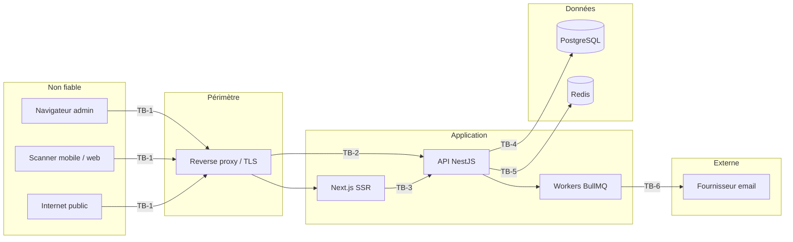

# Eventini — Modèle de menace

> **Statut :** Spécification normative · **Version :** 1.0 · **Date :** 30 juillet 2026
> **Méthode :** STRIDE par frontière de confiance, croisé OWASP Top 10 (2021) et API Security Top 10 (2023)
> **Étend :** Document B §48 — le STRIDE y était esquissé sans être relié à des contrôles ni à des tests

Chaque menace de ce document porte un **contrôle** et un **test qui le prouve**. Une menace sans test associé n'est pas traitée : elle est seulement décrite.

---

## 1. Frontières de confiance

| Frontière | Franchissement | Hypothèse |
|---|---|---|
| **TB-1** | Internet → proxy | Tout est hostile. TLS obligatoire, HSTS avec `preload` |
| **TB-2** | Proxy → API | Le proxy est de confiance **et déclaré**. `trust proxy` avec un nombre de sauts explicite, jamais `true` |
| **TB-3** | SSR Next.js → API | Le SSR n'est **pas** une frontière de sécurité : il rejoue les cookies de l'utilisateur, il n'a aucun privilège propre |
| **TB-4** | API → PostgreSQL | Réseau privé. Les requêtes sont paramétrées. Le filtre tenant est imposé par l'extension Prisma |
| **TB-5** | API → Redis | Réseau privé, `requirepass`. Redis n'est **jamais** source de vérité |
| **TB-6** | Workers → SMTP | Externe. Aucun secret dans les gabarits, échappement systématique |

**Le frontend n'est jamais une frontière de sécurité.** Il masque des actions pour l'ergonomie. Le backend décide. C'est AUTH-INV-011, et c'est ce qui rend l'état actuel du dépôt — `AuthGuard` qui ignore `requiredRole`, `middleware.ts` sans effet — un problème d'ergonomie et non une faille : il n'y a rien derrière à protéger encore, mais il ne faudra jamais compter dessus.

---

## 2. STRIDE

### 2.1 Spoofing — usurpation d'identité

| # | Menace | Contrôle | Test |
|---|---|---|---|
| S-1 | Vol de session par XSS | Tokens en cookies `HttpOnly` uniquement ; AUTH-INV-001 ; CSP avec nonce | Aucun token accessible via `document.cookie` |
| S-2 | Confusion d'algorithme JWT (`alg: none`, `HS256` sur clé publique) | Algorithme **explicite** passé à `jwtVerify`, jamais lu depuis l'en-tête | Test 13 de [`AUTHENTICATION_AUTHORIZATION.md` §11](AUTHENTICATION_AUTHORIZATION.md) |
| S-3 | Rejeu de refresh token volé | Rotation à usage unique + détection de rejeu + révocation de famille | Test 4 |
| S-4 | Fixation de session | Session créée **après** authentification, jamais réutilisée ; token CSRF rebindé | Test 8 |
| S-5 | Usurpation d'appareil scanner | `device_identifier` enregistré + assignation + révocation | Test 17 |
| S-6 | Forge de QR code | Signature EdDSA, `public_reference` de 128 bits non prédictible | `TICKET_SIGNATURE_INVALID` |
| S-7 | Usurpation d'IP via `X-Forwarded-For` | `trust proxy` avec nombre de sauts explicite | Test 10 de [`RATE_LIMITING…` §10](RATE_LIMITING_AND_ABUSE_PREVENTION.md) |
| S-8 | Énumération d'utilisateurs | Réponses et durées identiques ; vérification Argon2id factice | Test 14 |

### 2.2 Tampering — altération

| # | Menace | Contrôle | Test |
|---|---|---|---|
| T-1 | Mass assignment (`status`, `organizationId`, `role` dans le corps) | DTO en liste blanche, `forbidNonWhitelisted: true`, `whitelist: true` | Test 19 |
| T-2 | Injection SQL | Prisma paramétré ; `$queryRaw` interdit sauf revue explicite ; aucun fragment SQL client | Analyse statique + revue |
| T-3 | Altération de QR | Signature vérifiée **avant** toute lecture de base | Test 24 |
| T-4 | Falsification d'horodatage de check-in offline | `server_recorded_at` seul fait foi ; `client_recorded_at` jamais autoritaire | Test de synchronisation offline |
| T-5 | Manipulation de curseur de pagination | Curseur opaque et signé ; invalidé au changement de tri, filtre ou tenant | Test de contrat |
| T-6 | Altération d'audit | `audit_logs` et `security_events` append-only, aucun `UPDATE` ni `DELETE` applicatif | Test de permission base |
| T-7 | Escalade par assignation de rôle plateforme via l'API d'organisation | Refus applicatif **et** trigger | Test 20 |
| T-8 | Requête non scopée au tenant | Extension Prisma qui lève `TenantScopeViolationError` | Test d'architecture |

### 2.3 Repudiation — répudiation

| # | Menace | Contrôle |
|---|---|---|
| R-1 | Un administrateur nie avoir supprimé des données | `audit_logs` avec `actor_user_id`, `actor_role` en **snapshot**, `previous_values`, `new_values`, `request_id` |
| R-2 | Un opérateur nie un check-in | `attendance_records` append-only avec `operator_membership_id`, `scanner_device_id`, `server_recorded_at` |
| R-3 | Corrélation impossible entre un log et une action | `requestId` propagé de la requête HTTP jusqu'aux jobs et aux événements internes |
| R-4 | Le rôle a changé depuis l'action | `audit_logs.actor_role` est un snapshot textuel, insensible aux changements ultérieurs |
| R-5 | Un `SUPER_ADMIN` agit sans trace | Toute opération plateforme est auditée ; les opérations critiques exigent une réauthentification |

### 2.4 Information Disclosure — divulgation

| # | Menace | Contrôle | Test |
|---|---|---|---|
| I-1 | **Fuite cross-tenant** | Étapes 7-8 de la chaîne + `organization_id` obligatoire + garde Prisma | Test 10 |
| I-2 | PII dans les logs | Redaction Pino + minimisation + email masqué + IP tronquée | Test de redaction |
| I-3 | Secrets dans les logs | 9 catégories interdites ; redaction en défense secondaire, non transmission en règle première | Test de redaction |
| I-4 | Trace d'exécution en réponse | Filtre d'exception global ; jamais d'erreur Prisma exposée | Test de contrat |
| I-5 | PII dans le QR code | Le QR ne porte que `public_reference`, `key_id`, `payload_version`, signature | Revue de format |
| I-6 | Identifiants séquentiels énumérables | UUID v7 partout, jamais `SERIAL` | Revue de schéma |
| I-7 | Fuite par timing sur le login | Argon2id exécuté même sans utilisateur | Test 14 |
| I-8 | Fuite par cache HTTP entre tenants | `Cache-Control: private, no-store` sur les données sensibles ; clé de cache incluant le contexte d'autorisation | Test de contrat |
| I-9 | Collision d'identifiant d'appareil révélant l'activité d'un autre tenant | `ux_scanner_device_identifier` scopé au tenant (correction C-30) | Test d'insertion |
| I-10 | Swagger exposant la surface complète en production | OpenAPI protégé, aucun exemple porteur de secret | Vérification de déploiement |

### 2.5 Denial of Service

| # | Menace | Contrôle | Test |
|---|---|---|---|
| D-1 | Bruteforce de login | Rate limiting + lockout progressif | Test 2 |
| D-2 | **Verrouillage d'une victime par un tiers** | Clé `ip+email`, jamais `email` seul | Test 3 |
| D-3 | Épuisement mémoire via Argon2id | Rate limiting **avant** le hachage ; m=19 MiB et non 64 | Test de charge |
| D-4 | Charge utile volumineuse | Limites vérifiées avant parsing | Test 11 |
| D-5 | Pagination sans borne | `limit` maximum 100 | Test 12 |
| D-6 | Requête coûteuse (recherche non bornée) | Longueur minimale 2, maximale 100 ; champs en liste blanche | Test de contrat |
| D-7 | Saturation de queue par un tenant | 3 jobs concurrents par organisation | Test d'intégration |
| D-8 | Script Lua bloquant Redis | Scripts courts, sans boucle non bornée, sans `KEYS` | Revue + test |
| D-9 | Rafale de reconnexion synchronisée | Jitter sur `Retry-After` et sur le backoff | Test de charge |
| D-10 | Redis indisponible bloquant tout | Fail closed sur l'authentification, fail open ailleurs | Tests 8 et 9 |
| D-11 | Un tenant saturant la plateforme | Limite globale par organisation | Test de charge |

### 2.6 Elevation of Privilege

| # | Menace | Contrôle | Test |
|---|---|---|---|
| E-1 | `organizationId` forgé dans le corps ou l'URL | Le tenant vient **exclusivement** de la session ([ADR-0002](../adr/0002-active-organization-resolution.md)) ; les valeurs client sont comparées, jamais utilisées | Test 10 |
| E-2 | Permission obtenue via un rôle de mauvaise portée | INV-09 : routage strict par portée, vérifié par trigger | Test 20 |
| E-3 | Scanner accédant à un autre événement de la même organisation | `SCANNER` de portée `EVENT` ([ADR-0015](../adr/0015-scanner-role-scope.md)) | Test 16 |
| E-4 | Permission révoquée encore active | Cache versionné, invalidation immédiate | Test 11 |
| E-5 | Session survivant à la révocation d'un membership | Révocation de session dans la même transaction | Test d'intégration |
| E-6 | `SUPER_ADMIN` sans MFA | INV-11, refus d'assignation | Test 22 |
| E-7 | Perte du dernier `SUPER_ADMIN` | INV-10, révocation refusée par trigger | Test 21 |
| E-8 | Contournement de guard sur une route oubliée | Guard global par défaut ; l'accès public est un **opt-in explicite** (`@Public()`), jamais l'inverse | Test d'architecture |
| E-9 | Élévation par impersonation | Non implémentée. Si elle l'est un jour : durée limitée, réauthentification, audit dédié, bannière visible | `DEFERRED` |

---

## 3. OWASP Top 10 (2021)

| Risque | Traitement |
|---|---|
| **A01 Broken Access Control** | Chaîne en 8 étapes · garde Prisma · guard global opt-out · portées `SCANNER` limitées · tests 10, 11, 16, 20 |
| **A02 Cryptographic Failures** | Argon2id + pepper · EdDSA avec `kid` · 7 secrets indépendants · HMAC des refresh tokens et tickets · TLS + HSTS `preload` |
| **A03 Injection** | Prisma paramétré · `$queryRaw` sous revue · DTO en liste blanche · échappement des gabarits d'email · CSP |
| **A04 Insecure Design** | Fail closed · idempotence · outbox transactionnelle · append-only sur les preuves · le présent document |
| **A05 Security Misconfiguration** | Validation d'environnement **bloquante** au démarrage · en-têtes explicites · `X-Powered-By` retiré · aucun secret par défaut |
| **A06 Vulnerable Components** | `npm audit` en CI · Dependabot · pas de dépendance sans justification |
| **A07 Identification and Authentication Failures** | Rotation · détection de rejeu · MFA obligatoire pour `SUPER_ADMIN` · lockout · réponses génériques |
| **A08 Software and Data Integrity Failures** | Lockfiles committés · scripts Lua versionnés et immuables · migrations immuables |
| **A09 Logging and Monitoring Failures** | Pino structuré · `security_events` en base · 10 alertes · `requestId` propagé de bout en bout |
| **A10 SSRF** | Aucune URL fournie par l'utilisateur n'est appelée. Toute intégration future exige une liste blanche d'hôtes et le refus des plages privées |

---

## 4. Scénarios propres à Eventini

Cinq scénarios que les catalogues génériques ne couvrent pas.

### 4.1 QR code partagé entre deux participants

**Attaque** — un participant photographie son QR et l'envoie à un tiers, qui tente d'entrer.

**Contrôles** : `ux_attendance_checkin_unique` garantit **un seul** check-in accepté par `(event, registration, event_session)`. Le second reçoit `DUPLICATE` avec le motif `ALREADY_CHECKED_IN`, visible par l'opérateur. Le nonce anti-rejeu de 90 s bloque en plus la présentation simultanée sur deux appareils.

**Limite assumée** — le premier arrivé entre. Le système détecte et trace la tentative ; il ne peut pas déterminer lequel des deux est le titulaire légitime. La détection de rafale (`> 20 refus/min` sur un appareil) et le rapport d'anomalies remontent le cas à un humain, qui tranche.

### 4.2 Appareil scanner perdu ou volé pendant un événement

**Attaque** — l'appareil contient un snapshot offline et une session valide 30 jours.

**Contrôles** : révocation de `scanner_device_assignments` ⇒ coupure de l'accès opérationnel sans toucher au membership. Révocation des sessions `MOBILE_SCANNER` de l'appareil. Le snapshot offline a une validité bornée et n'autorise aucune écriture faisant autorité — toute opération offline est arbitrée par le serveur à la synchronisation.

**Limite assumée** — un appareil resté hors ligne continue d'accepter des scans localement jusqu'à sa prochaine connexion. Ces opérations sont **rejetées** à la synchronisation, avec leur motif. C'est le prix du mode hors ligne, et il est explicite.

### 4.3 Administrateur quittant une organisation cliente

**Attaque** — un ancien administrateur conserve ses cookies.

**Contrôles** : `membership → REVOKED` révoque les sessions liées et incrémente `permissionsVersion` dans la même transaction. L'étape 5 de la chaîne échoue immédiatement, sans attendre l'expiration de l'access token.

### 4.4 Organisation cliente compromise

**Attaque** — les identifiants d'un client sont massivement compromis.

**Contrôles** : `organizations.is_enabled = false` coupe l'accès en une écriture, sans transition d'état, réversible. `status = KILLED` est la version durable. Toutes les sessions du tenant sont révoquées. `ORGANIZATION_KILL_SWITCH_EXECUTED` déclenche une alerte immédiate. L'opération exige une réauthentification `SUPER_ADMIN` et une justification obligatoire.

### 4.5 Import de participants comme vecteur d'injection

**Attaque** — un CSV contenant `=cmd|' /C calc'!A0` (injection de formule), du HTML, ou 500 000 lignes.

**Contrôles** : validation de type MIME **et** de contenu réel, limite 10 Mo et 50 000 lignes, parsing en flux et non en mémoire, normalisation, aucune interprétation HTML, échappement de formule à l'export (préfixe `'` sur toute cellule commençant par `=`, `+`, `-`, `@`), traitement asynchrone avec rapport de lignes acceptées et rejetées.

L'échappement de formule à l'export est le point souvent oublié : la donnée entre inerte et ressort exécutable dans le tableur du destinataire.

---

## 5. Risques acceptés

Documentés parce qu'un risque non écrit finit par être découvert au mauvais moment.

| # | Risque | Pourquoi accepté | Réévaluation |
|---|---|---|---|
| RA-1 | Pas de RLS PostgreSQL — un accès SQL direct contourne l'isolation | Coût opérationnel élevé avec Prisma et le pooling ; la garde applicative couvre le chemin applicatif | Si une exigence de conformité l'impose |
| RA-2 | Bruteforce distribué sur de nombreuses IP contourne `ip+email` | La parade (verrouillage par email) créerait un déni de service contre les victimes | Détection + MFA ; réévalué sur données réelles |
| RA-3 | Un scan hors ligne sur appareil volé est accepté localement | Inhérent au mode hors ligne, exigé par le métier | Réduire la durée de validité du snapshot |
| RA-4 | `'unsafe-inline'` sur `style-src` | Tailwind et Base UI injectent des styles ; un nonce casse l'hydratation React | Si Next.js propose un nonce de style stable |
| RA-5 | TOTP en SHA-1 | RFC 6238 ; la sécurité tient à l'entropie du secret ; SHA-256 casse des applications d'authentification | Si le parc client le permet |
| RA-6 | Pas de vérification de mot de passe compromis au MVP | Dépendance externe ou jeu de données volumineux | Sprint 12 |
| RA-7 | Le premier présentant un QR partagé entre | Indécidable sans preuve d'identité supplémentaire | Si une vérification d'identité est ajoutée |
| RA-8 | Impersonation non implémentée | Hors périmètre ; l'ajouter sans conception dédiée serait pire | Conception dédiée requise |
| RA-9 | `dangerouslySetInnerHTML` dans `components/ui/chart.tsx` | Composant **généré par la CLI shadcn**, régénéré en bloc — un correctif en place serait écrasé. Il injecte des variables CSS depuis un `ChartConfig` défini par le développeur. **Contrainte : aucune valeur de `ChartConfig` ne doit jamais provenir d'une entrée utilisateur.** Un budget CI empêche toute occurrence supplémentaire | Si shadcn change son implémentation |
| RA-10 | ~~`brace-expansion` (high, DoS) confiné à `eslint`/`jest`~~ **RÉSOLU par [EVT-022](../sprints/sprint-04/README.md#evt-022)** | L'entrée affirmait qu'« aucune version corrigée n'existe pour ces lignes majeures ». C'était vrai à la rédaction et ne l'est plus : `brace-expansion@1.1.18` et `5.0.9` ont depuis été publiés. Les deux projets sont remontés par `overrides` scopés au numéro majeur (`brace-expansion@1` → `1.1.18`, `brace-expansion@5` → `^5.0.9`), et **`GHSA-mh99-v99m-4gvg` est retiré de la liste blanche CI** des deux projets. Une entrée de liste blanche qui ne correspond plus à rien masque la prochaine vraie alerte | — |
| RA-11 | `sharp` (high, CVE libvips) — dépendance optionnelle de Next.js | `next@16.2.12` déclare `sharp: "^0.34.5"` ; en notation caret sur une version `0.x`, cela **exclut structurellement** le correctif `0.35.x` (seuls les correctifs `0.34.x` seraient acceptés, et aucun n'existe). Sharp a des bindings natifs (libvips) : forcer un saut de mineure non certifié par les mainteneurs de Next.js risquerait une régression silencieuse de l'optimisation d'image, plus difficile à détecter qu'un échec de build | Dès qu'une version de Next.js certifie `sharp@0.35.x` |
| RA-12 | `@hono/node-server` (moderate, traversée de chemin Windows) — outillage `shadcn` uniquement | Atteint uniquement via `shadcn` (générateur de composants, jamais exécuté en production ni en CI applicative) → `@modelcontextprotocol/sdk`, lui-même utilisé seulement par la sous-commande MCP optionnelle de `shadcn`, jamais invoquée par nos scripts | Si `shadcn` devient un chemin d'exécution réel |

> ✅ **Les advisories de production sont résolues, vérifiées fonctionnellement, pas seulement installées.** `js-yaml` (via `@nestjs/swagger`, chemin d'exécution réel) et `uuid` + `brace-expansion` (via `exceljs → archiver → readdir-glob`, chemin d'exécution réel pour les imports/exports participants) sont corrigés par des [`overrides`](https://docs.npmjs.com/cli/v10/configuring-npm/package-json#overrides) npm **scopés au chemin exact**, pas globaux — un override global de `brace-expansion` a d'abord cassé ESLint (`minimatch@3.1.5` exige son ancienne forme), ce qui a été détecté par `npm run lint` avant tout commit, pas supposé. Côté web, `postcss` (via le pipeline interne de Next.js) est corrigé de la même façon.
>
> **`deepmerge-ts` (high, `GHSA-ggr8-5vv4-36mx`, épinglage exact de `@prisma/config@7.9.1`) — corrigé le 19 août 2026, override global `^8.0.1`.** L'avis couvre **tout `< 8.0.0`** : le correctif exige un saut de version majeure, pas un patch. Vérifié avant de l'appliquer que `7.9.1` est la dernière version stable de `prisma` (les seules versions plus récentes sont des `8.0.0-rc.*`), donc aucune mise à jour amont ne le résorbe pour l'instant. `deepmerge-ts` est une bibliothèque pure JavaScript sans binding natif — contrairement à `sharp` (RA-11), le risque d'un saut de majeure s'y limite à une incompatibilité d'API, pas à une régression binaire silencieuse — et a été **exercé fonctionnellement** avant d'être retenu : `prisma validate`, `prisma generate` et `prisma migrate status` contre PostgreSQL réel passent tous les trois à travers le chemin de fusion de configuration que `@prisma/config` construit avec cette bibliothèque. Chemin d'exécution réel : `prisma.config.ts` est chargé à chaque commande CLI, y compris en CI (job `Migrations`).
>
> Chaque correctif a été **exercé fonctionnellement**, pas seulement installé : un test direct construit un classeur `exceljs` avec mise en forme conditionnelle (le seul point d'appel réel de `uuid.v4()`), l'écrit, le relit ; le build Next.js produit 233 Ko de CSS réel via le pipeline `postcss` patché.
>
> `npm audit` continue de citer `archiver`, `glob`, `minimatch`, `exceljs`, etc. comme « high » même après correction : c'est un **artefact connu de `npm audit` avec `overrides`** — l'outil signale une plage déclarée dans le `package.json` du paquet intermédiaire, pas la version réellement installée. Vérifié par inspection directe du disque (`find node_modules -name brace-expansion`) : une seule copie non patchée subsiste par projet, confinée à ESLint/Jest (RA-10).

---

## 6. Matrice de vérification

| Menace | Test | Emplacement |
|---|---|---|
| S-1 à S-8 | 1, 4, 8, 13, 14, 17, 24 | `test/authentication/*.e2e-spec.ts` |
| T-1 à T-8 | 19, 20, 23 + test d'architecture | `test/`, `src/__architecture__/` |
| R-1 à R-5 | tests d'audit | `test/audit/` |
| I-1 à I-10 | 10 + tests de redaction | `test/`, `test/logging/` |
| D-1 à D-11 | 1 à 14 de [`RATE_LIMITING…`](RATE_LIMITING_AND_ABUSE_PREVENTION.md) | `test/rate-limiting/` |
| E-1 à E-9 | 10, 11, 16, 20, 21, 22 | `test/authorization/` |

État actuel : `backend` contient **2 assertions réelles** et **31 `it.todo`**. `src/__architecture__/tenant-isolation.spec.ts` — celui qui prouverait I-1, T-8 et E-8 — contient exactement deux `it.todo`. Il est activé au sprint 06.
