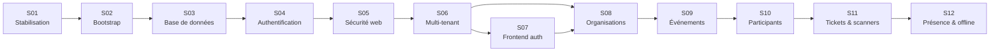

# Eventini — Feuille de route d'implémentation

> **Statut :** Spécification normative · **Version :** 1.0 · **Date :** 30 juillet 2026
> **Détail par feature :** [`SPRINT_PLAN.md`](SPRINT_PLAN.md) · **Processus :** [ADR-0017](../adr/0017-delivery-model.md)

---

## 1. Le problème réconcilié

Le corpus contenait **quatre séquences d'implémentation concurrentes**, jamais mises en correspondance :

| Source | Contenu |
|---|---|
| `EVENTINI_PROJECT_CONTEXT.md` §18 | 17 phases, 131 étapes numérotées |
| Document B §50 | 10 phases d'authentification |
| Document D §40 | 8 phases de logging |
| Document A §11 | 8 migrations de base |

Aucune ne portait d'estimation, de dépendance ni de critère de sortie. Un agent lisant les quatre ne savait pas laquelle appliquer.

Ce document produit **une seule séquence** de 12 sprints, dans laquelle chacune des quatre est intégralement absorbée. Les correspondances sont données au §6.

---

## 2. Les invariants d'ordonnancement

Cinq contraintes commandent tout l'ordre. Elles ne sont pas négociables.

| # | Contrainte | Pourquoi |
|---|---|---|
| **O-1** | Le build doit être vert avant tout | On ne construit pas sur un dépôt qui ne compile pas. 7 imports frontend cassés bloquent la moindre vérification |
| **O-2** | La configuration et l'observabilité précèdent l'authentification | Écrire de l'authentification sans logs ni validation d'environnement rend chaque bug invisible |
| **O-3** | L'audit précède la première écriture métier | Une opération non tracée l'est **définitivement**. Le trou ne se rattrape pas rétroactivement |
| **O-4** | Le rate limiting précède l'exposition publique du login | Argon2id consomme 19 MiB par vérification : sans limite, le login est son propre vecteur de déni de service |
| **O-5** | Le multi-tenant précède toute feature métier | Ajouter l'isolation après coup impose de réécrire chaque requête déjà écrite |

**O-3 et O-4 sont les plus souvent violés** dans les projets réels, et ce sont les deux dont la violation coûte le plus cher à rattraper.

---

## 3. La séquence

| Sprint | Thème | Sortie |
|---:|---|---|
| **01** | Stabilisation du dépôt | build vert, git assaini, CI en place |
| **02** | Bootstrap sécurisé | configuration validée, Pino, santé, métriques, Docker |
| **03** | Base de données | 30 tables, 14 migrations, seed, audit |
| **04** | Authentification cœur | login, rotation, détection de rejeu, MFA, mots de passe |
| **05** | Sécurité web | CSRF, rate limiting Lua, idempotence |
| **06** | Multi-tenant et autorisation | garde Prisma, chaîne en 8 étapes, tests cross-tenant |
| **07** | Frontend authentification | providers, formulaires, rotation en vol unique, guards |
| **08** | Organisations | membres, invitations, rôles, changement de contexte |
| **09** | Événements et sessions | états, multi-jour, fenêtres, affectations |
| **10** | Participants et inscriptions | imports, déduplication, accès par session |
| **11** | Tickets, QR et scanners | émission, signature, appareils, activation |
| **12** | Présence, offline et temps réel | check-in, synchronisation, SSE, rapports |

24 semaines. Les sprints 07 et 08 peuvent se chevaucher partiellement si deux personnes travaillent en parallèle.

---

## 4. Critères de sortie

Un sprint n'est pas terminé parce que son temps est écoulé. Il l'est quand son critère est **démontré**.

| Sprint | Critère de sortie — vérifiable, pas déclaratif |
|---:|---|
| 01 | `lint`, `typecheck` et `build` verts sur backend **et** frontend. `web/.git` supprimé, `master` et `develop` créées et poussées, contenant réellement les sources frontend. `docker/.env.example` rempli et `docker compose up` fonctionnel depuis un clone neuf |
| 02 | `GET /api/v1/health/ready` retourne `200`. Un démarrage avec une variable manquante échoue en `fatal` en la nommant. Une requête produit une ligne Pino avec `requestId`. `/metrics` répond |
| 03 | `prisma migrate deploy` sur base vierge aboutit. Le seed est idempotent. Les 12 invariants ont chacun un test d'insertion qui **échoue** comme prévu. `prisma migrate diff --exit-code` retourne 0 |
| 04 | Login, rotation, déconnexion fonctionnent de bout en bout. **Le rejeu d'un refresh token révoque la famille.** Deux rotations concurrentes : exactement un succès |
| 05 | `POST` sans `X-CSRF-Token` ⇒ `403`. 6ᵉ login échoué ⇒ `429`. Un attaquant ne peut pas verrouiller une victime. Deux check-ins de même clé ⇒ un seul enregistrement |
| 06 | **Un ID valide d'un autre tenant retourne `403`.** Une requête non scopée lève `TenantScopeViolationError`. `tenant-isolation.spec.ts` passe avec des assertions réelles |
| 07 | Connexion depuis le navigateur, session maintenue par rotation automatique, déconnexion effective. 10 requêtes recevant `401` déclenchent **une** rotation, pas dix |
| 08 | Un utilisateur membre de deux organisations bascule de contexte ; ses permissions changent immédiatement, sa session est rotée |
| 09 | Un événement passe `DRAFT → ACTIVE → EXPIRED`. Les transitions interdites sont refusées. Les fenêtres de check-in sont calculées dans le fuseau de l'événement |
| 10 | Un CSV de 10 000 lignes s'importe en asynchrone avec un rapport accepté/rejeté. Les doublons sont détectés. Une formule CSV est neutralisée à l'export |
| 11 | Un ticket est émis, son QR est signé, il ne contient **aucune** PII. Un ticket révoqué est refusé. Un appareil révoqué perd l'accès |
| 12 | Un check-in aboutit. **Le doublon est refusé.** Un lot offline rejoué ne crée aucun doublon. Le tableau de bord se met à jour en temps réel |

---

## 5. Chemin critique et parallélisation

**Chemin critique** : `01 → 02 → 03 → 04 → 05 → 06 → 09 → 10 → 11 → 12`

Rien ne peut le raccourcir : chaque sprint consomme la sortie du précédent.

| Parallélisable | Condition |
|---|---|
| 07 (frontend auth) ‖ 08 (organisations) | 06 terminé |
| Documentation ‖ tout | — |
| `.github/` ‖ tout | — |
| Scripts Lua | **déjà écrits et testés** — voir [`scripts/redis/`](../../scripts/redis/) |

**Non parallélisable** : 03 avant 04 (pas de session sans table), 05 avant l'exposition publique (O-4), 06 avant 09 (O-5).

---

## 6. Correspondance avec les quatre séquences d'origine

Preuve qu'aucune étape n'est perdue.

### `EVENTINI_PROJECT_CONTEXT.md` §18 — 17 phases

| Phase d'origine | Sprint |
|---|---:|
| 0 Stabilisation | 01 |
| 1 Bootstrap backend | 02 |
| 2 Infrastructure locale | 02 |
| 3 Base de données | 03 |
| 4 Infrastructure applicative | 02-03 |
| 5 Authentification | 04 |
| 6 Sécurité web | 05 |
| 7 Multi-tenant et autorisation | 06 |
| 8 Frontend auth | 07 |
| 9 Administration organisation | 08 |
| 10 Events et sessions | 09 |
| 11 Participants et registrations | 10 |
| 12 Tickets, QR et scanners | 11 |
| 13 Attendance | 12 |
| 14 Offline et realtime | 12 |
| 15 Notifications et reporting | 12 |
| 16 Production readiness | transverse — voir §7 |
| 17 Flutter | `DEFERRED` |

### Document B §50 — 10 phases d'authentification

| Phase | Sprint |
|---|---:|
| 1 Fondation | 02 |
| 2 Modèle de données | 03 |
| 3 Auth cœur | 04 |
| 4 CSRF | 05 |
| 5 Cycle de vie de session | 04 |
| 6 Récupération de mot de passe | 04 |
| 7 MFA | 04 |
| 8 Multi-tenancy | 06 |
| 9 Scanner mobile | 11 |
| 10 Durcissement | 05-06 |

### Document D §40 — 8 phases de logging

Intégralement absorbé au **sprint 02**, sauf les politiques par dépendance (BullMQ, SSE) qui arrivent avec leur dépendance, au sprint 12.

### Document A §11 — 8 migrations

Intégralement au **sprint 03**, étendu à 14 migrations. Les 8 d'origine conservent leur ordre relatif exact — voir [`MIGRATION_STRATEGY.md` §11](../database/MIGRATION_STRATEGY.md).

**La phase 16 « Production readiness » n'est pas un sprint.** La traiter comme une étape finale garantit qu'elle sera comprimée. Elle est répartie : Dockerfiles au 02, CI au 01, tests à chaque sprint, sécurité aux 05-06, monitoring au 02, runbooks au fil de l'eau.

---

## 7. Travaux transverses

Non affectés à un sprint, dus **à chaque** sprint.

| Travail | Règle |
|---|---|
| Tests | Aucune feature n'est `DONE` sans ses tests. Les tests négatifs sont obligatoires sur tout ce qui touche à la sécurité |
| Documentation | Un changement de contrat met à jour le document correspondant dans la même PR |
| ADR | Toute décision structurante produit un ADR **avant** le code |
| Migrations | Toujours expand/contract, jamais destructif en une passe |
| Observabilité | Toute nouvelle opération sensible émet un security event ou un audit log |
| OpenAPI | Toute route nouvelle est documentée ; la CI détecte les ruptures |
| Runbooks | Toute alerte nouvelle arrive avec sa procédure |

---

## 8. Jalons

| Jalon | Fin de sprint | Ce qui est démontrable |
|---|---:|---|
| **M1 — Fondations** | 03 | L'application démarre, se configure, journalise, persiste. Aucune feature |
| **M2 — Identité** | 06 | Authentification complète, isolation multi-tenant prouvée par test. **Le socle de sécurité est fini** |
| **M3 — Administration** | 09 | Un client crée son organisation, invite son équipe, crée un événement |
| **M4 — MVP** | 12 | Cycle complet : organisation → événement → participants → tickets → check-in → rapport |

**M2 est le jalon le plus important.** Passé M2, chaque feature métier hérite gratuitement de l'isolation et de l'autorisation. Avant M2, chaque feature écrite devrait être reprise.

---

## 9. Après le MVP

| Sujet | Condition d'entrée |
|---|---|
| Application Flutter | contrats scanner, ticket, présence, idempotence et synchronisation **stables** (contexte produit §12.5) |
| Vérification de mot de passe compromis | après M4 |
| Impersonation | conception dédiée, jamais improvisée ([`THREAT_MODEL.md` RA-8](../security/THREAT_MODEL.md)) |
| RLS PostgreSQL | si une exigence de conformité l'impose ([`THREAT_MODEL.md` RA-1](../security/THREAT_MODEL.md)) |
| Webhooks sortants | demande client réelle |
| Facturation, quotas | les colonnes `license_plan`, `user_limit`, `event_limit` existent ; l'application des quotas est reportée |
| Socket.IO | seulement si une bidirectionnalité réelle apparaît — SSE d'abord |

---

## 10. Risques

| Risque | Impact | Atténuation |
|---|---|---|
| Le dépôt git imbriqué `web/.git` n'est pas traité | **le frontend n'est jamais poussé** | Sprint 01, premier item, bloquant. **C'est le risque ouvert le plus élevé du projet** |
| L'isolation multi-tenant est reportée après les features | réécriture de chaque requête | O-5 ; sprint 06 avant toute feature |
| L'audit arrive après les premières écritures | **trou de traçabilité définitif** | O-3 ; migration `audit_and_security` appliquée dès le sprint 03 |
| Le rate limiting arrive après l'ouverture du login | déni de service par Argon2id | O-4 ; sprint 05 avant toute exposition |
| Les tests restent des `it.todo` | fausse impression de couverture | Definition of Done ; la CI compte les `it.todo` et échoue au-delà d'un seuil |
| La strictness TypeScript est activée tardivement | `any` implicite dans du code de sécurité | Sprint 01, avant l'écriture du code de sécurité |
| `PASSWORD_PEPPER` perdu | **aucun utilisateur ne peut se connecter** | Procédure de sauvegarde, runbook, alerte |
| Le scope glisse vers les non-objectifs | MVP jamais atteint | Contexte produit §20 ; tout ajout exige un ADR |
